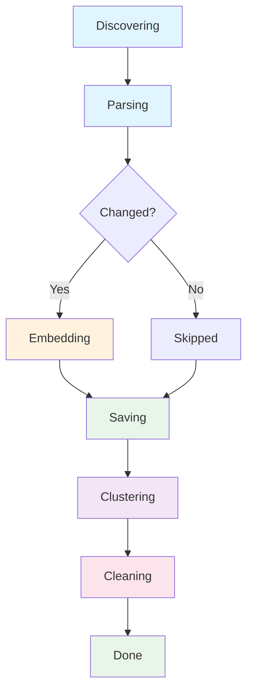

# mdvdb ingest

Ingest markdown files into the index. By default, performs incremental ingestion -- only new or changed files are processed. Unchanged files (detected via SHA-256 content hashing) are skipped automatically.

## Usage

```bash
mdvdb ingest [OPTIONS]
```

## Options

| Flag | Value | Default | Description |
|------|-------|---------|-------------|
| `--reindex` | | `false` | Force re-embedding of all files, ignoring content hashes |
| `--full` | | `false` | **Deprecated** -- hidden alias for `--reindex` |
| `--file` | `<PATH>` | | Ingest a specific file only (relative path) |
| `--preview` | | `false` | Preview what ingestion would do without actually ingesting |

### Option Details

#### `--reindex`

Forces re-embedding of every discovered markdown file, regardless of whether it has changed. Use this when you've changed your embedding provider, model, or dimensions, since the existing embeddings would no longer be compatible.

```bash
# Re-embed all files after switching models
mdvdb ingest --reindex
```

#### `--full` (deprecated)

Hidden alias for `--reindex`. This flag is deprecated and will be removed in a future version. Use `--reindex` instead.

#### `--file`

Restricts ingestion to a single file. The path should be relative to the project root. Useful for quickly updating the index after editing one file, or for debugging ingestion issues with a specific file.

```bash
# Ingest a single file
mdvdb ingest --file docs/getting-started.md

# Force re-embed a single file
mdvdb ingest --file docs/getting-started.md --reindex
```

#### `--preview`

Performs a dry run that shows what ingestion *would* do without actually embedding or saving anything. Reports per-file status (new, changed, unchanged), chunk counts, estimated tokens, and estimated API calls.

```bash
# Preview before ingesting
mdvdb ingest --preview
```

## Global Options

These options apply to all commands. See [Commands Index](./index.md) for details.

| Flag | Short | Description |
|------|-------|-------------|
| `--verbose` | `-v` | Increase log verbosity (-v info, -vv debug, -vvv trace) |
| `--root` | | Project root directory (defaults to current directory) |
| `--no-color` | | Disable colored output |
| `--json` | | Output results as JSON |

## Ingestion Pipeline

When you run `mdvdb ingest`, the pipeline proceeds through these phases:



| Phase | Description |
|-------|-------------|
| **Discovering** | Scans source directories for markdown files, respecting `.gitignore`, `.mdvdbignore`, and built-in ignore patterns |
| **Parsing** | Reads each file, extracts frontmatter and headings, computes SHA-256 content hash, and splits into chunks |
| **Skipped** | Files whose content hash matches the index are skipped (incremental mode) |
| **Embedding** | Sends chunk text to the embedding provider in batches (up to 4 concurrent API calls) |
| **Saving** | Writes updated chunks and vectors to the index file (atomic write: `.tmp` > fsync > rename) |
| **Clustering** | Runs K-means clustering on document-level vectors and generates TF-IDF keyword labels |
| **Cleaning** | Removes index entries for files that no longer exist on disk |
| **Done** | Ingestion complete |

### Interactive Progress

When running in an interactive terminal (not piped, not `--json`), ingestion displays a live progress bar showing:

- Current file being processed with progress percentage
- Elapsed time
- Phase status (discovering, parsing, embedding, saving, clustering, cleaning)

### Cancellation

Press **Ctrl+C** during ingestion to cancel gracefully. The cancellation is cooperative -- the current batch completes, partial results are saved, and the `cancelled` field is set to `true` in the output.

## Examples

```bash
# Standard incremental ingest (only new/changed files)
mdvdb ingest

# Force full re-embedding of all files
mdvdb ingest --reindex

# Ingest a single file
mdvdb ingest --file notes/meeting-2024-03.md

# Preview what would be ingested
mdvdb ingest --preview

# Ingest with JSON output
mdvdb ingest --json

# Ingest with timing breakdown
mdvdb ingest -v

# Preview in JSON format (for scripting)
mdvdb ingest --preview --json

# Ingest from a specific project root
mdvdb ingest --root /path/to/project
```

## JSON Output

### Ingest Result (`--json`)

```json
{
  "files_indexed": 12,
  "files_skipped": 45,
  "files_removed": 1,
  "chunks_created": 87,
  "api_calls": 3,
  "files_failed": 0,
  "errors": [],
  "duration_secs": 4.235,
  "cancelled": false
}
```

### IngestOutput Fields

| Field | Type | Description |
|-------|------|-------------|
| `files_indexed` | `number` | Number of files that were indexed (new or changed) |
| `files_skipped` | `number` | Number of files skipped (unchanged content hash) |
| `files_removed` | `number` | Number of files removed from index (deleted from disk) |
| `chunks_created` | `number` | Total number of chunks created across all indexed files |
| `api_calls` | `number` | Number of API calls made to the embedding provider |
| `files_failed` | `number` | Number of files that failed during ingestion |
| `errors` | `IngestError[]` | Array of error details for failed files |
| `duration_secs` | `number` | Wall-clock duration of the ingestion in seconds |
| `timings` | `IngestTimings?` | Per-phase timing breakdown (only included when `-v` is used) |
| `cancelled` | `boolean` | Whether the ingestion was cancelled via Ctrl+C |

### IngestError Fields

| Field | Type | Description |
|-------|------|-------------|
| `path` | `string` | Relative path to the file that failed |
| `message` | `string` | Error message describing the failure |

### IngestTimings Fields

Included when `-v` (verbose) flag is used:

| Field | Type | Description |
|-------|------|-------------|
| `discover_secs` | `number` | Time spent discovering markdown files |
| `parse_secs` | `number` | Time spent parsing files, computing hashes, and chunking |
| `embed_secs` | `number` | Time spent calling the embedding provider API |
| `upsert_secs` | `number` | Time spent upserting chunks into the vector index and FTS |
| `save_secs` | `number` | Time spent saving the index to disk and committing FTS |
| `total_secs` | `number` | Total wall-clock time |

### Preview Output (`--preview --json`)

```json
{
  "files": [
    {
      "path": "docs/getting-started.md",
      "status": "New",
      "chunks": 5,
      "estimated_tokens": 1200
    },
    {
      "path": "docs/api-reference.md",
      "status": "Changed",
      "chunks": 12,
      "estimated_tokens": 3400
    },
    {
      "path": "docs/faq.md",
      "status": "Unchanged",
      "chunks": 3,
      "estimated_tokens": 800
    }
  ],
  "total_files": 3,
  "files_to_process": 2,
  "files_unchanged": 1,
  "total_chunks": 17,
  "estimated_tokens": 4600,
  "estimated_api_calls": 1
}
```

### IngestPreview Fields

| Field | Type | Description |
|-------|------|-------------|
| `files` | `PreviewFileInfo[]` | Per-file details |
| `total_files` | `number` | Total number of markdown files discovered |
| `files_to_process` | `number` | Number of files that need processing (new + changed) |
| `files_unchanged` | `number` | Number of files that are unchanged |
| `total_chunks` | `number` | Total chunks across all files to process |
| `estimated_tokens` | `number` | Estimated total tokens for embedding |
| `estimated_api_calls` | `number` | Estimated number of API calls |

### PreviewFileInfo Fields

| Field | Type | Description |
|-------|------|-------------|
| `path` | `string` | Relative path to the file |
| `status` | `string` | File status: `"New"`, `"Changed"`, or `"Unchanged"` |
| `chunks` | `number` | Number of chunks this file would produce |
| `estimated_tokens` | `number` | Estimated token count for embedding |

## Configuration

The following environment variables affect ingestion behavior. See [Configuration](../configuration.md) for full details.

| Variable | Default | Description |
|----------|---------|-------------|
| `MDVDB_EMBEDDING_PROVIDER` | `openai` | Embedding provider: `openai`, `ollama`, or `custom` |
| `MDVDB_EMBEDDING_MODEL` | `text-embedding-3-small` | Model name for embedding |
| `MDVDB_EMBEDDING_DIMENSIONS` | `1536` | Vector dimensions |
| `MDVDB_EMBEDDING_BATCH_SIZE` | `100` | Number of texts per API batch |
| `MDVDB_SOURCE_DIRS` | `.` | Comma-separated directories to scan |
| `MDVDB_IGNORE_PATTERNS` | | Additional ignore patterns |
| `MDVDB_CHUNK_MAX_TOKENS` | `512` | Maximum tokens per chunk |
| `MDVDB_CHUNK_OVERLAP_TOKENS` | `50` | Overlap tokens between sub-split chunks |
| `MDVDB_CLUSTERING_ENABLED` | `true` | Enable clustering after ingestion |
| `MDVDB_EDGE_EMBEDDINGS` | `true` | Compute semantic edge embeddings between linked files |

## Related Commands

- [`mdvdb search`](./search.md) -- Search the index after ingesting
- [`mdvdb status`](./status.md) -- Check index health and document counts
- [`mdvdb tree`](./tree.md) -- View file tree with sync status indicators
- [`mdvdb doctor`](./doctor.md) -- Run diagnostic checks on the index
- [`mdvdb watch`](./watch.md) -- Automatically re-ingest on file changes

## See Also

- [Embedding Providers](../concepts/embedding-providers.md) -- Configure OpenAI, Ollama, or custom providers
- [Chunking](../concepts/chunking.md) -- How markdown files are split into chunks
- [Clustering](../concepts/clustering.md) -- K-means clustering and TF-IDF labels
- [Ignore Files](../concepts/ignore-files.md) -- `.gitignore`, `.mdvdbignore`, and built-in ignores
- [Index Storage](../concepts/index-storage.md) -- Index file format and `.markdownvdb/` directory
- [JSON Output Reference](../json-output.md) -- Complete JSON schema reference
- [Configuration](../configuration.md) -- All environment variables and config options
