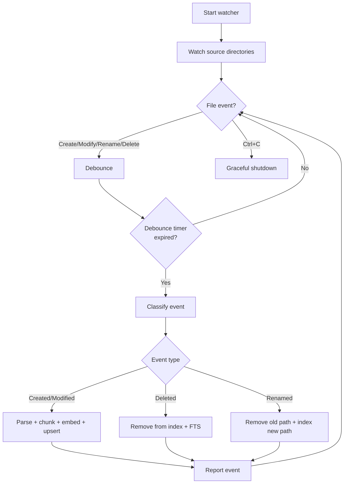

# mdvdb watch

Watch configured source directories for markdown file changes and automatically trigger incremental re-indexing. The watcher uses the [`notify`](https://docs.rs/notify) crate for cross-platform filesystem events with configurable debouncing.

## Usage

```bash
mdvdb watch [OPTIONS]
```

## Options

This command has no command-specific options. Only [global options](#global-options) apply.

## Global Options

These options apply to all commands. See [Commands Index](./index.md) for details.

| Flag | Short | Description |
|------|-------|-------------|
| `--verbose` | `-v` | Increase log verbosity (-v info, -vv debug, -vvv trace) |
| `--root` | | Project root directory (defaults to current directory) |
| `--no-color` | | Disable colored output |
| `--json` | | Output results as JSON |

## How It Works



### Event Processing

The watcher monitors all configured source directories (set via `MDVDB_SOURCE_DIRS`, default `.`) recursively. When a filesystem event is detected:

1. **Debounce** -- Events are debounced for `MDVDB_WATCH_DEBOUNCE_MS` milliseconds (default: 300ms) to coalesce rapid successive changes (e.g., editors that write to a temp file then rename)
2. **Filter** -- Only `.md` files that pass the ignore rules (`.gitignore`, `.mdvdbignore`, `MDVDB_IGNORE_PATTERNS`) are processed
3. **Classify** -- The raw filesystem event is classified into one of four types:
   - **Created** -- A new markdown file appeared
   - **Modified** -- An existing markdown file's content changed
   - **Deleted** -- A markdown file was removed
   - **Renamed** -- A markdown file was moved or renamed (old path removed, new path indexed)
4. **Content hash check** -- For create/modify events, the file's SHA-256 hash is compared against the stored hash. If unchanged, the event is skipped.
5. **Process** -- The file is parsed, chunked, embedded, and upserted into both the vector index and the FTS index. Link graphs and schema are also updated.
6. **Report** -- An event report is emitted (to stdout or as JSON) with the event type, path, chunk count, duration, and success/error status.

### Graceful Shutdown

Press **Ctrl+C** to stop the watcher. The watcher handles the SIGINT signal gracefully:

1. The cancellation token is triggered
2. The current event (if any) finishes processing
3. The watcher loop exits cleanly
4. The process terminates with exit code 0

No index corruption can occur from a Ctrl+C -- the watcher always completes atomic writes before checking for cancellation.

## Human-Readable Output

### Startup Message

When the watcher starts, it displays the watched directories:

```
  ● Watching for changes

  →  .

  Press Ctrl+C to stop
```

### Event Reports

Each processed event is displayed with a status icon, event type, file path, chunk count, and duration:

```
  ✓ indexed  docs/new-page.md (5 chunks) 142ms
  ✓ indexed  docs/updated.md (3 chunks) 89ms
  − deleted  docs/old-page.md 12ms
  ↻ renamed  docs/renamed.md (5 chunks) 156ms
  ✗ error    docs/broken.md failed to parse frontmatter
```

### Status Icons

| Icon | Color | Meaning |
|------|-------|---------|
| `✓` | Green | File successfully indexed (created or modified) |
| `−` | Yellow | File deleted from the index |
| `↻` | Blue | File renamed (old path removed, new path indexed) |
| `✗` | Red | Error processing the event |

## Examples

```bash
# Start watching for changes
mdvdb watch

# Watch with JSON streaming output
mdvdb watch --json

# Watch a specific project directory
mdvdb watch --root /path/to/project

# Watch with verbose logging to see debounce and skip details
mdvdb watch -vv

# Watch without colored output
mdvdb watch --no-color
```

## JSON Output

When `--json` is used, the watcher emits newline-delimited JSON (NDJSON) to stdout. Each line is a self-contained JSON object.

### Startup Message

```json
{"status":"watching","message":"File watching started"}
```

### WatchEventReport (per event)

Each processed event emits a `WatchEventReport` JSON object:

```json
{"event_type":"Modified","path":"docs/api.md","chunks_processed":5,"duration_ms":142,"success":true,"error":null}
```

```json
{"event_type":"Created","path":"docs/new-page.md","chunks_processed":3,"duration_ms":89,"success":true,"error":null}
```

```json
{"event_type":"Deleted","path":"docs/old-page.md","chunks_processed":0,"duration_ms":12,"success":true,"error":null}
```

```json
{"event_type":"Renamed","path":"docs/renamed.md","chunks_processed":5,"duration_ms":156,"success":true,"error":null}
```

### Error Event

```json
{"event_type":"Modified","path":"docs/broken.md","chunks_processed":0,"duration_ms":3,"success":false,"error":"failed to parse frontmatter: invalid YAML at line 3"}
```

### WatchEventReport Fields

| Field | Type | Description |
|-------|------|-------------|
| `event_type` | `string` | Type of filesystem event: `"Created"`, `"Modified"`, `"Deleted"`, or `"Renamed"` |
| `path` | `string` | Relative path of the affected file |
| `chunks_processed` | `number` | Number of chunks created/updated. `0` for deletions or skipped files. |
| `duration_ms` | `number` | Processing time in milliseconds |
| `success` | `boolean` | Whether the event was processed successfully |
| `error` | `string \| null` | Error message if processing failed, `null` on success |

### Streaming Usage

The JSON output is designed for streaming consumption by other tools or AI agents:

```bash
# Pipe watch events to jq for filtering
mdvdb watch --json | jq 'select(.success == false)'

# Log all watch events to a file
mdvdb watch --json >> watch-events.jsonl

# Monitor with real-time processing
mdvdb watch --json | while read -r line; do
  echo "$line" | jq -r '.path + " (" + .event_type + ")"'
done
```

## Configuration

The watcher behavior is controlled by two environment variables. See [Configuration](../configuration.md) for the full config reference.

| Variable | Default | Description |
|----------|---------|-------------|
| `MDVDB_WATCH` | `true` | Whether file watching is enabled. Set to `false` to disable the watcher. |
| `MDVDB_WATCH_DEBOUNCE_MS` | `300` | Debounce interval in milliseconds. Events within this window are coalesced into a single processing pass. |

### Debounce Tuning

The debounce interval controls how long the watcher waits after the last filesystem event before processing. This prevents redundant re-indexing when editors perform multiple rapid writes:

- **Lower values** (e.g., `100`) -- Faster reaction time, but may process intermediate saves
- **Default** (`300`) -- Good balance for most editors and workflows
- **Higher values** (e.g., `1000`) -- Better for batch operations or slow network filesystems

```bash
# Fast debounce for quick feedback
MDVDB_WATCH_DEBOUNCE_MS=100 mdvdb watch

# Slow debounce for batch workflows
MDVDB_WATCH_DEBOUNCE_MS=1000 mdvdb watch
```

### Source Directories

The watcher monitors directories listed in `MDVDB_SOURCE_DIRS` (default: `.`). Each directory is watched recursively. Non-existent directories are silently skipped.

## Notes

- The `watch` command opens the index in **read-write** mode. It modifies the index as files change.
- The watcher respects all ignore rules (`.gitignore`, `.mdvdbignore`, `MDVDB_IGNORE_PATTERNS`). Files matching ignore patterns are not processed even if they trigger filesystem events.
- Only `.md` files trigger processing. Changes to non-markdown files are silently ignored.
- The content hash check means that saving a file without changing its content will not trigger re-indexing (the event is received but the file is skipped after hash comparison).
- The watcher updates the vector index, FTS index, link graph, and schema on each event -- the same processing pipeline used by [`mdvdb ingest`](./ingest.md).
- If the watcher encounters an error processing a single file, it logs the error and continues watching. One broken file does not stop the watcher.
- The watcher requires a valid embedding provider configuration to generate vectors for new/modified files.

## Related Commands

- [`mdvdb ingest`](./ingest.md) -- Batch index all files (use when starting fresh or catching up)
- [`mdvdb tree`](./tree.md) -- View file tree with sync status indicators
- [`mdvdb status`](./status.md) -- Check current index status
- [`mdvdb get`](./get.md) -- View metadata for a specific indexed file
- [`mdvdb config`](./config.md) -- Verify resolved configuration including watch settings

## See Also

- [Configuration](../configuration.md) -- `MDVDB_WATCH` and `MDVDB_WATCH_DEBOUNCE_MS` environment variables
- [Ignore Files](../concepts/ignore-files.md) -- How ignore rules filter watched events
- [Embedding Providers](../concepts/embedding-providers.md) -- Required for processing new/modified files
- [JSON Output Reference](../json-output.md) -- Complete JSON schema reference
- [Index Storage](../concepts/index-storage.md) -- How the index is updated incrementally
