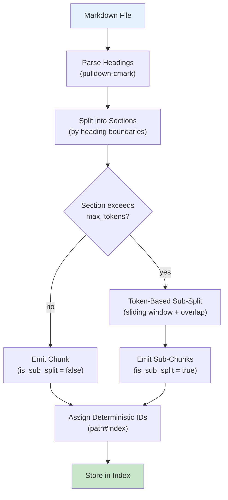

# Chunking

mdvdb splits each markdown file into **chunks** before embedding and indexing. Chunking ensures that search results point to specific, relevant sections of a document rather than returning entire files. The chunking engine uses a two-stage strategy: **heading-based splitting** (primary) followed by a **token size guard** (secondary).

## Overview



## Stage 1: Heading-Based Splitting

The primary splitting strategy uses **markdown headings** (`#`, `##`, `###`, etc.) as natural section boundaries. This preserves the semantic structure of the document -- each chunk corresponds to a logical section.

### How It Works

1. **Parse headings** -- `pulldown-cmark` identifies all headings in the markdown body, recording their level (1-6), text, and line number.
2. **Build sections** -- the document is divided at heading boundaries. Each section contains the content from one heading to the next.
3. **Track heading hierarchy** -- a stack-based approach maintains the full heading path for each section. For example, content under `## Setup` within `# Installation` has the hierarchy `["Installation", "Setup"]`.

### Heading Hierarchy

The chunker maintains a heading stack that provides context for each chunk:

```markdown
# Getting Started          -> hierarchy: ["Getting Started"]
## Installation            -> hierarchy: ["Getting Started", "Installation"]
### From Source            -> hierarchy: ["Getting Started", "Installation", "From Source"]
## Configuration           -> hierarchy: ["Getting Started", "Configuration"]
# API Reference            -> hierarchy: ["API Reference"]
```

When a heading at the same or higher level appears, the stack is popped back to the appropriate depth. This means `## Configuration` replaces `## Installation` (and its children) in the stack, and `# API Reference` resets the hierarchy entirely.

### Preamble Content

Content that appears before the first heading (preamble text) becomes its own chunk with an **empty heading hierarchy**. This ensures no content is lost.

```markdown
This is preamble text.     -> chunk #0, hierarchy: []

# First Section            -> chunk #1, hierarchy: ["First Section"]
Section content here.
```

### Files Without Headings

If a file has no headings at all, the entire body becomes a single chunk with an empty heading hierarchy.

### Empty Files

An empty file produces exactly one chunk with empty content and an empty heading hierarchy. This ensures every file has at least one chunk in the index.

## Stage 2: Token Size Guard

After heading-based splitting, any section that exceeds `MDVDB_CHUNK_MAX_TOKENS` (default: **512**) is further split using a **token-based sliding window**. This prevents embedding models from receiving oversized inputs and ensures consistent chunk sizes.

### How Sub-Splitting Works

1. **Tokenize** -- the full section content is tokenized using the `cl100k_base` tokenizer from `tiktoken-rs` (the same tokenizer used by OpenAI embedding models).
2. **Sliding window** -- tokens are divided into windows of `max_tokens` size. Each window advances by `max_tokens - overlap_tokens` tokens (the "stride").
3. **Overlap** -- consecutive windows share `MDVDB_CHUNK_OVERLAP_TOKENS` (default: **50**) tokens of overlap. This preserves context at chunk boundaries, ensuring that information spanning a boundary is captured in at least one chunk.
4. **Detokenize** -- each window of tokens is decoded back to text to produce the chunk content.
5. **Mark** -- sub-split chunks have `is_sub_split = true` and inherit the parent section's heading hierarchy.

### Sliding Window Diagram

```
Section with 1200 tokens, max_tokens=512, overlap=50:

|<-- Window 1 (tokens 0-511) -->|
                    |<-- overlap (50 tokens) -->|
                    |<-- Window 2 (tokens 462-973) -->|
                                        |<-- overlap (50 tokens) -->|
                                        |<-- Window 3 (tokens 924-1199) -->|
```

The stride is calculated as `max_tokens - overlap_tokens` = 512 - 50 = **462 tokens** per step. This ensures each consecutive pair of chunks shares exactly 50 tokens of context.

### Line Range Approximation

Sub-split chunks approximate their line ranges using character offset ratios. Since tokenization is not a 1:1 mapping with characters, the start and end lines for sub-split chunks are estimates rather than exact values.

## Chunk IDs

Every chunk receives a **deterministic identifier** in the format:

```
<relative_path>#<chunk_index>
```

Where:
- `<relative_path>` is the file path relative to the project root (e.g., `docs/guide.md`)
- `<chunk_index>` is a 0-based sequential integer within the file

### Examples

| Chunk ID | Meaning |
|----------|---------|
| `docs/guide.md#0` | First chunk of `docs/guide.md` |
| `docs/guide.md#1` | Second chunk of `docs/guide.md` |
| `notes/ideas.md#0` | First chunk of `notes/ideas.md` |
| `README.md#3` | Fourth chunk of `README.md` |

### Properties

- **Deterministic** -- the same file content always produces the same chunk IDs. This enables content-hash-based skip logic during incremental ingestion.
- **Sequential** -- chunk indices are assigned in order as the file is processed, starting at 0.
- **Stable** -- IDs are based on path and position, not heading text. Renaming a heading does not change chunk IDs (though it does change content hashes, triggering re-embedding).

## Configuration

| Variable | Default | Description |
|----------|---------|-------------|
| `MDVDB_CHUNK_MAX_TOKENS` | `512` | Maximum number of tokens per chunk. Sections exceeding this are sub-split with a sliding window. |
| `MDVDB_CHUNK_OVERLAP_TOKENS` | `50` | Number of overlapping tokens between consecutive sub-split chunks. Provides context continuity at chunk boundaries. |

### Choosing Values

- **`max_tokens`** -- should match or be well within the embedding model's context window. The default of 512 works well with OpenAI's `text-embedding-3-small` (8191 token limit) and most Ollama models. Larger values produce fewer, more context-rich chunks; smaller values produce more, more focused chunks.
- **`overlap_tokens`** -- should be large enough to preserve sentence-level context at boundaries but small enough to avoid excessive redundancy. The default of 50 tokens (~2-3 sentences) is a good general-purpose value.

### Setting Values

```bash
# In .markdownvdb/.config or environment
MDVDB_CHUNK_MAX_TOKENS=512
MDVDB_CHUNK_OVERLAP_TOKENS=50

# Larger chunks for long-form documents
MDVDB_CHUNK_MAX_TOKENS=1024
MDVDB_CHUNK_OVERLAP_TOKENS=100
```

After changing chunk settings, re-ingest all files to apply the new configuration:

```bash
mdvdb ingest --reindex
```

## Tokenizer

mdvdb uses the **`cl100k_base`** tokenizer from the `tiktoken-rs` crate for all token counting. This is the same tokenizer used by OpenAI's embedding models (`text-embedding-3-small`, `text-embedding-3-large`, `text-embedding-ada-002`).

The tokenizer is initialized once and cached globally for the lifetime of the process. Token counts are used for:

1. Determining whether a section exceeds `max_tokens` and needs sub-splitting.
2. Creating sliding windows of exact token sizes during sub-splitting.
3. Decoding token windows back to text for chunk content.

## Chunk Structure

Each chunk contains the following fields:

| Field | Type | Description |
|-------|------|-------------|
| `id` | String | Deterministic ID in `path#index` format |
| `source_path` | Path | Relative path to the source markdown file |
| `heading_hierarchy` | String[] | Heading path leading to this chunk (e.g., `["H1", "H2"]`) |
| `content` | String | The text content of the chunk |
| `start_line` | Number | 1-based start line in the source file |
| `end_line` | Number | 1-based end line in the source file (inclusive) |
| `chunk_index` | Number | 0-based index within the file |
| `is_sub_split` | Boolean | `true` if created by token-based sub-splitting |

## Examples

### Simple File (No Sub-Splitting)

Given a file `docs/setup.md`:

```markdown
# Installation

Download and install mdvdb.

## From Source

Build from source with Cargo.

## Using Docker

Pull the Docker image.
```

With default settings (max 512 tokens), this produces **3 chunks** (each section is well under 512 tokens):

| Chunk ID | Hierarchy | Sub-split |
|----------|-----------|-----------|
| `docs/setup.md#0` | `["Installation"]` | `false` |
| `docs/setup.md#1` | `["Installation", "From Source"]` | `false` |
| `docs/setup.md#2` | `["Installation", "Using Docker"]` | `false` |

### File With Sub-Splitting

Given a file `docs/api.md` where the "API Reference" section is 1200 tokens long:

| Chunk ID | Hierarchy | Sub-split | Notes |
|----------|-----------|-----------|-------|
| `docs/api.md#0` | `["Introduction"]` | `false` | Short section, no sub-split |
| `docs/api.md#1` | `["API Reference"]` | `true` | Tokens 0-511 |
| `docs/api.md#2` | `["API Reference"]` | `true` | Tokens 462-973 (50 overlap) |
| `docs/api.md#3` | `["API Reference"]` | `true` | Tokens 924-1199 (50 overlap) |
| `docs/api.md#4` | `["FAQ"]` | `false` | Short section, no sub-split |

## See Also

- [mdvdb ingest](../commands/ingest.md) -- Ingest command that triggers chunking
- [mdvdb search](../commands/search.md) -- Search returns chunk-level results
- [Embedding Providers](./embedding-providers.md) -- How chunks are embedded after splitting
- [Index Storage](./index-storage.md) -- Where chunks are stored
- [Configuration](../configuration.md) -- All environment variables including chunk settings
