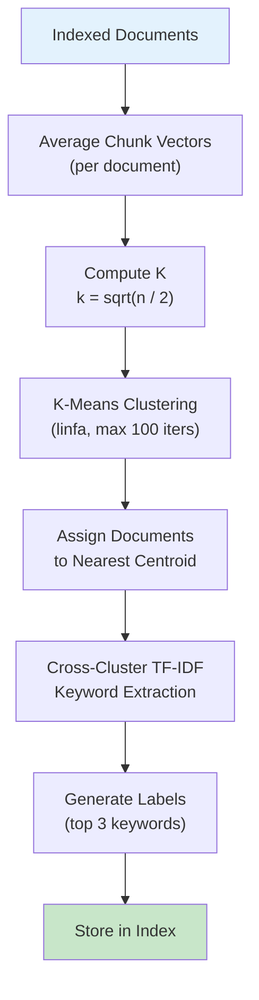

# Clustering

mdvdb groups your markdown files into **document-level clusters** using K-means on averaged chunk vectors. Each cluster receives auto-generated keywords and a human-readable label via cross-cluster TF-IDF analysis. Clustering helps you understand the thematic structure of your knowledge base and discover related documents.

## Overview



## Document-Level Vectors

Clustering operates on **document-level vectors**, not individual chunk vectors. Since each file may produce multiple chunks (split by headings), mdvdb computes a single representative vector per document by **averaging all chunk vectors** for that file.

```
Document Vector = mean(chunk_vector_1, chunk_vector_2, ..., chunk_vector_n)
```

This approach captures the overall theme of a document rather than the specifics of any single section. A document about "authentication" with sections on "JWT tokens", "OAuth", and "session management" produces a vector that represents the broad authentication topic.

### Zero-Norm Filtering

Documents whose averaged vector has zero norm (all components are zero) are excluded from clustering. This can happen if a file has no embeddable content or if embedding failed for all chunks.

## K-Means Algorithm

mdvdb uses the **K-means** algorithm from the [linfa](https://github.com/rust-ml/linfa) machine learning framework for clustering.

### How K-Means Works

1. **Initialize** -- K centroid positions are chosen (linfa uses the K-means++ initialization strategy for good starting positions).
2. **Assign** -- each document vector is assigned to its nearest centroid (by Euclidean distance).
3. **Update** -- each centroid is moved to the mean of its assigned document vectors.
4. **Repeat** -- steps 2-3 are repeated until convergence (centroid positions change by less than the tolerance) or the maximum iteration count is reached.

### Parameters

| Parameter | Value | Description |
|-----------|-------|-------------|
| Max iterations | 100 | Maximum number of assign-update cycles |
| Tolerance | 1e-4 | Convergence threshold for centroid movement |
| K (clusters) | `sqrt(n / 2)` | Number of clusters, computed from document count |

## Computing K (Number of Clusters)

The number of clusters is determined automatically using the formula:

```
k = floor(sqrt(n / 2))
```

Where `n` is the number of documents with valid (non-zero) vectors. The result is clamped to the range **[2, 50]**:

| Documents (n) | K (clusters) |
|---------------|-------------|
| 2-8 | 2 (minimum) |
| 18 | 3 |
| 32 | 4 |
| 50 | 5 |
| 200 | 10 |
| 800 | 20 |
| 2000 | 31 |
| 5000+ | 50 (maximum) |

This heuristic provides a reasonable number of clusters for most knowledge bases: enough to separate distinct topics, but not so many that clusters become meaninglessly small.

### Single Document

If only one document exists, it is placed in a single cluster with its own keywords and label. No K-means iteration is needed.

### Minimum Documents

K-means requires at least 2 documents to form clusters. With fewer valid vectors, clustering is skipped.

## Keyword Extraction

Each cluster is assigned **keywords** that describe its thematic content. Keywords are extracted using **cross-cluster TF-IDF**, which promotes terms that are distinctive to a specific cluster while down-weighting terms that appear broadly across many clusters.

### Cross-Cluster TF-IDF

Unlike standard TF-IDF (which operates over individual documents), cross-cluster TF-IDF operates at the **cluster level**:

1. **Tokenize** -- all documents in each cluster are tokenized on non-alphanumeric boundaries. Tokens are lowercased, and tokens shorter than 3 characters are removed.
2. **Remove stop words** -- common English stop words (a, the, is, etc.) are filtered out.
3. **Compute TF per cluster** -- the total occurrence count of each term across all documents in the cluster.
4. **Compute cross-cluster DF** -- for each term, count how many clusters contain it.
5. **Score** -- `TF-IDF = TF * ln(total_clusters / clusters_containing_term)`.
6. **Rank** -- terms are sorted by TF-IDF score, and the top 5 are selected as cluster keywords.

### Why Cross-Cluster TF-IDF?

Standard TF-IDF would favor terms that are common within a single document but rare across the corpus. Cross-cluster TF-IDF instead favors terms that are:

- **Common within the cluster** (high TF) -- the term appears frequently in the cluster's documents.
- **Rare across clusters** (high IDF) -- the term does not appear in many other clusters.

This produces keywords that genuinely distinguish one cluster from another, rather than generic terms that appear everywhere.

### Example

Consider three clusters:

| Cluster | Documents | Top Keywords |
|---------|-----------|-------------|
| 0 | `api/auth.md`, `api/tokens.md`, `api/oauth.md` | `authentication`, `tokens`, `oauth` |
| 1 | `guides/setup.md`, `guides/install.md`, `guides/config.md` | `installation`, `configuration`, `setup` |
| 2 | `notes/sprint-1.md`, `notes/sprint-2.md`, `notes/retro.md` | `sprint`, `retrospective`, `velocity` |

The term "documentation" might appear in all three clusters and would receive a low IDF score, keeping it out of the keyword lists. Meanwhile, "authentication" appears primarily in cluster 0, giving it a high IDF score there.

## Label Generation

Each cluster receives a **human-readable label** generated from its top keywords:

```
label = top_keyword_1 / top_keyword_2 / top_keyword_3
```

For example, a cluster with keywords `["authentication", "tokens", "oauth", "jwt", "session"]` receives the label:

```
authentication / tokens / oauth
```

If a cluster has no keywords (e.g., all content was filtered out as stop words), it receives the label `"Unlabeled"`.

## Cluster State

The clustering result is stored in the index as a `ClusterState` containing:

| Field | Description |
|-------|-------------|
| `clusters` | Array of cluster information (ID, label, centroid, members, keywords) |
| `docs_since_rebalance` | Number of documents added since the last full re-clustering |
| `docs_at_last_rebalance` | Total document count at the time of the last re-clustering |

Each cluster contains:

| Field | Type | Description |
|-------|------|-------------|
| `id` | Number | Cluster identifier (0-based) |
| `label` | String | Human-readable label (top 3 keywords joined by " / ") |
| `centroid` | Vector | Mean of all member document vectors |
| `members` | String[] | Relative file paths belonging to this cluster |
| `keywords` | String[] | Top 5 distinctive keywords via cross-cluster TF-IDF |

## Incremental Assignment

When new documents are ingested incrementally (without `--reindex`), they are assigned to the **nearest existing centroid** using cosine distance. This avoids re-running K-means on every ingest.

The `docs_since_rebalance` counter tracks how many documents have been incrementally assigned since the last full clustering pass.

## Rebalancing

Over time, incremental assignments may cause clusters to drift from their optimal configuration. When `docs_since_rebalance` exceeds the configured **rebalance threshold** (default: 50), a full re-clustering is triggered automatically during the next ingest.

### How Rebalancing Works

1. **Threshold check** -- during ingestion, if `docs_since_rebalance >= clustering_rebalance_threshold`, rebalancing is triggered.
2. **Full re-cluster** -- `cluster_all()` runs K-means over all current document vectors.
3. **Reset counter** -- `docs_since_rebalance` is reset to 0 and `docs_at_last_rebalance` is updated.

### When Does Rebalancing Happen?

Rebalancing is automatic and transparent. It happens during `mdvdb ingest` when the threshold is reached. You can also force a full re-cluster by re-indexing:

```bash
# Force full re-clustering
mdvdb ingest --reindex
```

## Viewing Clusters

Use the `mdvdb clusters` command to view the current cluster state:

```bash
# Human-readable output
mdvdb clusters

# JSON output
mdvdb clusters --json
```

### Human-Readable Output

```
Cluster 0: authentication / tokens / oauth
  - api/auth.md
  - api/tokens.md
  - api/oauth.md

Cluster 1: installation / configuration / setup
  - guides/setup.md
  - guides/install.md
  - guides/config.md

Cluster 2: sprint / retrospective / velocity
  - notes/sprint-1.md
  - notes/sprint-2.md
  - notes/retro.md
```

### JSON Output

```json
{
  "clusters": [
    {
      "id": 0,
      "label": "authentication / tokens / oauth",
      "keywords": ["authentication", "tokens", "oauth", "jwt", "session"],
      "members": ["api/auth.md", "api/tokens.md", "api/oauth.md"]
    },
    {
      "id": 1,
      "label": "installation / configuration / setup",
      "keywords": ["installation", "configuration", "setup", "environment", "dependencies"],
      "members": ["guides/setup.md", "guides/install.md", "guides/config.md"]
    }
  ]
}
```

## Edge Clustering

In addition to document clustering, mdvdb can cluster **semantic edge embeddings** (link relationship vectors). Edge clustering uses the same K-means approach but with:

- A separate K formula: `k = sqrt(n / 2)` clamped to **[2, 20]** (tighter upper bound than document clusters).
- A minimum of **4 edges** required before clustering is attempted.
- Keywords extracted from edge context paragraphs rather than full document text.
- Labels represent relationship types (e.g., "references / implements / extends").

Edge clustering is managed independently from document clustering and has its own rebalance threshold (`MDVDB_EDGE_CLUSTER_REBALANCE`, default: 50).

## Configuration

| Variable | Default | Description |
|----------|---------|-------------|
| `MDVDB_CLUSTERING_ENABLED` | `true` | Enable document-level K-means clustering. When `false`, the `clusters` command returns empty results and no cluster state is stored. |
| `MDVDB_CLUSTERING_REBALANCE_THRESHOLD` | `50` | Number of incrementally assigned documents before triggering a full re-clustering pass. Lower values keep clusters more accurate but increase ingestion time. |

### Setting Values

```bash
# In .markdownvdb/.config or environment
MDVDB_CLUSTERING_ENABLED=true
MDVDB_CLUSTERING_REBALANCE_THRESHOLD=50

# Disable clustering entirely
MDVDB_CLUSTERING_ENABLED=false

# More frequent rebalancing (tighter clusters, slower ingest)
MDVDB_CLUSTERING_REBALANCE_THRESHOLD=20
```

After changing clustering settings, re-ingest to apply:

```bash
mdvdb ingest --reindex
```

## See Also

- [mdvdb clusters](../commands/clusters.md) -- Clusters command reference
- [mdvdb ingest](../commands/ingest.md) -- Ingestion triggers clustering
- [Link Graph](./link-graph.md) -- Edge clustering and semantic edges
- [Embedding Providers](./embedding-providers.md) -- How document vectors are created
- [Search Modes](./search-modes.md) -- How search uses the index
- [Configuration](../configuration.md) -- All environment variables
