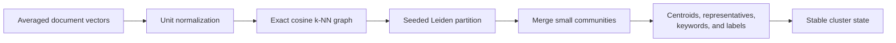

# Clustering

mdvdb provides two independent ways to organize indexed Markdown:

- **Automatic communities** discover structure without definitions. Leiden community detection is
  the default; seeded K-means remains available as a fallback.
- **Topics** are user-defined semantic groupings built from a description and seed phrases. A
  document can match multiple Topics or remain Unassigned.

Both layers use document-level embeddings and cosine similarity, but automatic communities do not
constrain Topic membership and Topics do not change the automatic partition.

## Document vectors

A Markdown file may produce several section chunks. mdvdb averages those chunk embeddings into one
document vector, then unit-normalizes the vector before clustering:

```text
document vector = normalize(mean(chunk vectors))
```

Zero-norm vectors cannot be compared by cosine similarity. Their paths are retained in the
automatic cluster state as `unclustered`, rather than being assigned arbitrarily.

## Leiden is the default

Leiden operates on a weighted similarity graph:


```mermaid
flowchart LR
    A["Averaged document vectors"] --> B["Unit normalization"]
    B --> C["Exact cosine k-NN graph"]
    C --> D["Seeded Leiden partition"]
    D --> E["Merge small communities"]
    E --> F["Centroids, representatives,<br/>keywords, and labels"]
    F --> G["Stable cluster state"]
```

For each document, mdvdb selects up to `clustering.knn` nearest neighbors. Positive cosine
similarities become edge weights; non-positive edges are dropped. Leiden partitions that graph
with the configured resolution, and undersized communities are folded into their strongest
connected or nearest positively similar neighbor where possible.

The implementation is deterministic for the same corpus and settings: paths are sorted, ties have
explicit ordering, and the clustering seed is fixed.

### Leiden controls

```yaml
# .markdownvdb/config.yaml
clustering:
  enabled: true
  algorithm: leiden
  knn: 15
  resolution: 1.0
  min_cluster_size: 2
  rebalance_threshold: 50
```

| Setting | Default | Range | Effect |
|---|---:|---:|---|
| `clustering.knn` | `15` | `2..64` | Maximum neighbors per document |
| `clustering.resolution` | `1.0` | `0.1..10.0` | Higher values generally produce finer communities |
| `clustering.min_cluster_size` | `2` | `1..50` | Merge smaller communities where a positive neighbor exists; `1` disables merging |
| `clustering.rebalance_threshold` | `50` | positive integer | New documents allowed before a full automatic rebalance |

The exact graph build is quadratic in document count. mdvdb warns above 20,000 clusterable
documents because the full pass may take longer.

### Labels, representatives, and hierarchy

Every automatic community stores:

- a unit-normalized centroid;
- sorted member paths;
- the member closest to the centroid as its representative;
- up to five distinctive keywords;
- a readable label built from up to three keywords.

Keyword ranking uses cross-community TF-IDF over filtered unigrams and adjacent bigrams. Terms
shared by many communities are down-weighted, while terms distinctive to one community rise.

When Leiden produces at least seven communities, mdvdb may derive one coarser parent level by
partitioning the aggregated community graph at lower resolution. The parent level is omitted when
that pass does not produce a useful coarsening.

Cluster IDs are opaque and need not be contiguous. During a rebalance, mdvdb matches new
communities to the previous state by member overlap so surviving communities can retain stable IDs
and, for strong matches, stable labels.

## K-means fallback

Select K-means when its fixed-centroid behavior better suits a corpus or for compatibility with an
existing workflow:

```yaml
clustering:
  algorithm: kmeans
  granularity: 1.0
```

The fallback is seeded and operates on the same unit-normalized document vectors. It computes:

```text
k = clamp(floor(sqrt(document_count * granularity / 2)), 2, 50)
```

`clustering.granularity` accepts `0.25..4.0`; higher values request more clusters. K-means uses
nearest-centroid incremental assignment and does not derive the Leiden parent hierarchy.

`granularity` does not affect Leiden document communities. It is also used by the separate
semantic-edge clustering layer, which continues to use K-means with a cluster-count cap of 20 and
a minimum of four edge embeddings.

## Incremental assignment and rebalancing

A full ingest creates the automatic partition. Single-file ingestion and watch mode can incorporate
later additions without re-running the entire algorithm:

- Leiden uses a weighted vote from the new document's nearest positive-similarity neighbors, with
  nearest-centroid assignment as a fallback.
- K-means assigns the document to the nearest centroid.

Centroids are updated incrementally. Once `clustering.rebalance_threshold` newly added documents
have accumulated through that fast path, ingest performs a full automatic rebalance and resets the
counter. Deletes and renames remove old memberships.

Changing the automatic algorithm or its clustering settings requires another ingest, but does not
require recomputing embeddings:

```bash
mdvdb config set clustering.algorithm leiden
mdvdb ingest
```

Use `mdvdb ingest --reindex` only when the embedding space itself changed or when you explicitly
want to rebuild everything.

## Topics

Topics are named semantic definitions, not another forced partition. Collection definitions live
under the historically named `clustering.custom` YAML key:

```yaml
clustering:
  topics:
    min_similarity: 0.30
  custom:
    - name: Reliability
      description: Incidents, recovery, and resilient system design
      seeds: [incident, rollback, failover]
      threshold: 0.35

    - name: Developer experience
      description: Tooling and workflows that make engineers productive
      seeds: [local setup, feedback loop]
```

A Topic needs a description, at least one seed, or both. mdvdb embeds the definition to build a
centroid:

- with both components, the description contributes 60% and the averaged seeds contribute 40%;
- with only one component, that component is used alone.

For each document and Topic:

```text
effective cutoff = max(topic.threshold, clustering.topics.min_similarity)
```

The document joins every Topic whose cosine similarity meets that cutoff. This is multi-label:
one document may appear in several Topics. A document below every cutoff appears in the explicit
Unassigned bucket. Membership similarity scores are persisted.

Manage definitions through the CLI so YAML writes are locked and atomic:

```bash
mdvdb clusters add Reliability \
  --description "Incidents, recovery, and resilient system design" \
  --seeds incident,rollback,failover \
  --threshold 0.35

mdvdb clusters list
mdvdb clusters update Reliability --threshold 0.40
mdvdb clusters remove Reliability
```

Run `mdvdb ingest` after adding or changing a Topic. A fingerprint covers the ordered definitions,
global threshold, embedding model, and dimensions; stale Topic centroids are not silently reused.

Inspect the computed layer separately from automatic communities:

```bash
mdvdb clusters --custom
mdvdb clusters unassigned
```

## Collection and Shard analysis

Without `--shard`, `mdvdb clusters` reads automatic communities and Topics for the whole
Collection:

```bash
mdvdb clusters
mdvdb clusters --custom --json
```

A Shard is a project-local recursive folder lens over the shared index. It computes independent
automatic communities from the same stored document vectors and owns its own Topic definitions:

```bash
mdvdb clusters --shard research
mdvdb clusters --shard research --custom
mdvdb clusters --shard research unassigned
```

Shard assignments do not inherit from the Collection, parent Shards, or sibling Shards. Shard
analysis is disposable cached state; it does not duplicate document embeddings or link topology.

## Disabling clustering

```yaml
clustering:
  enabled: false
```

This disables automatic document clustering. It does not remove Markdown, embeddings, lexical
search data, or the link graph.

## Related pages

- [`mdvdb clusters`](../commands/clusters.md) — inspect communities and manage Topics
- [`mdvdb shards`](../commands/shards.md) — manage project-local sub-collection lenses
- [`mdvdb graph`](../commands/graph.md) — render cluster and Topic metadata
- [`mdvdb ingest`](../commands/ingest.md) — refresh automatic and Topic analysis
- [Configuration](../configuration.md) — complete clustering YAML reference
- [Embedding Providers](./embedding-providers.md) — how document vectors are produced
