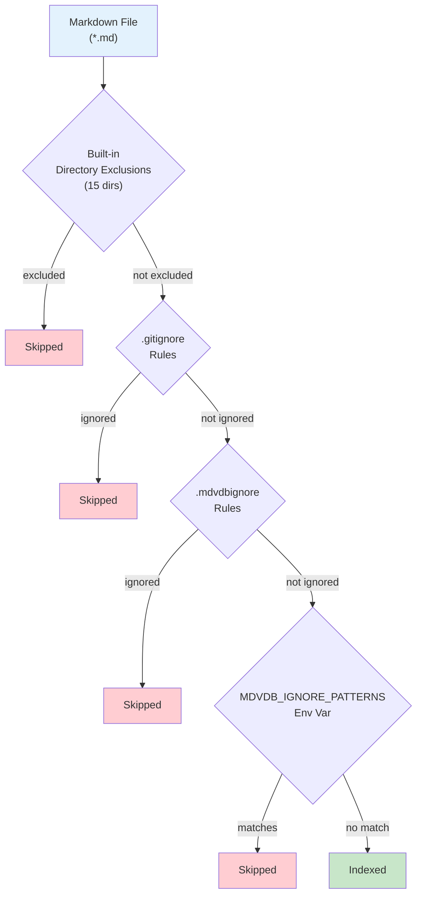

# Ignore Files

mdvdb uses a layered ignore system to control which markdown files are discovered and indexed. There are three layers of ignore rules, evaluated in order, plus a set of **15 built-in directory exclusions** that are always applied.

## Ignore Layers



### Layer 1: Built-in Directory Exclusions

mdvdb always excludes files under **15 directories** that are known to contain non-content files. These exclusions cannot be overridden:

| Directory | Purpose |
|-----------|---------|
| `.claude/` | Claude AI tool configuration |
| `.cursor/` | Cursor editor configuration |
| `.vscode/` | VS Code editor configuration |
| `.idea/` | JetBrains IDE configuration |
| `.git/` | Git version control metadata |
| `node_modules/` | Node.js dependencies |
| `.obsidian/` | Obsidian vault configuration |
| `__pycache__/` | Python bytecode cache |
| `.next/` | Next.js build output |
| `.nuxt/` | Nuxt.js build output |
| `.svelte-kit/` | SvelteKit build output |
| `target/` | Rust/Cargo build output |
| `dist/` | Distribution/build output |
| `build/` | Build output |
| `out/` | Output directory |

These directories are excluded regardless of depth. For example, `subdir/node_modules/readme.md` is excluded even though it is nested.

### Layer 2: `.gitignore` (Automatic)

mdvdb automatically respects your project's `.gitignore` file. Any file or directory ignored by git is also excluded from indexing. This uses the same `ignore` crate that powers `ripgrep`, ensuring full compatibility with `.gitignore` syntax including:

- Glob patterns (`*.tmp`, `docs/**/*.draft.md`)
- Directory patterns (`logs/`)
- Negation (`!important.md`)
- Comments (`# this is a comment`)
- Nested `.gitignore` files in subdirectories

You do not need to configure anything -- `.gitignore` rules are applied automatically whenever `mdvdb ingest` or `mdvdb watch` discovers files.

### Layer 3: `.mdvdbignore` (Index-Only Exclusions)

The `.mdvdbignore` file provides **index-specific exclusions** that do not affect git. This is useful when you have markdown files that are tracked by git but should not be indexed for search.

Create a `.mdvdbignore` file in your project root:

```bash
# .mdvdbignore

# Exclude draft documents
drafts/
*.draft.md

# Exclude meeting notes
meetings/

# Exclude auto-generated docs
generated/api-reference.md

# Exclude specific files
CHANGELOG.md
CONTRIBUTING.md
```

#### Syntax

`.mdvdbignore` uses **the same syntax as `.gitignore`**:

| Pattern | Matches |
|---------|---------|
| `drafts/` | All files under the `drafts/` directory |
| `*.draft.md` | Any file ending in `.draft.md` anywhere in the tree |
| `docs/internal/` | All files under `docs/internal/` |
| `CHANGELOG.md` | The file `CHANGELOG.md` (at any depth) |
| `!important.md` | Negation: do NOT ignore `important.md` even if a broader pattern would |
| `# comment` | Comment line (ignored) |

#### Use Cases

- **Exclude templated/boilerplate files** that pollute search results (e.g., `CHANGELOG.md`, `CONTRIBUTING.md`)
- **Exclude drafts or WIP documents** that are in git but not ready for search
- **Exclude generated documentation** that duplicates source content
- **Exclude meeting notes or personal notes** that you want in version control but not in the search index

### Layer 4: `MDVDB_IGNORE_PATTERNS` (Environment Variable)

For programmatic or temporary exclusions, use the `MDVDB_IGNORE_PATTERNS` environment variable. This accepts a **comma-separated list** of patterns:

```bash
# In .markdownvdb/.config or environment
MDVDB_IGNORE_PATTERNS=drafts/,*.wip.md,archive/

# Or as a shell variable
export MDVDB_IGNORE_PATTERNS="drafts/,*.wip.md,archive/"
```

Patterns are matched against the relative path of each file. A file is excluded if its relative path contains the pattern string (after stripping any leading `!` and trailing `/`).

## Evaluation Order

When mdvdb discovers files, all ignore layers are evaluated. A file is excluded if **any** layer matches:

1. **Built-in exclusions** -- checked first. If the file is under any of the 15 built-in directories, it is immediately excluded.
2. **`.gitignore`** -- the `ignore` crate's walker applies `.gitignore` rules during directory traversal, so ignored files are never even visited.
3. **`.mdvdbignore`** -- after the walker yields a file, `.mdvdbignore` patterns are checked.
4. **`MDVDB_IGNORE_PATTERNS`** -- finally, the env var patterns are checked against the relative path.

## Source Directories

By default, mdvdb scans the entire project root (`.`) for markdown files. You can restrict scanning to specific directories using `MDVDB_SOURCE_DIRS`:

```bash
# Only scan specific directories
MDVDB_SOURCE_DIRS=docs,notes,wiki

# Scan multiple directories (comma-separated)
MDVDB_SOURCE_DIRS=src/docs,content
```

This setting controls **where** mdvdb looks for files. The ignore layers then control **which** files within those directories are indexed.

## File Watcher Integration

The same ignore rules apply to the file watcher (`mdvdb watch`). When a filesystem event occurs, the watcher checks:

1. Does the file have a `.md` extension?
2. Is the file under a built-in excluded directory?
3. Does the file match any `MDVDB_IGNORE_PATTERNS`?
4. Does the file match any `.mdvdbignore` patterns?

Only files passing all checks trigger re-indexing.

## Examples

### Typical Project Setup

```
my-project/
  .gitignore           # Already ignores: node_modules/, *.tmp, .env
  .mdvdbignore         # Index-specific: drafts/, CHANGELOG.md
  .markdownvdb/.config # MDVDB_IGNORE_PATTERNS=archive/
  docs/
    guide.md           # Indexed
    api.md             # Indexed
    internal/
      notes.md         # Indexed (unless .mdvdbignore excludes internal/)
  drafts/
    wip.md             # Excluded by .mdvdbignore
  archive/
    old-design.md      # Excluded by MDVDB_IGNORE_PATTERNS
  node_modules/
    package/readme.md  # Excluded by built-in rules
  CHANGELOG.md         # Excluded by .mdvdbignore
  README.md            # Indexed
```

### Checking What Gets Indexed

Use `mdvdb tree` to see which files mdvdb is aware of and their sync status:

```bash
# See all discovered files
mdvdb tree

# Check a specific directory
mdvdb tree --path docs/
```

Use `mdvdb ingest --preview` to see what would be ingested without actually doing it:

```bash
mdvdb ingest --preview
```

### Debugging Ignore Rules

If a file is unexpectedly excluded or included, check:

1. **Is it under a built-in excluded directory?** Check the 15-directory list above.
2. **Is it in `.gitignore`?** Run `git status` or `git check-ignore <path>`.
3. **Is it in `.mdvdbignore`?** Check the `.mdvdbignore` file in your project root.
4. **Does `MDVDB_IGNORE_PATTERNS` match?** Run `mdvdb config` to see the resolved configuration.
5. **Is it outside `MDVDB_SOURCE_DIRS`?** If source dirs are configured, files outside those directories are not scanned.

## Configuration Reference

| Variable | Default | Description |
|----------|---------|-------------|
| `MDVDB_SOURCE_DIRS` | `.` | Comma-separated list of directories to scan for markdown files |
| `MDVDB_IGNORE_PATTERNS` | *(empty)* | Comma-separated list of additional ignore patterns |

## See Also

- [mdvdb ingest](../commands/ingest.md) -- Ingest command that discovers and indexes files
- [mdvdb tree](../commands/tree.md) -- View discovered files and sync status
- [mdvdb watch](../commands/watch.md) -- File watcher uses the same ignore rules
- [Index Storage](./index-storage.md) -- Where indexed files are stored
- [Configuration](../configuration.md) -- All environment variables
