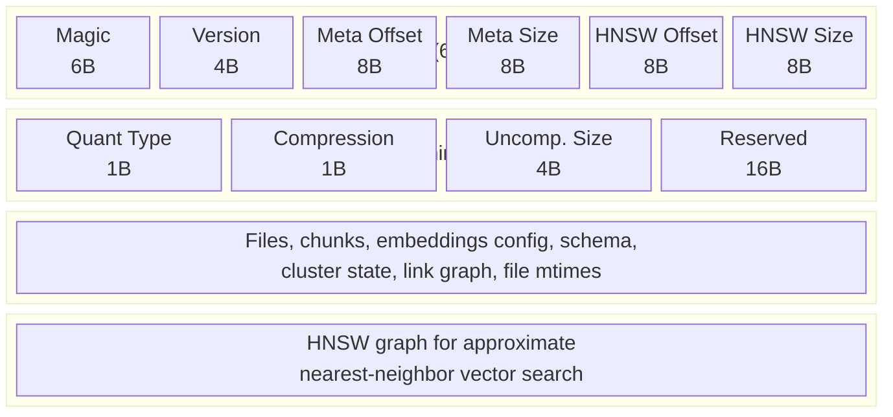
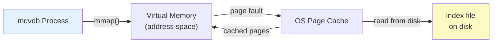

# Index Storage

mdvdb stores all index data in a `.markdownvdb/` directory at the project root. This directory contains a binary index file for vector search and metadata, plus a full-text search directory for lexical search. The index is designed for fast loading via memory mapping and safe updates via atomic writes.

## Directory Structure

```
.markdownvdb/
  .config              # Project configuration (dotenv format)
  index                # Binary index file (vectors + metadata)
  fts/                 # Full-text search directory (Tantivy segments)
    meta.json          # Tantivy meta file
    *.managed.json     # Segment metadata
    *.store            # Stored fields
    *.idx              # Inverted index segments
    *.pos              # Position data
    *.term             # Term dictionary
    *.fast             # Fast fields (columnar data)
```

### `index` (Binary Index File)

The main index file contains all vector embeddings and document metadata in a single binary file. It uses a custom format with three regions: a fixed header, an rkyv-serialized metadata region, and a usearch HNSW graph.

### `fts/` (Full-Text Search Directory)

The FTS directory contains a [Tantivy](https://github.com/quickwit-oss/tantivy) full-text search index. Tantivy uses a segment-based architecture similar to Lucene, with BM25 scoring for lexical search. This directory is managed entirely by Tantivy and is rebuilt during ingestion.

### `.config` (Project Configuration)

The `.config` file uses dotenv syntax to store project-level configuration. See [Configuration](../configuration.md) for details.

## Binary Index Format

The `index` file uses a custom binary format optimized for memory-mapped loading:



### Header Layout (64 Bytes)

| Offset | Size | Field | Description |
|--------|------|-------|-------------|
| 0 | 6 | Magic | `MDVDB\0` -- identifies the file format |
| 6 | 4 | Version | Format version (currently `1`), little-endian u32 |
| 10 | 8 | Meta Offset | Byte offset to the rkyv metadata region, little-endian u64 |
| 18 | 8 | Meta Size | Size of the (possibly compressed) metadata region in bytes |
| 26 | 8 | HNSW Offset | Byte offset to the usearch HNSW region |
| 34 | 8 | HNSW Size | Size of the HNSW region in bytes |
| 42 | 1 | Quantization | Vector quantization type: `0` = F32, `1` = F16 |
| 43 | 1 | Compression | Metadata compression: `0x01` = zstd, `0x00` = none |
| 44 | 4 | Uncompressed Size | Original uncompressed size of metadata (for zstd decompression) |
| 48 | 16 | Reserved | Reserved for future use (zero-filled) |

### rkyv Metadata Region

The metadata region contains all document and chunk data, serialized using [rkyv](https://rkyv.org/) for zero-copy deserialization. When loaded via memory mapping, metadata fields can be accessed directly from the mapped memory without full deserialization.

The metadata includes:

| Field | Description |
|-------|-------------|
| `chunks` | Map from chunk ID (e.g., `"path.md#0"`) to stored chunk data (content, headings, line ranges) |
| `files` | Map from relative file path to stored file data (content hash, frontmatter, file size, chunk IDs) |
| `embedding_config` | Provider name, model name, and vector dimensions used to build this index |
| `last_updated` | Unix timestamp (seconds since epoch) of the last index save |
| `schema` | Auto-inferred metadata schema (field names, types, value distributions) |
| `cluster_state` | K-means cluster assignments and centroids |
| `link_graph` | Extracted links between documents (outgoing, incoming, edge data) |
| `file_mtimes` | File modification timestamps for time decay scoring |
| `scoped_schemas` | Path-scoped schemas for directory-level metadata inference |

When `MDVDB_INDEX_COMPRESSION` is `true` (the default), the metadata region is compressed with **zstd** at level 3 before writing. This typically reduces the metadata size by 60-80%. The uncompressed size is stored in the header so the decompressor knows how much memory to allocate.

### usearch HNSW Region

The HNSW (Hierarchical Navigable Small World) region contains the vector index for approximate nearest-neighbor search. It is serialized by the `usearch` library and loaded directly from the memory-mapped file.

Key HNSW parameters (set at index creation):

| Parameter | Value | Description |
|-----------|-------|-------------|
| Metric | Cosine | Distance metric for vector comparison |
| Connectivity | 16 | Maximum number of edges per node in the graph |
| Expansion (add) | 128 | Search width when inserting vectors |
| Expansion (search) | 64 | Search width when querying vectors |

### Vector Quantization

Vectors can be stored in two precisions, controlled by `MDVDB_VECTOR_QUANTIZATION`:

| Type | Bytes per Dimension | Memory (1536-dim) | Description |
|------|--------------------|--------------------|-------------|
| **F16** (default) | 2 | ~3 KB/vector | Half-precision float. Good balance of accuracy and size. |
| **F32** | 4 | ~6 KB/vector | Full-precision float. Maximum accuracy, double the memory. |

F16 quantization halves memory usage with negligible impact on search quality for most use cases.

## Memory Mapping

mdvdb loads the index file using **memory mapping** (`memmap2`). Instead of reading the entire file into memory, the operating system maps the file into the process's virtual address space. Pages are loaded on demand by the OS page cache.

### Benefits

- **Fast startup** -- opening a large index is nearly instantaneous because no data is copied.
- **Low memory usage** -- only pages that are actually accessed are loaded into physical memory.
- **OS-managed caching** -- the operating system manages the page cache, automatically evicting pages under memory pressure.
- **Shared across processes** -- multiple mdvdb processes reading the same index share physical memory pages.

### How It Works



1. `memmap2::Mmap::map()` creates a memory-mapped view of the index file.
2. The header is read to locate the metadata and HNSW regions.
3. When metadata or HNSW data is accessed, the OS transparently loads the relevant pages from disk into the page cache.
4. Subsequent accesses to the same pages hit the cache without disk I/O.

## Atomic Writes

Index writes are **atomic** to prevent corruption from crashes or interrupts:

1. **Write to `.tmp`** -- all data is written to `index.tmp` (the index path with a `.tmp` extension).
2. **fsync** -- `file.sync_all()` ensures all data is flushed to the storage device.
3. **Rename** -- `fs::rename("index.tmp", "index")` atomically replaces the old index with the new one.

This pattern ensures that the `index` file is always either the complete old version or the complete new version -- never a partially written state. If the process crashes during step 1 or 2, the `.tmp` file is left behind (and overwritten on the next ingest), but the existing `index` file remains intact.

### Why This Matters

- **Crash safety** -- a power failure or process kill during ingestion does not corrupt the index.
- **Read safety** -- other processes reading the index via memory mapping see a consistent snapshot.
- **No locking required** -- the rename operation is atomic on all supported platforms (Linux, macOS, Windows NTFS).

## Concurrency

At runtime, the index is protected by a `parking_lot::RwLock`:

| Operation | Lock Type | Description |
|-----------|-----------|-------------|
| Search queries | Read lock | Multiple queries can run concurrently |
| Ingestion | Write lock | Exclusive access during index updates |
| Status / Schema / Clusters | Read lock | Read-only access to metadata |

`parking_lot::RwLock` is preferred over `std::sync::RwLock` for its superior performance in read-heavy workloads (no syscalls for uncontended read locks).

## Configuration

| Variable | Default | Description |
|----------|---------|-------------|
| `MDVDB_INDEX_DIR` | `.markdownvdb` | Directory for index files (relative to project root) |
| `MDVDB_VECTOR_QUANTIZATION` | `f16` | Vector precision: `f16` or `f32` |
| `MDVDB_INDEX_COMPRESSION` | `true` | Enable zstd compression of metadata region |

## Index Lifecycle

### Creation

An index is created on the first `mdvdb ingest` run. The `.markdownvdb/` directory is created automatically if it does not exist. Running `mdvdb init` creates the `.markdownvdb/.config` file but does not create the index itself.

### Updates

Incremental ingestion (`mdvdb ingest`) updates the index:

1. Discovers all markdown files (applying ignore rules).
2. Compares SHA-256 content hashes against the existing index.
3. Re-embeds only changed files.
4. Writes the updated index atomically.

### Full Rebuild

`mdvdb ingest --reindex` forces a complete rebuild:

1. Discards all existing embeddings.
2. Re-chunks and re-embeds every file.
3. Writes a fresh index.

This is necessary when changing embedding providers, models, dimensions, or chunk settings.

### Deletion

To delete the index and start fresh:

```bash
rm -rf .markdownvdb/
mdvdb init         # Re-create config
mdvdb ingest       # Rebuild index from scratch
```

## Diagnostics

Use `mdvdb doctor` to check the health of your index:

```bash
mdvdb doctor
```

Doctor checks include:
- Index file exists and is readable
- Magic bytes and version are valid
- Metadata can be deserialized
- Embedding provider is reachable
- Vector dimensions match configuration
- FTS index is accessible

Use `mdvdb status` to see index statistics:

```bash
mdvdb status
```

This shows document count, chunk count, vector count, file size, last updated timestamp, and embedding configuration.

## See Also

- [mdvdb ingest](../commands/ingest.md) -- Build or update the index
- [mdvdb status](../commands/status.md) -- View index statistics
- [mdvdb doctor](../commands/doctor.md) -- Diagnose index issues
- [Chunking](./chunking.md) -- How files are chunked before indexing
- [Embedding Providers](./embedding-providers.md) -- How chunks are embedded
- [Search Modes](./search-modes.md) -- How the index is queried
- [Configuration](../configuration.md) -- All environment variables
