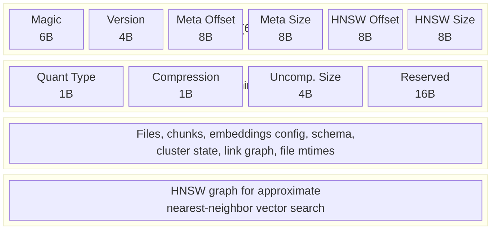
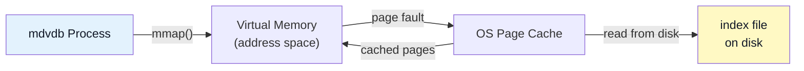

# Index Storage

mdvdb keeps project configuration and generated local state in `.markdownvdb/`. The primary
binary index stores vectors and metadata, Tantivy owns the lexical index, and disposable sidecars
hold Shard-local analysis. The primary index is designed for fast memory-mapped loading and safe
replacement through atomic writes.

## Directory Structure

```
.markdownvdb/
  config.yaml          # Project settings (YAML; keep this)
  .env                 # Optional project secrets (keep this private)
  index                # Binary index file (vectors + metadata)
  fts/                 # Full-text search directory (Tantivy segments)
    meta.json          # Tantivy meta file
    *.managed.json     # Segment metadata
    *.store            # Stored fields
    *.idx              # Inverted index segments
    *.pos              # Position data
    *.term             # Term dictionary
    *.fast             # Fast fields (columnar data)
  cache/
    shards/*.json      # Disposable Shard-local communities and Topics
  modules.lock         # Cross-process computed-module coordination
```

### `index` (Binary Index File)

The main index file contains document and semantic-edge vectors plus indexed document metadata.
It uses a custom format with three regions: a fixed header, an rkyv-serialized metadata region,
and a usearch HNSW graph. The lexical index and Shard sidecars remain separate.

### `fts/` (Full-Text Search Directory)

The FTS directory contains a [Tantivy](https://github.com/quickwit-oss/tantivy) full-text search index. Tantivy uses a segment-based architecture similar to Lucene, with BM25 scoring for lexical search. This directory is managed entirely by Tantivy and is rebuilt during ingestion.

### `config.yaml` and `.env`

`config.yaml` stores non-secret project settings. `.env` stores optional project credentials.
Computed-field declarations live separately in `.markdownvdb.schema.yml` at the collection root.
See [Configuration](../configuration.md) and [Computed Fields](./computed-fields.md).

## Binary Index Format

The `index` file uses a custom binary format optimized for memory-mapped loading:


```mermaid
block-beta
    columns 1
    block:HEADER["Header (64 bytes)"]
        columns 6
        A["Magic<br/>6B"] B["Version<br/>4B"] C["Meta Offset<br/>8B"] D["Meta Size<br/>8B"] E["HNSW Offset<br/>8B"] F["HNSW Size<br/>8B"]
    end
    block:EXT["Extension Fields (within header bytes 42-63)"]
        columns 4
        G["Quant Type<br/>1B"] H["Compression<br/>1B"] I["Uncomp. Size<br/>4B"] J["Reserved<br/>16B"]
    end
    block:META["rkyv Metadata Region (variable size)"]
        columns 1
        K["Files, chunks, embeddings config, schema,<br/>cluster state, link graph, file mtimes"]
    end
    block:HNSW["usearch HNSW Region (variable size)"]
        columns 1
        L["HNSW graph for approximate<br/>nearest-neighbor vector search"]
    end
```

### Header Layout (64 Bytes)

| Offset | Size | Field | Description |
|--------|------|-------|-------------|
| 0 | 6 | Magic | `MDVDB\0` -- identifies the file format |
| 6 | 4 | Version | Format version (currently `1`), little-endian u32 |
| 10 | 8 | Meta Offset | Byte offset to the rkyv metadata region, little-endian u64 |
| 18 | 8 | Meta Size | Size of the (possibly compressed) metadata region in bytes |
| 26 | 8 | HNSW Offset | Byte offset to the usearch HNSW region |
| 34 | 8 | HNSW Size | Size of the HNSW region in bytes |
| 42 | 1 | Quantization | Vector quantization type: `0` = F32, `1` = F16 |
| 43 | 1 | Compression | Metadata compression: `0x01` = zstd, `0x00` = none |
| 44 | 4 | Uncompressed Size | Original uncompressed size of metadata (for zstd decompression) |
| 48 | 16 | Reserved | Reserved for future use (zero-filled) |

### rkyv Metadata Region

The metadata region contains document and chunk data serialized with
[rkyv](https://rkyv.org/). mdvdb validates and deserializes that region when opening the index.

The metadata includes:

| Field | Description |
|-------|-------------|
| `chunks` | Map from chunk ID (e.g., `"path.md#0"`) to stored chunk data (content, headings, line ranges) |
| `files` | Map from relative file path to stored file data (content hashes, frontmatter, file size, chunk IDs, computed-field bookkeeping) |
| `embedding_config` | Provider name, model name, and vector dimensions used to build this index |
| `last_updated` | Unix timestamp (seconds since epoch) of the last index save |
| `schema` | Auto-inferred metadata schema (field names, types, value distributions) |
| `cluster_state` | Automatic community assignments (Leiden by default; K-means optional) |
| `custom_cluster_state` | Multi-label user Topic definitions, centroids, and memberships |
| `link_graph` | Extracted links between documents (outgoing, incoming, edge data) |
| `file_mtimes` | File modification timestamps for time decay scoring |
| `scoped_schemas` | Path-scoped schemas for directory-level metadata inference |

When `MDVDB_INDEX_COMPRESSION` is `true` (the default), the metadata region is compressed with **zstd** at level 3 before writing. This typically reduces the metadata size by 60-80%. The uncompressed size is stored in the header so the decompressor knows how much memory to allocate.

### usearch HNSW Region

The HNSW (Hierarchical Navigable Small World) region contains the vector index for approximate
nearest-neighbor search. It is serialized and loaded by `usearch`.

Key HNSW parameters (set at index creation):

| Parameter | Value | Description |
|-----------|-------|-------------|
| Metric | Cosine | Distance metric for vector comparison |
| Connectivity | 16 | Maximum number of edges per node in the graph |
| Expansion (add) | 128 | Search width when inserting vectors |
| Expansion (search) | 64 | Search width when querying vectors |

### Vector Quantization

Vectors can be stored in two precisions, controlled by `MDVDB_VECTOR_QUANTIZATION`:

| Type | Bytes per Dimension | Memory (1536-dim) | Description |
|------|--------------------|--------------------|-------------|
| **F16** (default) | 2 | ~3 KB/vector | Half-precision float. Good balance of accuracy and size. |
| **F32** | 4 | ~6 KB/vector | Full-precision float. Maximum accuracy, double the memory. |

F16 quantization halves memory usage with negligible impact on search quality for most use cases.

## Memory Mapping

mdvdb opens the binary index through **memory mapping** (`memmap2`) so its regions can be
validated and handed to the metadata and HNSW decoders without a separate whole-file read.

### Benefits

- **Efficient file access** -- the OS can page the mapped index regions as they are read.
- **OS-managed caching** -- the operating system manages the page cache, automatically evicting pages under memory pressure.
- **Shared file cache** -- multiple processes can benefit from the operating system's cached pages.

### How It Works


```mermaid
flowchart LR
    PROCESS["mdvdb Process"] -->|"mmap()"| VM["Virtual Memory<br/>(address space)"]
    VM -->|"page fault"| CACHE["OS Page Cache"]
    CACHE -->|"read from disk"| DISK["index file<br/>on disk"]
    CACHE -->|"cached pages"| VM

    style PROCESS fill:#e3f2fd,color:#111827
    style DISK fill:#fff9c4,color:#111827
```

1. `memmap2::Mmap::map()` creates a memory-mapped view of the index file.
2. The header is read to locate the metadata and HNSW regions.
3. The metadata and HNSW regions are validated and decoded by their respective loaders.
4. Subsequent accesses to the same pages hit the cache without disk I/O.

## Atomic Writes

Index writes are **atomic** to prevent corruption from crashes or interrupts:

1. **Write to `.tmp`** -- all data is written to `index.tmp` (the index path with a `.tmp` extension).
2. **fsync** -- `file.sync_all()` ensures all data is flushed to the storage device.
3. **Rename** -- `fs::rename("index.tmp", "index")` atomically replaces the old index with the new one.

This pattern ensures that the `index` file is always either the complete old version or the complete new version -- never a partially written state. If the process crashes during step 1 or 2, the `.tmp` file is left behind (and overwritten on the next ingest), but the existing `index` file remains intact.

### Why This Matters

- **Crash safety** -- a power failure or process kill during ingestion does not corrupt the index.
- **Read safety** -- other processes reading the index via memory mapping see a consistent snapshot.
- **Coordinated mutations** -- atomic replacement prevents partial generations; mdvdb also uses
  project lock files to coordinate cross-process index and computed-module writes.

## Concurrency

At runtime, the index is protected by a `parking_lot::RwLock`:

| Operation | Lock Type | Description |
|-----------|-----------|-------------|
| Search queries | Read lock | Multiple queries can run concurrently |
| Ingestion | Write lock | Exclusive access during index updates |
| Status / Schema / Clusters | Read lock | Read-only access to metadata |

`parking_lot::RwLock` is preferred over `std::sync::RwLock` for its superior performance in read-heavy workloads (no syscalls for uncontended read locks).

## Configuration

| YAML key | Shell override | Default | Description |
|----------|----------------|---------|-------------|
| `index.quantization` | `MDVDB_VECTOR_QUANTIZATION` | `f16` | Vector precision: `f16` or `f32` |
| `index.compression` | `MDVDB_INDEX_COMPRESSION` | `true` | Enable zstd compression of metadata region |

## Index Lifecycle

### Creation

An index is created on the first `mdvdb ingest` run. The `.markdownvdb/` directory is created
automatically if it does not exist. Running `mdvdb init` creates
`.markdownvdb/config.yaml` but does not create the index itself.

### Updates

Incremental ingestion (`mdvdb ingest`) updates the index:

1. Discovers all markdown files (applying ignore rules).
2. Compares SHA-256 content hashes against the existing index.
3. Re-embeds only changed files.
4. Writes the updated index atomically.

### Full Rebuild

`mdvdb ingest --reindex` forces a complete rebuild:

1. Discards all existing embeddings.
2. Re-chunks and re-embeds every file.
3. Writes a fresh index.

This is necessary when changing embedding providers, models, dimensions, or chunk settings.

### Safe rebuild

Rebuild generated vector, metadata, lexical, community, and Topic state without deleting project
configuration or secrets:

```bash
mdvdb ingest --reindex
```

## Diagnostics

Use `mdvdb doctor` to check the health of your index:

```bash
mdvdb doctor
```

Doctor returns nine named checks:

| Check | What it reports |
|-------|-----------------|
| **Config loaded** | Active provider, model, and dimensions after configuration resolution |
| **User config** | Whether `~/.mdvdb/config.yaml` (or the `MDVDB_CONFIG_HOME` equivalent) exists |
| **Project config** | Whether the project `.markdownvdb/` directory exists |
| **API key** | Explicit OpenAI key presence; other provider credentials are exercised when the provider is constructed |
| **Provider reachable** | Result of a test embedding request with a five-second timeout |
| **Index** | Empty, healthy, or mismatched counts; healthy means `vector_count == chunk_count + edge_count` |
| **Source directories** | Discovered source directories and Markdown file count, or the discovery error |
| **Relations** | Dangling Relation targets, unused overlay target folders, and the unquoted-`[[...]]` YAML footgun |
| **Shards** | Invalid definitions, missing Shard folders, and malformed local Topic definitions |

Relations and Shards report repairable content/configuration problems as warnings. Some corrupt or
incompatible storage failures can prevent the project from opening before a `DoctorResult` is
produced; they are not separate doctor checks.

Use `mdvdb status` to see index statistics:

```bash
mdvdb status
```

This shows document, chunk, total-vector, and semantic-edge counts; file size and last-update time;
the stored embedding configuration; and whether the runtime embedding space is compatible. JSON
also exposes `reindex_required` and an actionable compatibility reason when present.

## See Also

- [mdvdb ingest](../commands/ingest.md) -- Build or update the index
- [mdvdb status](../commands/status.md) -- View index statistics
- [mdvdb doctor](../commands/doctor.md) -- Diagnose index issues
- [Chunking](./chunking.md) -- How files are chunked before indexing
- [Embedding Providers](./embedding-providers.md) -- How chunks are embedded
- [Search Modes](./search-modes.md) -- How the index is queried
- [Configuration](../configuration.md) -- All environment variables
