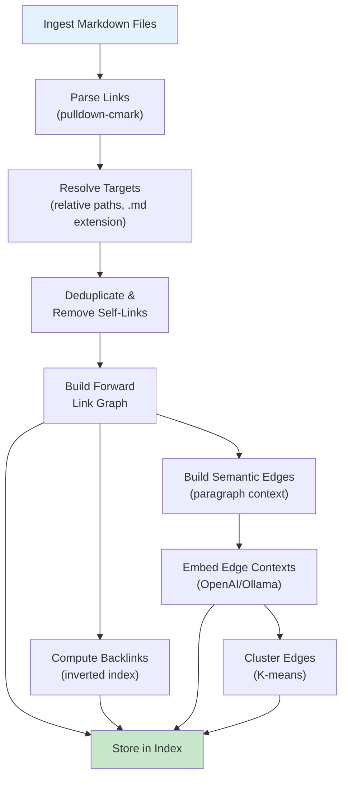
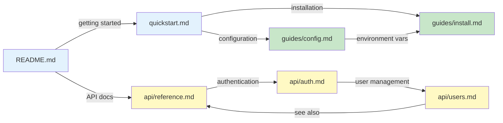
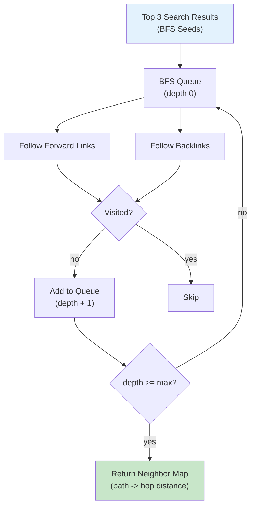

# Link Graph

mdvdb automatically extracts links from your markdown files, builds a directed link graph, and uses it to enhance search results. The link graph powers backlink discovery, orphan detection, multi-hop search boosting, graph context expansion, and semantic edge embeddings.

## Overview

When files are ingested, mdvdb parses every Markdown link (`[text](target.md)`) and wikilink (`[[target]]`) to build a graph of relationships between documents. This graph is stored in the index and used during search to boost related documents and expand results with contextual information from linked files.



## Link Extraction

During ingestion, mdvdb uses `pulldown-cmark` to identify all links in each markdown file. Both standard Markdown links and wikilinks are supported:

| Syntax | Example | Type |
|--------|---------|------|
| Standard link | `[user guide](./guide.md)` | Markdown |
| Link with fragment | `[setup](guide.md#installation)` | Markdown (fragment stripped) |
| Wikilink | `[[guide]]` | Wikilink |
| Relative path | `[API](../api/reference.md)` | Markdown |

### Link Resolution

Raw link targets are resolved relative to the source file's directory:

1. **Strip fragments** -- `guide.md#installation` becomes `guide.md`.
2. **Normalize separators** -- backslashes are converted to forward slashes.
3. **Resolve relative paths** -- `.` and `..` components are resolved without filesystem access.
4. **Ensure `.md` extension** -- if the target does not end in `.md`, the extension is appended.

For example, a link `[ref](../api/auth)` in `docs/guides/setup.md` resolves to `docs/api/auth.md`.

### Deduplication

Within a single file, duplicate links to the same target are deduplicated -- only the first occurrence is kept. Self-links (a file linking to itself) are excluded entirely.

## The Link Graph

The link graph is a directed graph where:

- **Nodes** are markdown files (identified by relative path).
- **Edges** are links from one file to another.

The graph is stored as a **forward adjacency map**: for each source file, a list of `LinkEntry` records containing the target path, link text, line number, and whether it was a wikilink.

### Sample Link Graph



In this example:
- `README.md` links to `quickstart.md` and `api/reference.md`
- `quickstart.md` links to `guides/config.md` and `guides/install.md`
- `api/auth.md` links to `api/users.md`, and `api/users.md` links back to `api/reference.md`
- `guides/config.md` and `guides/install.md` are interconnected

## Backlinks

Backlinks are the inverse of the forward link graph. If file A links to file B, then B has a backlink from A. mdvdb computes backlinks automatically by inverting the forward adjacency map.

### How Backlinks Work

```
Forward:   quickstart.md  -->  guides/config.md
Backlink:  guides/config.md  <--  quickstart.md
```

Backlinks are computed on-the-fly from the stored forward graph. They are used for:

- **`mdvdb backlinks <file>`** -- list all files that link to a given file.
- **BFS traversal** -- backlinks are traversed alongside forward links during multi-hop search.
- **Orphan detection** -- a file with no forward links AND no backlinks is an orphan.

### Querying Links

Use the CLI to inspect a file's links:

```bash
# Show outgoing and incoming links for a file
mdvdb links docs/guide.md

# Show only backlinks (incoming links)
mdvdb backlinks docs/guide.md

# JSON output
mdvdb links docs/guide.md --json
```

Each outgoing link is classified as **Valid** (target exists in the index) or **Broken** (target not found).

## Orphan Detection

An orphan file has **no outgoing links and no incoming links** -- it is completely disconnected from the rest of the knowledge base. Orphans may indicate forgotten or uncategorized content.

```bash
# List all orphan files
mdvdb orphans

# JSON output
mdvdb orphans --json
```

## Multi-Hop BFS Traversal

The link graph enables **multi-hop Breadth-First Search (BFS)** to discover files related to search results. BFS traverses both forward links and backlinks simultaneously, building a set of neighboring files at configurable depth.

### How BFS Works

1. **Seed selection** -- the top 3 search results are used as BFS seeds.
2. **Initialization** -- seeds are added to the visited set and the BFS queue at depth 0.
3. **Expansion** -- for each node in the queue, discover all forward links and backlinks that have not been visited. Add each newly discovered file at depth + 1.
4. **Termination** -- stop when the queue is empty or the maximum depth is reached.
5. **Output** -- a map from discovered file path to its minimum hop distance from any seed.



### Depth Clamping

The maximum BFS depth is clamped to **1-3 hops**. This prevents runaway traversal in densely linked knowledge bases while still discovering meaningful relationships:

| Hops | Reach | Use Case |
|------|-------|----------|
| 1 | Direct neighbors only | Conservative boosting, tightly related files |
| 2 | Neighbors of neighbors | Moderate exploration, thematic clusters |
| 3 | Three degrees of separation | Broad discovery, loosely related content |

### Cycle Safety

BFS uses a **visited set** to prevent infinite loops. Each file is visited at most once, and only the minimum hop distance is recorded. Seeds are excluded from the output.

## Link Boosting

When link boosting is enabled, search results that are **graph neighbors** of top results receive a score boost. This promotes documents that are structurally related to the most relevant results.

### How Link Boosting Works

1. **Run search** -- perform the normal search pipeline (hybrid, semantic, or lexical).
2. **BFS from top results** -- take the top 3 results as seeds and run BFS at the configured hop depth.
3. **Boost neighbors** -- for each remaining search result that appears in the BFS neighbor map, increase its score based on hop distance. Closer neighbors get a larger boost.
4. **Re-sort** -- results are re-sorted by boosted score.

### Semantic Edge Boosting

When edge embeddings are enabled, the link boost also considers **semantic edge similarity**. For each neighbor found via BFS, the system checks if there is a semantic edge whose embedding is similar to the query vector. If so, an additional weighted boost is applied based on the edge cosine similarity, scaled by `MDVDB_EDGE_BOOST_WEIGHT`.

### Enabling Link Boosting

```bash
# Enable link boosting for a single query
mdvdb search --boost-links "authentication patterns"

# With 2-hop depth
mdvdb search --boost-links --hops 2 "authentication patterns"

# Disable link boosting (if enabled by default in config)
mdvdb search --no-boost-links "authentication patterns"
```

## Graph Context Expansion

Graph context expansion fetches chunks from **linked files** and includes them as supplementary context alongside the main search results. This is useful for AI agents that need surrounding context from related documents.

### How Expansion Works

1. **Run search and link boost** -- the normal pipeline runs first.
2. **BFS from top results** -- expand the graph at the configured depth.
3. **Fetch chunks** -- for each neighboring file found via BFS, retrieve its highest-scoring chunks.
4. **Append as context** -- the expanded chunks are returned in the `graph_context` array, separate from the main `results` array.

### Expansion Depth and Limit

- **Depth** (`--expand-graph <N>`) -- how many hops to follow from top results. Range: 0-3. Default: 0 (disabled).
- **Limit** (`MDVDB_SEARCH_EXPAND_LIMIT`) -- maximum number of expanded context items. Range: 1-10. Default: 3.

```bash
# Expand graph context by 1 hop
mdvdb search --expand-graph 1 "authentication"

# Combine with link boosting
mdvdb search --boost-links --expand-graph 2 "authentication"
```

### JSON Output with Graph Context

```json
{
  "results": [
    {
      "score": 0.92,
      "file": { "path": "docs/auth.md" },
      "chunk": { "content": "Authentication uses JWT tokens..." }
    }
  ],
  "graph_context": [
    {
      "path": "docs/users.md",
      "chunk_id": "docs/users.md#0",
      "content": "User management handles account creation...",
      "heading_hierarchy": ["User Management"],
      "hop_distance": 1,
      "link_text": "user management"
    }
  ]
}
```

## Semantic Edge Embeddings

Beyond the link structure, mdvdb creates **semantic edge embeddings** that capture the context and meaning of each link. These enable edge-based search and semantic edge boosting.

### How Edge Embeddings Work

1. **Extract context** -- for each link, the surrounding paragraph text in the source file is extracted.
2. **Build edge ID** -- a unique identifier in the format `edge:source.md->target.md@42` (line number disambiguates multiple links between the same files).
3. **Embed context** -- the paragraph context is sent to the embedding provider, producing a vector that represents the _relationship_ between the source and target.
4. **Store in HNSW** -- edge embeddings are stored in a separate HNSW index for edge-based search.
5. **Compute strength** -- cosine similarity between the edge embedding and the target document's embedding gives an edge "strength" score.

### Edge Clustering

Edge embeddings are clustered using K-means (minimum 4 edges required). Each cluster receives:

- A numeric ID
- Auto-generated keywords via TF-IDF from edge context paragraphs
- A human-readable relationship type label (top 3 keywords joined by " / ")

This enables searching by relationship type (e.g., "references", "extends", "implements").

```bash
# Search by edge relationships
mdvdb search --edge-search "API authentication"

# View edge information
mdvdb edges docs/auth.md
```

## Neighborhood Exploration

The `mdvdb graph` command provides a tree-structured view of a file's link neighborhood, exploring both outgoing and incoming connections recursively.

### How Neighborhood Exploration Works

Unlike BFS (which produces a flat map), neighborhood exploration builds a **tree structure** with per-branch cycle detection. A file can appear in multiple branches but not twice on the same branch path.

```bash
# Explore 1-hop neighborhood (default)
mdvdb graph docs/auth.md

# Explore 2-hop neighborhood
mdvdb graph --depth 2 docs/auth.md

# JSON output
mdvdb graph --depth 2 docs/auth.md --json
```

Depth is clamped to **1-3**. The result includes:

- **Outgoing tree** -- forward links from the file, recursively.
- **Incoming tree** -- backlinks to the file, recursively.
- **Counts** -- total unique files and depth levels explored in each direction.

## Configuration

### Link Boosting

| Variable | Default | Description |
|----------|---------|-------------|
| `MDVDB_SEARCH_BOOST_LINKS` | `false` | Enable link-graph boosting for search results. When enabled, documents linked to top results receive a score boost. |
| `MDVDB_SEARCH_BOOST_HOPS` | `1` | Maximum BFS hop depth for link boosting. Range: 1-3. Higher values discover more distant relationships but may introduce noise. |

### Graph Expansion

| Variable | Default | Description |
|----------|---------|-------------|
| `MDVDB_SEARCH_EXPAND_GRAPH` | `0` | Graph context expansion depth. `0` disables expansion. Range: 0-3. When > 0, chunks from linked files are included as supplementary context. |
| `MDVDB_SEARCH_EXPAND_LIMIT` | `3` | Maximum number of graph context items to return. Range: 1-10. |

### Edge Embeddings

| Variable | Default | Description |
|----------|---------|-------------|
| `MDVDB_EDGE_EMBEDDINGS` | `true` | Compute semantic edge embeddings during ingestion. When enabled, each link's surrounding paragraph context is embedded and stored in a separate HNSW index. |
| `MDVDB_EDGE_BOOST_WEIGHT` | `0.15` | Weight applied to semantic edge similarity when boosting link neighbors. Range: 0.0-1.0. Higher values give more influence to edge semantics during link boosting. |
| `MDVDB_EDGE_CLUSTER_REBALANCE` | `50` | Number of new edges before triggering edge cluster rebalancing. |

### Setting Values

```bash
# In .markdownvdb/.config or environment
MDVDB_SEARCH_BOOST_LINKS=true
MDVDB_SEARCH_BOOST_HOPS=2
MDVDB_SEARCH_EXPAND_GRAPH=1
MDVDB_EDGE_EMBEDDINGS=true
MDVDB_EDGE_BOOST_WEIGHT=0.15
```

## CLI Commands

| Command | Description |
|---------|-------------|
| `mdvdb links <file>` | Show outgoing and incoming links for a file |
| `mdvdb backlinks <file>` | Show files that link to a given file |
| `mdvdb orphans` | List files with no links (disconnected from graph) |
| `mdvdb edges <file>` | Show semantic edges for a file |
| `mdvdb graph <file>` | Explore link neighborhood as a tree |
| `mdvdb search --boost-links` | Enable link boosting for a search |
| `mdvdb search --expand-graph <N>` | Include graph context in search results |
| `mdvdb search --edge-search` | Search by semantic edge embeddings |

## See Also

- [mdvdb links](../commands/links.md) -- Links command reference
- [mdvdb backlinks](../commands/backlinks.md) -- Backlinks command reference
- [mdvdb orphans](../commands/orphans.md) -- Orphans command reference
- [mdvdb edges](../commands/edges.md) -- Edges command reference
- [mdvdb graph](../commands/graph.md) -- Graph command reference
- [mdvdb search](../commands/search.md) -- Search command reference
- [Search Modes](./search-modes.md) -- How search modes work (including edge mode)
- [Time Decay](./time-decay.md) -- Time-based score adjustment
- [Configuration](../configuration.md) -- All environment variables
