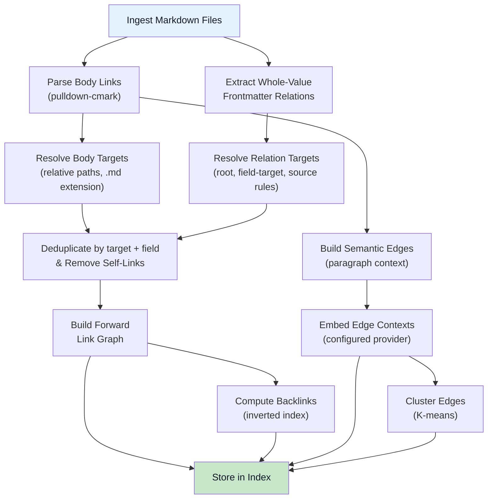
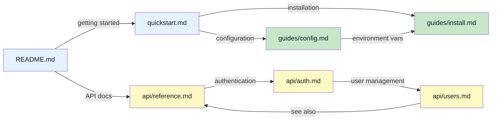
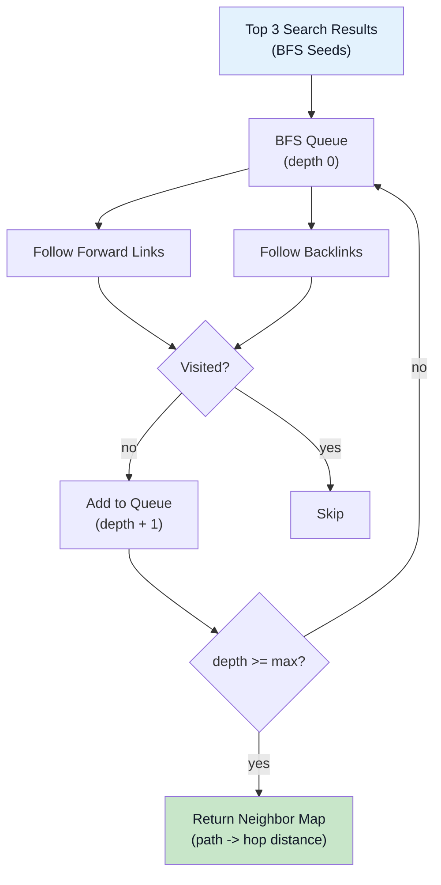

# Link Graph

mdvdb builds one directed graph from body links and whole-value frontmatter Relations. The graph
powers backlink discovery, orphan detection, multi-hop search boosting, graph context expansion,
and visualization. Body links can additionally produce semantic edge embeddings from their
surrounding paragraph context.

## Overview

During ingestion, mdvdb parses Markdown links and wikilinks from the body, plus link-shaped strings
and string-list elements from top-level frontmatter. Frontmatter entries remain attributable to
their originating field, so consumers can distinguish an authored body link from a Relation such as
`client: clients/acme.md`.


```mermaid
flowchart TD
    INGEST["Ingest Markdown Files"] --> BODY["Parse Body Links<br/>(pulldown-cmark)"]
    INGEST --> FM["Extract Whole-Value<br/>Frontmatter Relations"]
    BODY --> RESOLVE["Resolve Body Targets<br/>(relative paths, .md extension)"]
    FM --> RELRESOLVE["Resolve Relation Targets<br/>(root, field-target, source rules)"]
    RESOLVE --> DEDUP["Deduplicate by target + field<br/>& Remove Self-Links"]
    RELRESOLVE --> DEDUP
    DEDUP --> GRAPH["Build Forward<br/>Link Graph"]
    GRAPH --> BACK["Compute Backlinks<br/>(inverted index)"]
    BODY --> EDGES["Build Semantic Edges<br/>(paragraph context)"]
    EDGES --> EMBED_E["Embed Edge Contexts<br/>(configured provider)"]
    EMBED_E --> CLUSTER_E["Cluster Edges<br/>(K-means)"]

    GRAPH --> STORE["Store in Index"]
    BACK --> STORE
    EMBED_E --> STORE
    CLUSTER_E --> STORE

    style INGEST fill:#e3f2fd,color:#111827
    style STORE fill:#c8e6c9,color:#111827
```

## Link Extraction

Body links are parsed with `pulldown-cmark`. Top-level frontmatter strings and string-list elements
are also considered when the entire value is link-shaped:

| Location | Syntax | Example |
|----------|--------|---------|
| Body | Standard Markdown | `[user guide](./guide.md)` |
| Body | Link with fragment | `[setup](guide.md#installation)` |
| Body | Wikilink | `[[guide]]` |
| Frontmatter | Bare Markdown path | `client: clients/acme.md` |
| Frontmatter | Quoted wikilink | `client: "[[clients/acme]]"` |
| Frontmatter | Markdown link | `client: "[Acme](clients/acme.md)"` |

Frontmatter values with explicit non-Markdown extensions are physical files, not Relations.
Fields declared as `field_type: file` and computed Formula/Lookup/Rollup outputs are also excluded
from the graph. See [Relations](./relations.md) for value classification and target-folder rules.

### Link Resolution

Body link targets are resolved relative to the source file's directory:

1. **Strip fragments** -- `guide.md#installation` becomes `guide.md`.
2. **Normalize separators** -- backslashes are converted to forward slashes.
3. **Resolve relative paths** -- `.` and `..` components are resolved without filesystem access.
4. **Ensure `.md` extension** -- if the target does not end in `.md`, the extension is appended.

For example, a link `[ref](../api/auth)` in `docs/guides/setup.md` resolves to `docs/api/auth.md`.

A frontmatter Relation containing `/` tries a collection-root-relative path first and then a
source-directory-relative fallback. A simple name uses its overlay-declared `target:` folder when
present, otherwise the source directory. Extensionless Relation targets receive the Markdown
extension during resolution.

### Deduplication

Deduplication uses `(target, field)`:

- repeated body links to one target keep the first body occurrence;
- repeated values in the same Relation field keep the first occurrence;
- a body link and a Relation to the same target coexist; and
- two different Relation fields pointing to the same target coexist.

Empty targets and self-links are excluded on both paths.

## The Link Graph

The link graph is a directed graph where:

- **Nodes** are markdown files (identified by relative path).
- **Edges** are body links or frontmatter Relations from one file to another.

The graph is stored as a **forward adjacency map**. Each `LinkEntry` records the source, target,
display text, wikilink flag, and an always-serialized `field`. Body links use `field: null` and a
1-based `line_number`; frontmatter Relations use their field name and the `line_number: 0` sentinel.

### Sample Link Graph


```mermaid
graph LR
    README["README.md"] -->|"getting started"| QUICK["quickstart.md"]
    README -->|"API docs"| API["api/reference.md"]
    QUICK -->|"configuration"| CONFIG["guides/config.md"]
    QUICK -->|"installation"| INSTALL["guides/install.md"]
    API -->|"authentication"| AUTH["api/auth.md"]
    AUTH -->|"user management"| USERS["api/users.md"]
    CONFIG -->|"environment vars"| INSTALL
    USERS -->|"see also"| API

    style README fill:#e3f2fd,color:#111827
    style QUICK fill:#e3f2fd,color:#111827
    style API fill:#fff9c4,color:#111827
    style AUTH fill:#fff9c4,color:#111827
    style USERS fill:#fff9c4,color:#111827
    style CONFIG fill:#c8e6c9,color:#111827
    style INSTALL fill:#c8e6c9,color:#111827
```

In this example:
- `README.md` links to `quickstart.md` and `api/reference.md`
- `quickstart.md` links to `guides/config.md` and `guides/install.md`
- `api/auth.md` links to `api/users.md`, and `api/users.md` links back to `api/reference.md`
- `guides/config.md` and `guides/install.md` are interconnected

## Backlinks

Backlinks are the inverse of the forward graph. If file A has either a body link or a frontmatter
Relation to file B, then B has a backlink from A. mdvdb computes backlinks by inverting the forward
adjacency map without discarding the Relation `field`.

### How Backlinks Work

```
Forward:   quickstart.md  -->  guides/config.md
Backlink:  guides/config.md  <--  quickstart.md
```

Backlinks are computed on-the-fly from the stored forward graph. They are used for:

- **`mdvdb backlinks <file>`** -- list all files that link to a given file.
- **BFS traversal** -- backlinks are traversed alongside forward links during multi-hop search.
- **Orphan detection** -- a file with no forward links AND no backlinks is an orphan.

### Querying Links

Use the CLI to inspect a file's links:

```bash
# Show outgoing and incoming links for a file
mdvdb links docs/guide.md

# Show only backlinks (incoming links)
mdvdb backlinks docs/guide.md

# JSON output
mdvdb links docs/guide.md --json
```

Each outgoing link is classified as **Valid** (target exists in the index) or **Broken** (target not found).

## Orphan Detection

An orphan file has **no outgoing entries and no incoming entries** across both body links and
frontmatter Relations. A stored outgoing entry counts even when its target is currently broken;
orphans are nodes with no graph entries at all.

```bash
# List all orphan files
mdvdb orphans

# JSON output
mdvdb orphans --json
```

## Multi-Hop BFS Traversal

The link graph enables **multi-hop Breadth-First Search (BFS)** to discover files related to search results. BFS traverses both forward links and backlinks simultaneously, building a set of neighboring files at configurable depth.

### How BFS Works

1. **Seed selection** -- the top 3 search results are used as BFS seeds.
2. **Initialization** -- seeds are added to the visited set and the BFS queue at depth 0.
3. **Expansion** -- for each node in the queue, discover all forward links and backlinks that have not been visited. Add each newly discovered file at depth + 1.
4. **Termination** -- stop when the queue is empty or the maximum depth is reached.
5. **Output** -- a map from discovered file path to its minimum hop distance from any seed.


```mermaid
flowchart TD
    SEED["Top 3 Search Results<br/>(BFS Seeds)"] --> BFS["BFS Queue<br/>(depth 0)"]
    BFS --> FWD["Follow Forward Links"]
    BFS --> BACK["Follow Backlinks"]
    FWD --> CHECK{"Visited?"}
    BACK --> CHECK
    CHECK -->|no| ADD["Add to Queue<br/>(depth + 1)"]
    CHECK -->|yes| SKIP["Skip"]
    ADD --> DEPTH{"depth >= max?"}
    DEPTH -->|no| BFS
    DEPTH -->|yes| DONE["Return Neighbor Map<br/>(path -> hop distance)"]

    style SEED fill:#e3f2fd,color:#111827
    style DONE fill:#c8e6c9,color:#111827
```

### Depth Clamping

The maximum BFS depth is clamped to **1-3 hops**. This prevents runaway traversal in densely linked knowledge bases while still discovering meaningful relationships:

| Hops | Reach | Use Case |
|------|-------|----------|
| 1 | Direct neighbors only | Conservative boosting, tightly related files |
| 2 | Neighbors of neighbors | Moderate exploration, thematic clusters |
| 3 | Three degrees of separation | Broad discovery, loosely related content |

### Cycle Safety

BFS uses a **visited set** to prevent infinite loops. Each file is visited at most once, and only the minimum hop distance is recorded. Seeds are excluded from the output.

## Link Boosting

When link boosting is enabled, search results that are **graph neighbors** of top results receive a score boost. This promotes documents that are structurally related to the most relevant results.

### How Link Boosting Works

1. **Run search** -- perform the normal search pipeline (hybrid, semantic, or lexical).
2. **BFS from top results** -- take the top 3 results as seeds and run BFS at the configured hop depth.
3. **Boost neighbors** -- for each remaining search result that appears in the BFS neighbor map, increase its score based on hop distance. Closer neighbors get a larger boost.
4. **Re-sort** -- results are re-sorted by boosted score.

### Semantic Edge Boosting

When edge embeddings are enabled, the link boost also considers **semantic edge similarity**. For each neighbor found via BFS, the system checks if there is a semantic edge whose embedding is similar to the query vector. If so, an additional weighted boost is applied based on the edge cosine similarity, scaled by `MDVDB_EDGE_BOOST_WEIGHT`.

### Enabling Link Boosting

```bash
# Enable link boosting for a single query
mdvdb search --boost-links "authentication patterns"

# With 2-hop depth
mdvdb search --boost-links --hops 2 "authentication patterns"

# Disable link boosting (if enabled by default in config)
mdvdb search --no-boost-links "authentication patterns"
```

## Graph Context Expansion

Graph context expansion fetches chunks from **linked files** and includes them as supplementary context alongside the main search results. This is useful for AI agents that need surrounding context from related documents.

### How Expansion Works

1. **Run search and link boost** -- the normal pipeline runs first.
2. **BFS from top results** -- expand the graph at the configured depth.
3. **Fetch chunks** -- for each neighboring file found via BFS, retrieve its highest-scoring chunks.
4. **Append as context** -- the expanded chunks are returned in the `graph_context` array, separate from the main `results` array.

### Expansion Depth and Limit

- **Depth** (`--expand <N>`) -- how many hops to follow from top results. Range: 0-3. Default: 0 (disabled).
- **Limit** (`MDVDB_SEARCH_EXPAND_LIMIT`) -- maximum number of expanded context items. Range: 1-10. Default: 3.

```bash
# Expand graph context by 1 hop
mdvdb search --expand 1 "authentication"

# Combine with link boosting
mdvdb search --boost-links --expand 2 "authentication"
```

### JSON Output with Graph Context

```json
{
  "results": [
    {
      "score": 0.92,
      "file": { "path": "docs/auth.md" },
      "chunk": { "content": "Authentication uses JWT tokens..." }
    }
  ],
  "graph_context": [
    {
      "path": "docs/users.md",
      "chunk_id": "docs/users.md#0",
      "content": "User management handles account creation...",
      "heading_hierarchy": ["User Management"],
      "hop_distance": 1,
      "link_text": "user management"
    }
  ]
}
```

## Semantic Edge Embeddings

For body links, mdvdb can create **semantic edge embeddings** that capture the surrounding
paragraph's meaning. These enable edge search and semantic edge boosting. Frontmatter Relations
participate in graph traversal, backlinks, orphan detection, and visualization, but do not have a
body paragraph to embed and therefore do not produce semantic edges.

### How Edge Embeddings Work

1. **Extract context** -- for each body link, the surrounding paragraph text in the source file is extracted.
2. **Build edge ID** -- a unique identifier in the format `edge:source.md->target.md@42` (line number disambiguates multiple links between the same files).
3. **Embed context** -- the paragraph context is sent to the embedding provider, producing a vector that represents the _relationship_ between the source and target.
4. **Store in HNSW** -- edge embeddings are stored alongside chunk vectors with `edge:`-prefixed IDs.
5. **Compute strength** -- cosine similarity between the edge embedding and the target document's embedding gives an edge "strength" score.

### Edge Clustering

Edge embeddings are clustered using K-means (minimum 4 edges required). Each cluster receives:

- A numeric ID
- Auto-generated keywords via TF-IDF from edge context paragraphs
- A human-readable relationship type label (top 3 keywords joined by " / ")

This enables searching by relationship type (e.g., "references", "extends", "implements").

```bash
# Search by edge relationships
mdvdb search --edge-search "API authentication"

# View edge information
mdvdb edges docs/auth.md
```

## Neighborhood Exploration and Visualization

Use `mdvdb links <file> --depth <N>` for a tree-structured neighborhood rooted at one file. It
follows outgoing connections and backlinks, clamps depth to 1-3, and prevents cycles per branch:

```bash
# Direct incoming and outgoing entries with LinkEntry metadata
mdvdb links docs/auth.md

# Two-hop neighborhood tree
mdvdb links docs/auth.md --depth 2 --json
```

Use `mdvdb graph` for visualization-ready graph data rather than a rooted neighborhood. It takes no
file argument and has no `--depth` option. Document-level output contains body-link and Relation
edges; chunk-level output contains cross-file similarity edges.

```bash
# Whole-collection document graph
mdvdb graph --json

# Folder projection or independent Shard analysis
mdvdb graph --path docs/api --json
mdvdb graph --shard research --json --compact

# Chunk-similarity graph
mdvdb graph --level chunk --json
```

`--compact` emits the versioned app wire format and requires `--json`. See
[`mdvdb graph`](../commands/graph.md) for the full node, edge, Shard-analysis, and compact contracts.

## Configuration

### Link Boosting

| YAML key | Default | Shell override | Description |
|----------|---------|----------------|-------------|
| `search.boost_links` | `false` | `MDVDB_SEARCH_BOOST_LINKS` | Boost result files connected to the leading matches. |
| `search.boost_hops` | `1` | `MDVDB_SEARCH_BOOST_HOPS` | Maximum BFS depth for boosting, from 1 to 3. |

### Graph Expansion

| YAML key | Default | Shell override | Description |
|----------|---------|----------------|-------------|
| `search.expand_graph` | `0` | `MDVDB_SEARCH_EXPAND_GRAPH` | Context-expansion depth from 0 to 3; `0` disables expansion. The CLI override is `--expand`. |
| `search.expand_limit` | `3` | `MDVDB_SEARCH_EXPAND_LIMIT` | Maximum graph-context items, from 1 to 10. |

### Edge Embeddings

| YAML key | Default | Shell override | Description |
|----------|---------|----------------|-------------|
| `index.edge_embeddings` | `true` | `MDVDB_EDGE_EMBEDDINGS` | Embed body-link paragraph contexts during ingestion. |
| `index.edge_boost_weight` | `0.15` | `MDVDB_EDGE_BOOST_WEIGHT` | Semantic-edge contribution to link boosting, from 0.0 to 1.0. |
| `index.edge_cluster_rebalance` | `50` | `MDVDB_EDGE_CLUSTER_REBALANCE` | New-edge threshold for rebalancing edge clusters; must be greater than zero. |

### Setting Values

```yaml
# .markdownvdb/config.yaml
search:
  boost_links: true
  boost_hops: 2
  expand_graph: 1
index:
  edge_embeddings: true
  edge_boost_weight: 0.15
```

The YAML keys are canonical. The corresponding `MDVDB_*` variables are shell overrides; ordinary
settings loaded only from a dotenv file do not override YAML.

## CLI Commands

| Command | Description |
|---------|-------------|
| `mdvdb links <file>` | Show outgoing and incoming links for a file |
| `mdvdb backlinks <file>` | Show files that link to a given file |
| `mdvdb orphans` | List files with no links (disconnected from graph) |
| `mdvdb edges [file]` | Show all semantic edges or filter by source/target file |
| `mdvdb graph [--level document\|chunk] [--path PATH] [--shard ID] [--compact --json]` | Return visualization-ready graph data |
| `mdvdb search --boost-links` | Enable link boosting for a search |
| `mdvdb search --expand <N>` | Include graph context in search results |
| `mdvdb search --edge-search` | Search by semantic edge embeddings |

## See Also

- [mdvdb links](../commands/links.md) -- Links command reference
- [mdvdb backlinks](../commands/backlinks.md) -- Backlinks command reference
- [mdvdb orphans](../commands/orphans.md) -- Orphans command reference
- [mdvdb edges](../commands/edges.md) -- Edges command reference
- [mdvdb graph](../commands/graph.md) -- Graph command reference
- [mdvdb search](../commands/search.md) -- Search command reference
- [Search Modes](./search-modes.md) -- How search modes work (including edge mode)
- [Time Decay](./time-decay.md) -- Time-based score adjustment
- [Configuration](../configuration.md) -- All environment variables
