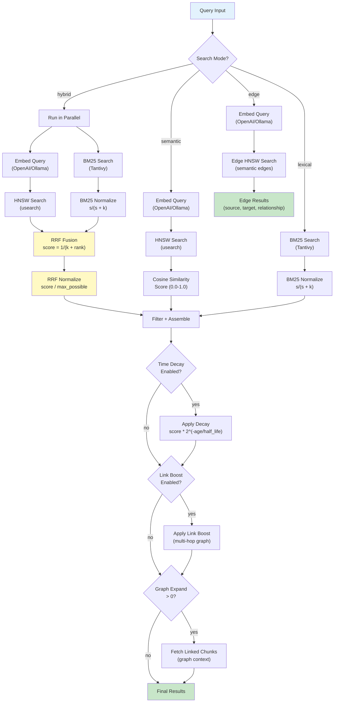

# Search Modes

mdvdb supports four search modes, each using different retrieval strategies. The default mode is **hybrid**, which combines semantic and lexical search for the best overall results.

## Overview

| Mode | Retrieval Strategy | Requires Embedding API | Requires Index |
|------|-------------------|----------------------|----------------|
| **hybrid** (default) | Semantic + Lexical, fused via RRF | Yes | Yes (HNSW + Tantivy) |
| **semantic** | HNSW vector nearest-neighbor search | Yes | Yes (HNSW) |
| **lexical** | Tantivy BM25 full-text search | No | Yes (Tantivy) |
| **edge** | Semantic edge embeddings between linked files | Yes | Yes (Edge HNSW) |

## Search Pipeline

The following diagram shows how all four modes flow through the search pipeline:



## Hybrid Mode (Default)

Hybrid mode runs both semantic and lexical retrieval in parallel, then fuses their results using **Reciprocal Rank Fusion (RRF)**. This produces the most robust results by combining the strengths of both approaches:

- **Semantic search** excels at finding conceptually similar content even when different words are used.
- **Lexical search** excels at finding exact keyword matches and specific terms.

### How RRF Fusion Works

Each retrieval path produces a ranked list of candidates. RRF assigns each candidate a score based on its rank position in each list:

```
RRF_score(doc) = sum( 1 / (k + rank_i) )
```

Where:
- `k` is a constant (default `60.0`, configurable via `MDVDB_SEARCH_RRF_K`)
- `rank_i` is the 1-based rank of the document in retrieval list `i`
- The sum is taken across all lists where the document appears

A document ranked #1 in both lists gets the highest possible score: `2 / (k + 1)`. The final RRF scores are normalized by dividing by this theoretical maximum, producing scores in the `[0.0, 1.0]` range.

### Why RRF?

RRF is preferred over simple score averaging because:

1. **Rank-based** -- it uses position, not raw scores, so there is no need to calibrate score scales between different retrieval methods.
2. **Robust** -- a document appearing in both lists is naturally boosted, while a document appearing in only one list still contributes.
3. **Tunable** -- the `k` parameter controls how much weight is given to top-ranked vs. lower-ranked results. Higher `k` values compress the score differences.

### Over-Fetching

In hybrid mode, mdvdb over-fetches candidates (5x the requested limit) from each retrieval path to ensure that after fusion and filtering, enough high-quality results remain.

### Usage

```bash
# Hybrid is the default -- no flag needed
mdvdb search "authentication patterns"

# Explicit mode flag
mdvdb search --mode hybrid "authentication patterns"
```

## Semantic Mode

Semantic mode uses only vector-based retrieval. The query is embedded using the configured provider (OpenAI, Ollama, or Custom), then the nearest neighbors are found in the HNSW index using cosine similarity.

### How It Works

1. **Embed the query** -- the query string is sent to the embedding provider API, producing a vector.
2. **HNSW search** -- the `usearch` library performs approximate nearest-neighbor search in the HNSW index, returning candidates ranked by cosine similarity.
3. **Score** -- the cosine similarity (0.0 to 1.0) is used directly as the result score.

### When to Use

- When you want purely conceptual/meaning-based search.
- When exact keyword matching is not important.
- When you want results that are semantically similar even if they use different terminology.

### Usage

```bash
# Shorthand flag
mdvdb search --semantic "how does user authentication work"

# Explicit mode flag
mdvdb search --mode semantic "how does user authentication work"
```

## Lexical Mode

Lexical mode uses only BM25 full-text search via Tantivy. **No embedding API call is made**, making this mode fast and free of external dependencies.

### How It Works

1. **BM25 search** -- Tantivy searches the full-text index using the BM25 scoring algorithm. Content and heading hierarchy fields are searched.
2. **Normalize** -- raw BM25 scores are unbounded, so they are normalized to `[0.0, 1.0]` using saturation: `score / (score + k)` where `k` is controlled by `MDVDB_BM25_NORM_K` (default `1.5`). A BM25 score equal to `k` maps to 0.5.
3. **Filter and rank** -- results are filtered by metadata and path prefix, then ranked by normalized score.

### When to Use

- When you need exact keyword matching (e.g., searching for specific function names, error codes, or technical terms).
- When you want fast search without an embedding API call.
- When the embedding provider is unavailable or you want to avoid API costs.

### Usage

```bash
# Shorthand flag
mdvdb search --lexical "OPENAI_API_KEY"

# Explicit mode flag
mdvdb search --mode lexical "OPENAI_API_KEY"
```

### Fallback Behavior

If the Tantivy FTS index is not available (e.g., the index was created before FTS support was added), hybrid and lexical modes automatically fall back to semantic mode. A debug log message is emitted when this happens.

## Edge Mode

Edge mode searches **semantic edge embeddings** -- vector representations of the relationships between linked documents. This finds connections between documents rather than content within documents.

### How It Works

1. **Embed the query** -- the query is embedded just like in semantic mode.
2. **Edge HNSW search** -- the query vector is compared against edge embeddings in a separate HNSW index dedicated to edges.
3. **Assemble results** -- results include the source document, target document, link text, surrounding context, relationship type label, and edge strength.

### What Are Edge Embeddings?

When mdvdb ingests files, it extracts Markdown links between documents. For each link, it creates an "edge embedding" by combining:
- The link text
- The surrounding context from the source document
- The relationship between source and target

These edge embeddings are stored in a separate HNSW index and can be searched to find specific types of relationships between documents.

### When to Use

- When you want to find how documents relate to each other.
- When searching for specific relationship types (e.g., "references", "extends", "implements").
- When exploring the structure of your knowledge base rather than its content.

### Usage

```bash
# Shorthand flag
mdvdb search --edge-search "API authentication"

# Explicit mode flag
mdvdb search --mode edge "API authentication"
```

### Edge Results

Edge mode returns results in the `edge_results` array rather than the standard `results` array:

```json
{
  "results": [],
  "edge_results": [
    {
      "score": 0.85,
      "edge_id": "auth.md->users.md#0",
      "source_path": "docs/auth.md",
      "target_path": "docs/users.md",
      "link_text": "user management",
      "context": "Authentication relies on [user management](users.md) for...",
      "relationship_type": "references",
      "cluster_id": 2,
      "strength": 0.72
    }
  ],
  "query": "API authentication",
  "total_results": 0,
  "mode": "edge"
}
```

## Choosing a Search Mode

| Scenario | Recommended Mode |
|----------|-----------------|
| General-purpose search | `hybrid` (default) |
| Finding conceptually similar content | `semantic` |
| Searching for exact terms, codes, or names | `lexical` |
| Exploring relationships between documents | `edge` |
| Offline / no API key available | `lexical` |
| Combining best of both worlds | `hybrid` |

## Configuration

### Setting the Default Mode

The default search mode is set via the `MDVDB_SEARCH_MODE` environment variable:

```bash
# In .markdownvdb/.config or environment
MDVDB_SEARCH_MODE=hybrid    # default
MDVDB_SEARCH_MODE=semantic
MDVDB_SEARCH_MODE=lexical
MDVDB_SEARCH_MODE=edge
```

The `--mode` flag (or shorthands `--semantic`, `--lexical`, `--edge-search`) overrides this default on a per-query basis.

### RRF Fusion Constant

The `MDVDB_SEARCH_RRF_K` variable controls the RRF fusion constant used in hybrid mode:

| Variable | Default | Description |
|----------|---------|-------------|
| `MDVDB_SEARCH_RRF_K` | `60.0` | RRF constant `k`. Higher values compress score differences between ranks. Must be > 0. |

The standard value of 60 comes from the original RRF paper. Lowering `k` makes the ranking more sensitive to position differences; raising it makes the ranking more uniform.

### BM25 Normalization

The `MDVDB_BM25_NORM_K` variable controls how BM25 scores are normalized in lexical and hybrid modes:

| Variable | Default | Description |
|----------|---------|-------------|
| `MDVDB_BM25_NORM_K` | `1.5` | Saturation constant for BM25 score normalization. A BM25 score equal to this value maps to 0.5. Must be > 0. |

## CLI Flags

Search mode can be selected with the following mutually exclusive flags:

| Flag | Mode | Notes |
|------|------|-------|
| `--mode <MODE>` | Any | Explicit mode selection |
| `--semantic` | `semantic` | Shorthand, conflicts with `--lexical`, `--edge-search`, `--mode` |
| `--lexical` | `lexical` | Shorthand, conflicts with `--semantic`, `--edge-search`, `--mode` |
| `--edge-search` | `edge` | Shorthand, conflicts with `--semantic`, `--lexical`, `--mode` |

These flags are mutually exclusive -- specifying more than one is an error.

## Score Interpretation

Scores are normalized to `[0.0, 1.0]` across all modes, but their meaning differs:

| Mode | Score Meaning |
|------|--------------|
| **semantic** | Cosine similarity -- absolute measure of vector proximity |
| **lexical** | Saturated BM25 -- relative measure of term relevance |
| **hybrid** | Normalized RRF -- relative measure combining both signals |
| **edge** | Cosine similarity of edge embeddings |

A score of 0.85 in semantic mode is not directly comparable to 0.85 in lexical mode. Within a single mode, scores are comparable across queries.

## See Also

- [mdvdb search](../commands/search.md) -- Full command reference
- [Embedding Providers](./embedding-providers.md) -- How queries are embedded
- [Time Decay](./time-decay.md) -- Time-based score adjustment
- [Link Graph](./link-graph.md) -- Link boosting and graph expansion
- [Configuration](../configuration.md) -- All environment variables
