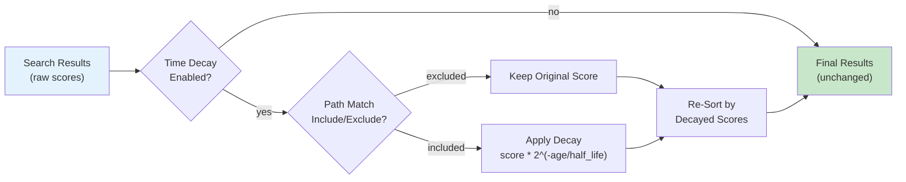
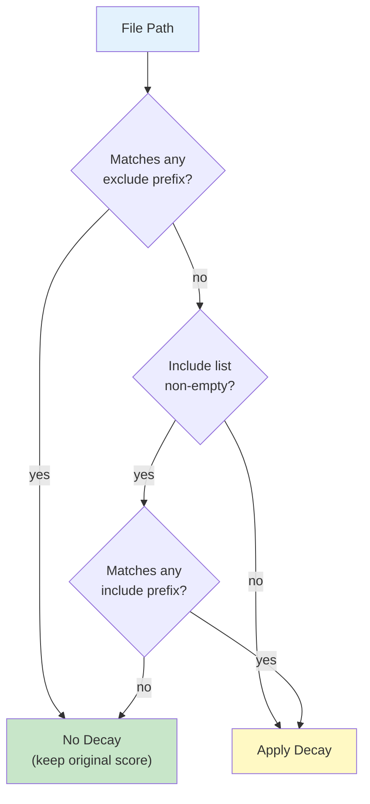

# Time Decay

mdvdb supports **exponential time decay** for search scores, allowing you to favor recently modified files over older ones. When enabled, each search result's score is multiplied by a decay factor based on how long ago the file was last modified. Time decay is disabled by default and can be enabled globally or per-query.

## Overview

Time decay applies a multiplier to each result's score based on file age:

```
final_score = score * 2^(-age_days / half_life_days)
```

The multiplier is always in the range `(0, 1]`, so the final score is always less than or equal to the original score. Recently modified files receive a multiplier close to 1.0 (minimal penalty), while older files receive progressively lower multipliers.



## The Decay Formula

The decay function uses an exponential half-life model:

```
multiplier = 0.5 ^ (elapsed_days / half_life_days)
```

Where:
- **`elapsed_days`** = `(now - file_modified_at) / 86400` -- the file's age in days
- **`half_life_days`** = the configured half-life (default: **90 days**)
- **`multiplier`** = the factor applied to the raw search score

### How the Half-Life Works

The half-life determines how quickly scores decay:

| File Age | Multiplier (90-day half-life) | Effect |
|----------|-------------------------------|--------|
| 0 days (today) | 1.000 | No penalty |
| 30 days | 0.794 | ~80% of original score |
| 45 days | 0.707 | ~71% of original score |
| 90 days (1 half-life) | 0.500 | Half the original score |
| 180 days (2 half-lives) | 0.250 | Quarter of original score |
| 365 days (~4 half-lives) | 0.065 | ~7% of original score |

### Decay Curve

```
Score Multiplier
1.0 |*
    | *
0.8 |  *
    |    *
0.6 |      *
    |         *
0.4 |            *
    |                *
0.2 |                      *
    |                              *
0.0 |_____________________________________
    0    90   180   270   360   450  days
         ^
      half-life
```

At one half-life (90 days), the multiplier is exactly 0.5. At two half-lives (180 days), it is 0.25. The decay never reaches zero -- even very old files retain a small fraction of their original score.

### Choosing a Half-Life

| Half-Life | Best For |
|-----------|----------|
| **30 days** | Fast-moving projects where only very recent content matters (e.g., sprint notes, daily logs) |
| **90 days** (default) | General-purpose knowledge bases with moderate update frequency |
| **180 days** | Slowly evolving documentation where content stays relevant for months |
| **365 days** | Reference material that remains valuable for a year or more |

Shorter half-lives aggressively penalize older content; longer half-lives produce a gentler decay curve.

## Include and Exclude Paths

Not all files should be subject to time decay. Reference documentation, architecture decisions, and other evergreen content should retain its full score regardless of age. mdvdb provides **include** and **exclude** path prefix lists to control which files are affected.

### Priority Rules

1. **Exclude takes precedence** -- if a file matches any exclude prefix, decay is NOT applied, even if it also matches an include prefix.
2. **Include acts as a whitelist** -- if the include list is non-empty, decay is ONLY applied to files matching at least one include prefix.
3. **Both empty** -- if both lists are empty, decay applies to all files.

### Decision Logic



### Examples

**Exclude evergreen content from decay:**

```bash
# In .markdownvdb/.config
MDVDB_SEARCH_DECAY=true
MDVDB_SEARCH_DECAY_HALF_LIFE=90
MDVDB_SEARCH_DECAY_EXCLUDE=docs/architecture,docs/reference,ADR
```

Files under `docs/architecture/`, `docs/reference/`, and `ADR/` keep their full scores. All other files are subject to decay.

**Apply decay only to specific directories:**

```bash
# In .markdownvdb/.config
MDVDB_SEARCH_DECAY=true
MDVDB_SEARCH_DECAY_HALF_LIFE=30
MDVDB_SEARCH_DECAY_INCLUDE=notes/,journal/,sprints/
```

Only files under `notes/`, `journal/`, and `sprints/` are subject to decay. All other files keep their full scores.

**Combined include + exclude:**

```bash
MDVDB_SEARCH_DECAY=true
MDVDB_SEARCH_DECAY_INCLUDE=notes/
MDVDB_SEARCH_DECAY_EXCLUDE=notes/pinned
```

Files under `notes/` are subject to decay, EXCEPT those under `notes/pinned/` (which match the exclude prefix and are therefore exempted).

## File Modification Time

Time decay uses the file's **filesystem modification time** (mtime) to determine age. This timestamp is recorded during ingestion and stored in the index.

- If the file has a recorded mtime in the index, that value is used.
- If no mtime is available (e.g., the file was indexed before mtime tracking was added), the `indexed_at` timestamp is used as a fallback.

### Important Notes

- Modification times come from the filesystem, not from frontmatter or git history.
- Re-saving a file (even without content changes) updates its mtime and resets the decay clock.
- `mdvdb ingest --reindex` re-records all file mtimes.

## Result Re-Sorting

When time decay is enabled, result ordering may change because scores are multiplied by different decay factors. After applying decay:

1. **All candidates are scored** -- decay is applied to every candidate that passes path filtering.
2. **Re-sort** -- results are re-sorted by decayed score in descending order.
3. **Truncate** -- the result list is truncated to the requested limit.

Without decay, the search engine can stop early once it has enough results (since candidates arrive pre-sorted). With decay enabled, all candidates must be evaluated before final sorting.

## Per-Query Overrides

Time decay can be controlled on a per-query basis using CLI flags, overriding the global configuration:

```bash
# Enable decay for this query (even if globally disabled)
mdvdb search --decay "recent changes"

# Disable decay for this query (even if globally enabled)
mdvdb search --no-decay "architecture decisions"

# Override half-life for this query
mdvdb search --decay --decay-half-life 30 "sprint updates"

# Override exclude patterns for this query
mdvdb search --decay --decay-exclude "docs/reference" "recent API changes"

# Override include patterns for this query
mdvdb search --decay --decay-include "journal/" "what did I write about"
```

### Library API

Per-query overrides are also available via the `SearchQuery` builder:

```rust
use markdown_vdb::SearchQuery;

let query = SearchQuery::new("recent changes")
    .with_decay(true)
    .with_decay_half_life(30.0)
    .with_decay_exclude(vec!["docs/reference".to_string()])
    .with_decay_include(vec!["notes/".to_string()]);
```

## Configuration

| Variable | Default | Description |
|----------|---------|-------------|
| `MDVDB_SEARCH_DECAY` | `false` | Enable time decay globally. When `true`, all search results have their scores adjusted by file age. |
| `MDVDB_SEARCH_DECAY_HALF_LIFE` | `90` | Half-life in days. After this many days, a file's score is halved. Must be > 0. |
| `MDVDB_SEARCH_DECAY_EXCLUDE` | _(empty)_ | Comma-separated list of path prefixes excluded from decay. Files matching any prefix keep their full scores. Takes precedence over the include list. |
| `MDVDB_SEARCH_DECAY_INCLUDE` | _(empty)_ | Comma-separated list of path prefixes where decay applies. If non-empty, only matching files are decayed. Acts as a whitelist. |

### Setting Values

```bash
# In .markdownvdb/.config or environment
MDVDB_SEARCH_DECAY=true
MDVDB_SEARCH_DECAY_HALF_LIFE=90
MDVDB_SEARCH_DECAY_EXCLUDE=docs/reference,docs/architecture
MDVDB_SEARCH_DECAY_INCLUDE=
```

No re-ingestion is required after changing decay settings -- they are applied at search time.

## When to Use Time Decay

| Scenario | Recommendation |
|----------|---------------|
| Knowledge base with mix of evergreen and transient content | Enable decay, exclude evergreen paths |
| Daily notes / journal / sprint logs | Enable decay with short half-life (30 days) |
| Static reference documentation | Disable decay (default) |
| AI agent searching for recent context | Enable decay for the query: `--decay --decay-half-life 14` |
| Research notes that age gracefully | Enable decay with long half-life (180-365 days) |

## Interaction with Other Features

- **Link boosting** -- decay is applied before link boosting. A decayed result may still be boosted if it is a graph neighbor of top results.
- **Graph expansion** -- expanded graph context items are not subject to decay (they are supplementary, not ranked).
- **Metadata filters** -- filters are applied on the potentially decayed score. If `min_score` is set, the decayed score must meet the threshold.
- **Search modes** -- decay works identically across hybrid, semantic, and lexical modes.

## See Also

- [mdvdb search](../commands/search.md) -- Full command reference with decay flags
- [Search Modes](./search-modes.md) -- How search pipelines work
- [Link Graph](./link-graph.md) -- Link boosting and graph expansion
- [Clustering](./clustering.md) -- Document clustering
- [Configuration](../configuration.md) -- All environment variables
