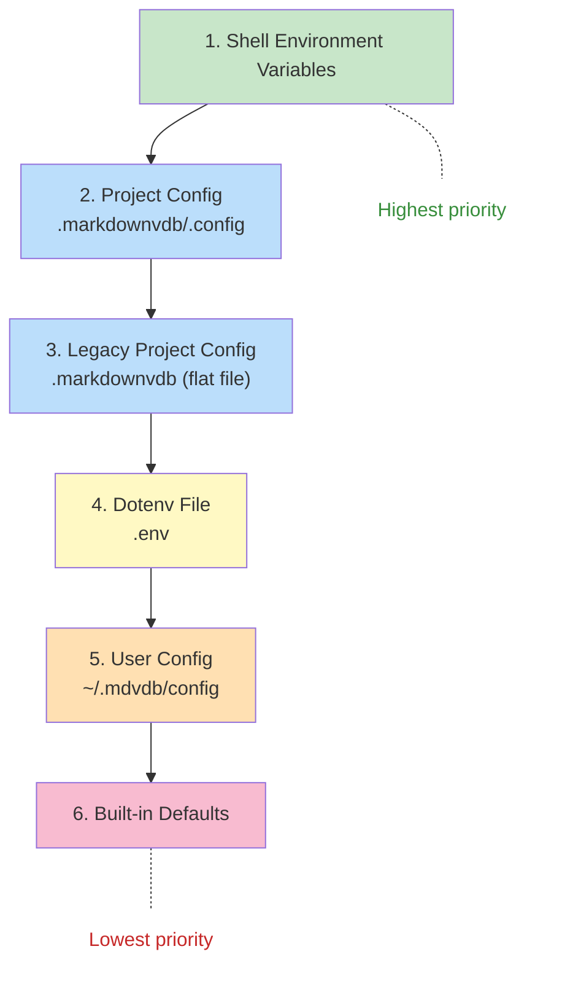

# Configuration

mdvdb uses dotenv-style configuration files and environment variables. No TOML, no YAML config -- just `KEY=VALUE` pairs that can live in config files or be set directly as shell environment variables.

## Config Resolution Order

Configuration values are resolved in a strict priority order. The first source that sets a variable wins -- later sources never override it.



**How it works:** mdvdb uses `dotenvy` to load config files. Each file is loaded in order, but `dotenvy` never overwrites a variable that is already set. This means:

1. **Shell environment** always wins -- export a variable in your shell and it takes precedence over everything.
2. **`.markdownvdb/.config`** is tried first (new location). If it doesn't exist, the legacy flat `.markdownvdb` file is tried instead.
3. **`.env`** is loaded as a fallback -- useful for shared secrets like `OPENAI_API_KEY` that other tools also read.
4. **`~/.mdvdb/config`** provides user-level defaults that apply to all projects.
5. **Built-in defaults** are used for any variable not set by any source.

## Config File Format

Config files use dotenv syntax -- one `KEY=VALUE` pair per line:

```bash
# This is a comment
MDVDB_EMBEDDING_PROVIDER=openai
MDVDB_EMBEDDING_MODEL=text-embedding-3-small
MDVDB_EMBEDDING_DIMENSIONS=1536

# Blank lines are ignored
OPENAI_API_KEY=sk-...

# Quotes are optional but supported
MDVDB_SOURCE_DIRS="docs, notes"
```

Rules:
- Lines starting with `#` are comments
- Blank lines are ignored
- No spaces around `=` (follow standard dotenv convention)
- Values with commas are treated as comma-separated lists where applicable
- Boolean values accept: `true`, `false`, `1`, `0`, `yes`, `no` (case-insensitive)

## Config File Locations

### Project Config (`.markdownvdb/.config`)

The primary project config lives inside the `.markdownvdb/` directory:

```
my-project/
  .markdownvdb/
    .config          # Project configuration
    index            # Binary index file (auto-generated)
    fts/             # Full-text search segments (auto-generated)
  docs/
    ...
```

Create it with:

```bash
mdvdb init
```

This generates `.markdownvdb/.config` with commented defaults. See [mdvdb init](./commands/init.md) for details.

### Legacy Config (`.markdownvdb` flat file)

Earlier versions of mdvdb used a flat `.markdownvdb` file (not a directory) for configuration. This is still supported as a fallback. If `.markdownvdb/.config` exists, the legacy flat file is ignored.

### User Config (`~/.mdvdb/config`)

User-level configuration provides defaults that apply to all projects on your machine. This is the ideal place for API credentials and personal preferences.

```
~/.mdvdb/
  config             # User-level configuration
```

Create it with:

```bash
mdvdb init --global
```

This generates `~/.mdvdb/config` with a commented template for API credentials and provider settings. See [mdvdb init](./commands/init.md) for details.

The user config directory can be customized with the `MDVDB_CONFIG_HOME` environment variable:

```bash
export MDVDB_CONFIG_HOME=/custom/config/path
# User config is now read from /custom/config/path/config
```

### `.env` File

mdvdb also reads a `.env` file in the project root. This is useful when you share API keys with other tools that also use `.env`:

```bash
# .env
OPENAI_API_KEY=sk-...
```

The `.env` file has lower priority than `.markdownvdb/.config`, so project-specific settings always override `.env`.

## Initialization Commands

### `mdvdb init`

Creates `.markdownvdb/.config` in the current directory with default values:

```bash
mdvdb init
```

Generated file contents:

```bash
# markdown-vdb configuration
MDVDB_EMBEDDING_PROVIDER=openai
MDVDB_EMBEDDING_MODEL=text-embedding-3-small
MDVDB_EMBEDDING_DIMENSIONS=1536
MDVDB_EMBEDDING_BATCH_SIZE=100
MDVDB_SOURCE_DIRS=.
MDVDB_CHUNK_MAX_TOKENS=512
MDVDB_CHUNK_OVERLAP_TOKENS=50
MDVDB_SEARCH_DEFAULT_LIMIT=10
MDVDB_SEARCH_MIN_SCORE=0.0
MDVDB_SEARCH_MODE=hybrid
MDVDB_SEARCH_RRF_K=60.0
MDVDB_WATCH=true
MDVDB_WATCH_DEBOUNCE_MS=300
MDVDB_CLUSTERING_ENABLED=true
MDVDB_CLUSTERING_REBALANCE_THRESHOLD=50
```

Returns an error if `.markdownvdb/.config` or a legacy `.markdownvdb` flat file already exists.

### `mdvdb init --global`

Creates `~/.mdvdb/config` with a template for user-level settings:

```bash
mdvdb init --global
```

Generated file contents:

```bash
# mdvdb user-level configuration
# Values here apply to all projects unless overridden by project .markdownvdb

# API credentials
# OPENAI_API_KEY=sk-...

# Default embedding provider
# MDVDB_EMBEDDING_PROVIDER=openai
# MDVDB_EMBEDDING_MODEL=text-embedding-3-small
# MDVDB_EMBEDDING_DIMENSIONS=1536

# Ollama host (if using Ollama)
# OLLAMA_HOST=http://localhost:11434
```

Returns an error if the user config file already exists.

## Environment Variables Reference

All configuration variables recognized by mdvdb, organized by category. Every variable can be set in any config file or as a shell environment variable.

### Embedding Provider

| Variable | Default | Type | Description |
|----------|---------|------|-------------|
| `MDVDB_EMBEDDING_PROVIDER` | `openai` | String | Embedding backend: `openai`, `ollama`, or `custom` |
| `MDVDB_EMBEDDING_MODEL` | `text-embedding-3-small` | String | Model name passed to the provider |
| `MDVDB_EMBEDDING_DIMENSIONS` | `1536` | Integer | Vector dimensions (must be > 0) |
| `MDVDB_EMBEDDING_BATCH_SIZE` | `100` | Integer | Texts per embedding API call (must be > 0) |
| `OPENAI_API_KEY` | *(none)* | String | OpenAI API key (required for `openai` provider) |
| `OLLAMA_HOST` | `http://localhost:11434` | String | Ollama server URL |
| `MDVDB_EMBEDDING_ENDPOINT` | *(none)* | String | Custom OpenAI-compatible endpoint URL (for `custom` provider) |

See [Embedding Providers](./concepts/embedding-providers.md) for setup guides.

### Source & Discovery

| Variable | Default | Type | Description |
|----------|---------|------|-------------|
| `MDVDB_SOURCE_DIRS` | `.` | Comma-list | Directories to scan for Markdown files (relative to project root) |
| `MDVDB_IGNORE_PATTERNS` | *(none)* | Comma-list | Additional gitignore-style patterns to exclude from scanning |

Patterns from `.gitignore` and `.mdvdbignore` are always applied automatically. See [Ignore Files](./concepts/ignore-files.md).

### Chunking

| Variable | Default | Type | Description |
|----------|---------|------|-------------|
| `MDVDB_CHUNK_MAX_TOKENS` | `512` | Integer | Maximum tokens per chunk (heading-split primary, token guard secondary) |
| `MDVDB_CHUNK_OVERLAP_TOKENS` | `50` | Integer | Token overlap when sub-splitting oversized chunks (must be < `MDVDB_CHUNK_MAX_TOKENS`) |

See [Chunking](./concepts/chunking.md) for details on the chunking algorithm.

### Search

| Variable | Default | Type | Description |
|----------|---------|------|-------------|
| `MDVDB_SEARCH_DEFAULT_LIMIT` | `10` | Integer | Default number of results returned |
| `MDVDB_SEARCH_MIN_SCORE` | `0.0` | Float | Minimum similarity score threshold (range: 0.0 to 1.0) |
| `MDVDB_SEARCH_MODE` | `hybrid` | String | Default search mode: `hybrid`, `semantic`, `lexical`, or `edge` |
| `MDVDB_SEARCH_RRF_K` | `60.0` | Float | Reciprocal Rank Fusion constant for hybrid mode (must be > 0) |
| `MDVDB_BM25_NORM_K` | `1.5` | Float | BM25 saturation normalization constant (must be > 0). A BM25 score equal to this value maps to 0.5 after normalization. Higher values compress scores. |

See [Search Modes](./concepts/search-modes.md) for details on each mode.

### Time Decay

| Variable | Default | Type | Description |
|----------|---------|------|-------------|
| `MDVDB_SEARCH_DECAY` | `false` | Boolean | Whether time decay is applied to search scores by default |
| `MDVDB_SEARCH_DECAY_HALF_LIFE` | `90.0` | Float | Half-life in days (must be > 0). After this many days, a document's score is halved. |
| `MDVDB_SEARCH_DECAY_EXCLUDE` | *(none)* | Comma-list | Path prefixes excluded from time decay (immune even when decay is enabled) |
| `MDVDB_SEARCH_DECAY_INCLUDE` | *(none)* | Comma-list | Path prefixes where time decay applies. Empty means all files are eligible. |

See [Time Decay](./concepts/time-decay.md) for details on the decay formula and path filtering.

### Link Graph & Boosting

| Variable | Default | Type | Description |
|----------|---------|------|-------------|
| `MDVDB_SEARCH_BOOST_LINKS` | `false` | Boolean | Whether link boosting is applied to search results by default |
| `MDVDB_SEARCH_BOOST_HOPS` | `1` | Integer | Number of link-graph hops for link-boost scoring (range: 1 to 3) |
| `MDVDB_SEARCH_EXPAND_GRAPH` | `0` | Integer | Graph expansion depth for adding linked-file results (0 = disabled, range: 0 to 3) |
| `MDVDB_SEARCH_EXPAND_LIMIT` | `3` | Integer | Maximum number of graph-expanded results to add (range: 1 to 10) |

See [Link Graph](./concepts/link-graph.md) for details on graph-based search features.

### Edge Embeddings

| Variable | Default | Type | Description |
|----------|---------|------|-------------|
| `MDVDB_EDGE_EMBEDDINGS` | `true` | Boolean | Whether to compute and store semantic edge embeddings between linked files |
| `MDVDB_EDGE_BOOST_WEIGHT` | `0.15` | Float | Weight for edge-based boost in search scoring (range: 0.0 to 1.0) |
| `MDVDB_EDGE_CLUSTER_REBALANCE` | `50` | Integer | Threshold for rebalancing edge clusters (must be > 0) |

### Index Storage

| Variable | Default | Type | Description |
|----------|---------|------|-------------|
| `MDVDB_VECTOR_QUANTIZATION` | `f16` | String | Vector quantization type for the HNSW index: `f16` or `f32`. `f16` uses half the memory with minimal accuracy loss. |
| `MDVDB_INDEX_COMPRESSION` | `true` | Boolean | Whether to compress the metadata region with zstd |

See [Index Storage](./concepts/index-storage.md) for details on the index file format.

### File Watching

| Variable | Default | Type | Description |
|----------|---------|------|-------------|
| `MDVDB_WATCH` | `true` | Boolean | Whether file watching is enabled |
| `MDVDB_WATCH_DEBOUNCE_MS` | `300` | Integer | Debounce interval in milliseconds before reacting to file changes |

### Clustering

| Variable | Default | Type | Description |
|----------|---------|------|-------------|
| `MDVDB_CLUSTERING_ENABLED` | `true` | Boolean | Whether k-means document clustering is enabled |
| `MDVDB_CLUSTERING_REBALANCE_THRESHOLD` | `50` | Integer | Number of document changes before clusters are rebalanced |

See [Clustering](./concepts/clustering.md) for details on how clustering works.

### Special Variables

These variables control mdvdb behavior but are not part of the standard config file:

| Variable | Default | Type | Description |
|----------|---------|------|-------------|
| `MDVDB_CONFIG_HOME` | `~/.mdvdb` | Path | Override the user-level config directory. When set, user config is read from `$MDVDB_CONFIG_HOME/config` instead of `~/.mdvdb/config`. |
| `MDVDB_NO_USER_CONFIG` | *(none)* | Any | When set to any value, skip loading the user-level config file (`~/.mdvdb/config`). Useful for testing or CI environments. |
| `NO_COLOR` | *(none)* | Any | Disable colored output. This is a [standard](https://no-color.org/) environment variable respected by mdvdb. Equivalent to `--no-color` flag. |

## Validation Constraints

mdvdb validates configuration values at load time and returns an error if any constraint is violated:

| Constraint | Error |
|------------|-------|
| `MDVDB_EMBEDDING_DIMENSIONS` must be > 0 | `embedding_dimensions must be > 0` |
| `MDVDB_EMBEDDING_BATCH_SIZE` must be > 0 | `embedding_batch_size must be > 0` |
| `MDVDB_CHUNK_OVERLAP_TOKENS` must be < `MDVDB_CHUNK_MAX_TOKENS` | `chunk_overlap_tokens (N) must be less than chunk_max_tokens (M)` |
| `MDVDB_SEARCH_MIN_SCORE` must be in [0.0, 1.0] | `search_min_score (N) must be in [0.0, 1.0]` |
| `MDVDB_SEARCH_RRF_K` must be > 0 | `search_rrf_k must be > 0` |
| `MDVDB_BM25_NORM_K` must be > 0 | `bm25_norm_k must be > 0` |
| `MDVDB_SEARCH_DECAY_HALF_LIFE` must be > 0 | `search_decay_half_life must be > 0` |
| `MDVDB_SEARCH_BOOST_HOPS` must be in [1, 3] | `search_boost_hops (N) must be in [1, 3]` |
| `MDVDB_SEARCH_EXPAND_GRAPH` must be in [0, 3] | `search_expand_graph (N) must be in [0, 3]` |
| `MDVDB_SEARCH_EXPAND_LIMIT` must be in [1, 10] | `search_expand_limit (N) must be in [1, 10]` |
| `MDVDB_EDGE_BOOST_WEIGHT` must be in [0.0, 1.0] | `edge_boost_weight (N) must be in [0.0, 1.0]` |
| `MDVDB_EDGE_CLUSTER_REBALANCE` must be > 0 | `edge_cluster_rebalance must be > 0` |
| `MDVDB_EMBEDDING_PROVIDER` must be `openai`, `ollama`, or `custom` | `unknown embedding provider 'X': expected openai, ollama, or custom` |
| `MDVDB_SEARCH_MODE` must be `hybrid`, `semantic`, `lexical`, or `edge` | Parse error |
| `MDVDB_VECTOR_QUANTIZATION` must be `f16` or `f32` | `unknown vector quantization 'X': expected f16 or f32` |

## Type Reference

### Boolean values

Boolean variables accept these values (case-insensitive):

| True | False |
|------|-------|
| `true` | `false` |
| `1` | `0` |
| `yes` | `no` |

### Comma-separated lists

Variables of type "Comma-list" accept comma-separated values with optional whitespace:

```bash
# Both are equivalent:
MDVDB_SOURCE_DIRS=docs,notes,wiki
MDVDB_SOURCE_DIRS=docs, notes, wiki

# Path prefixes for decay filtering:
MDVDB_SEARCH_DECAY_EXCLUDE=archive/, legacy/
MDVDB_SEARCH_DECAY_INCLUDE=blog/, news/
```

### Enum values

Some variables accept a fixed set of values:

| Variable | Valid Values |
|----------|-------------|
| `MDVDB_EMBEDDING_PROVIDER` | `openai`, `ollama`, `custom` |
| `MDVDB_SEARCH_MODE` | `hybrid`, `semantic`, `lexical`, `edge` |
| `MDVDB_VECTOR_QUANTIZATION` | `f16`, `f32` |

All enum values are case-insensitive (`OpenAI`, `OPENAI`, `openai` are all valid).

## Viewing Resolved Configuration

To see the final resolved configuration with all values and their effective settings:

```bash
mdvdb config
```

For machine-readable output:

```bash
mdvdb config --json
```

See [mdvdb config](./commands/config.md) for details.

## Examples

### Minimal OpenAI Setup

```bash
# .markdownvdb/.config
OPENAI_API_KEY=sk-...
```

Everything else uses defaults: `openai` provider, `text-embedding-3-small` model, 1536 dimensions.

### Ollama Local Setup

```bash
# .markdownvdb/.config
MDVDB_EMBEDDING_PROVIDER=ollama
MDVDB_EMBEDDING_MODEL=nomic-embed-text
MDVDB_EMBEDDING_DIMENSIONS=768
```

### Custom Provider (OpenAI-Compatible)

```bash
# .markdownvdb/.config
MDVDB_EMBEDDING_PROVIDER=custom
MDVDB_EMBEDDING_ENDPOINT=https://my-server.example.com/v1/embeddings
MDVDB_EMBEDDING_MODEL=my-model
MDVDB_EMBEDDING_DIMENSIONS=768
```

### Tuned Search Configuration

```bash
# .markdownvdb/.config
MDVDB_SEARCH_MODE=hybrid
MDVDB_SEARCH_DEFAULT_LIMIT=20
MDVDB_SEARCH_MIN_SCORE=0.3
MDVDB_SEARCH_RRF_K=60.0

# Enable time decay for blog posts, exempt reference docs
MDVDB_SEARCH_DECAY=true
MDVDB_SEARCH_DECAY_HALF_LIFE=30.0
MDVDB_SEARCH_DECAY_INCLUDE=blog/,news/
MDVDB_SEARCH_DECAY_EXCLUDE=reference/,api/

# Enable link boosting with 2-hop traversal
MDVDB_SEARCH_BOOST_LINKS=true
MDVDB_SEARCH_BOOST_HOPS=2
```

### Multi-Directory Project

```bash
# .markdownvdb/.config
MDVDB_SOURCE_DIRS=docs,wiki,notes
MDVDB_IGNORE_PATTERNS=drafts/**,*.draft.md
```

### CI/Testing Configuration

```bash
# Disable user config and file watching for CI
export MDVDB_NO_USER_CONFIG=1
export MDVDB_WATCH=false
export MDVDB_CLUSTERING_ENABLED=false
```

## Related Pages

- [mdvdb init](./commands/init.md) -- Create project or user config files
- [mdvdb config](./commands/config.md) -- View resolved configuration
- [mdvdb doctor](./commands/doctor.md) -- Validate configuration
- [Embedding Providers](./concepts/embedding-providers.md) -- Provider setup guides
- [Search Modes](./concepts/search-modes.md) -- Search mode details
- [Time Decay](./concepts/time-decay.md) -- Time decay scoring
- [Ignore Files](./concepts/ignore-files.md) -- File exclusion patterns
- [Index Storage](./concepts/index-storage.md) -- Index directory structure
- [Quick Start](./quickstart.md) -- Getting started guide
