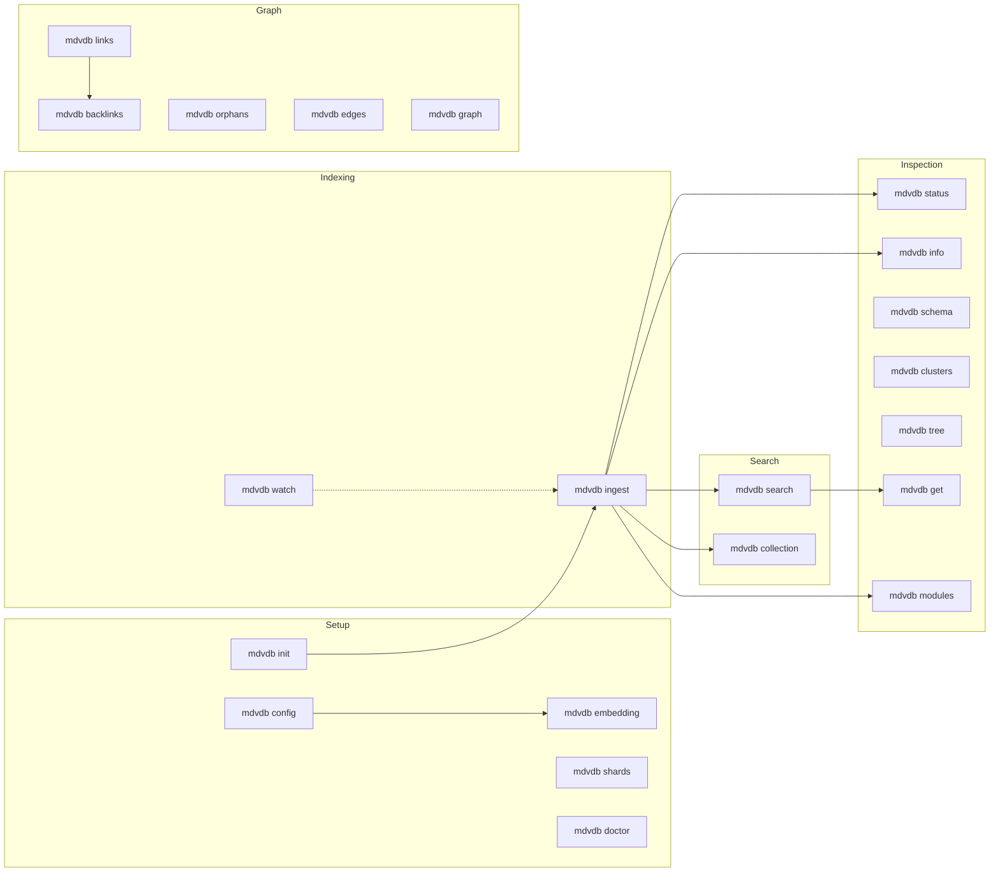

# mdvdb CLI Documentation

**mdvdb** is a filesystem-native vector database built around Markdown files. It provides semantic and lexical retrieval, graph analysis, typed frontmatter queries, computed fields, Shards, Topics, and more from one local CLI.

## Getting Started

| Page | Description |
|------|-------------|
| [Installation](./installation.md) | Install mdvdb via cargo, GitHub releases, or from source |
| [Quick Start](./quickstart.md) | Go from zero to your first search in 5 minutes |
| [Configuration](./configuration.md) | Environment variables, config files, and resolution order |
| [Tesseract desktop companion](./tesseract.md) | Visual editing, tables, graphs, Shards, Topics, and agent tooling |
| [Shell Completions](./shell-completions.md) | Set up tab completions for bash, zsh, fish, and PowerShell |

## Command Reference

All CLI commands are documented individually under [Commands](./commands/index.md).

| Category | Commands | Description |
|----------|----------|-------------|
| Core | [search](./commands/search.md), [ingest](./commands/ingest.md), [status](./commands/status.md), [collection](./commands/collection.md) | Index, retrieve, and query Markdown records |
| Setup | [init](./commands/init.md), [config](./commands/config.md), [embedding](./commands/embedding.md), [shards](./commands/shards.md), [doctor](./commands/doctor.md) | Initialize, configure, verify providers, and diagnose |
| Inspection | [info](./commands/info.md), [schema](./commands/schema.md), [clusters](./commands/clusters.md), [tree](./commands/tree.md), [get](./commands/get.md) | Explore Collection or Shard analysis and metadata |
| Graph | [links](./commands/links.md), [backlinks](./commands/backlinks.md), [orphans](./commands/orphans.md), [edges](./commands/edges.md), [graph](./commands/graph.md) | Navigate the link graph between files |
| Automation | [watch](./commands/watch.md), [modules](./commands/modules.md) | React to file changes and materialize computed metadata |

## Concepts

Deeper explanations of how mdvdb works under the hood.

| Page | Description |
|------|-------------|
| [Frontmatter as structured data](./concepts/frontmatter-data.md) | SQL-like row, column, filter, sort, and pagination model—and its limits |
| [Relations](./concepts/relations.md) | Foreign-key-like Markdown references and depth-one population |
| [Computed Fields](./concepts/computed-fields.md) | Formula, Lookup, and Rollup fields materialized into frontmatter |
| [Shards and Topics](./concepts/shards-and-topics.md) | Named folder lenses, local analysis, communities, and multi-label Topics |
| [Search Modes](./concepts/search-modes.md) | Hybrid, semantic, lexical, and edge search explained |
| [Embedding Providers](./concepts/embedding-providers.md) | Supported local and cloud provider setup |
| [Chunking](./concepts/chunking.md) | How Markdown files are split into chunks for embedding |
| [Link Graph](./concepts/link-graph.md) | Link extraction, backlinks, orphans, and semantic edges |
| [Time Decay](./concepts/time-decay.md) | Time-based scoring decay for search results |
| [Clustering](./concepts/clustering.md) | Automatic communities and user-defined Topics |
| [Ignore Files](./concepts/ignore-files.md) | `.gitignore`, `.mdvdbignore`, and built-in exclusions |
| [Index Storage](./concepts/index-storage.md) | The `.markdownvdb/` directory and binary index format |

## Use cases

| Playbook | What it builds |
|----------|----------------|
| [LLM wiki](./use-cases/llm-wiki.md) | Retrieval-ready handbooks, product docs, runbooks, and decisions |
| [AI memory layer](./use-cases/ai-memory.md) | Durable Markdown memory with configurable recency decay |
| [Knowledge operations](./use-cases/knowledge-operations.md) | Linked project, client, research, or workflow records with computed state |

## Output Formats

| Page | Description |
|------|-------------|
| [JSON Output Reference](./json-output.md) | JSON schemas for every command that supports `--json` |

## Command Overview

## Global Options

The first four flags are accepted before or after any subcommand. `--version` is top-level only.

| Flag | Short | Description |
|------|-------|-------------|
| `--verbose` | `-v` | Increase log verbosity (`-v` info, `-vv` debug, `-vvv` trace) |
| `--root <PATH>` | | Project root directory (defaults to current directory) |
| `--no-color` | | Disable colored output |
| `--json` | | Output results as JSON |
| `--version` | | Print version information with logo; use `mdvdb --version` |

Running `mdvdb` with no subcommand prints a logo and usage hint.

## See Also

- [Command Reference](./commands/index.md) -- Full index of all commands with categories
- [JSON Output Reference](./json-output.md) -- JSON schemas for every command's `--json` output
- [Configuration](./configuration.md) -- Complete environment variable and config file reference
- [Installation](./installation.md) -- Install from cargo, GitHub releases, or source
