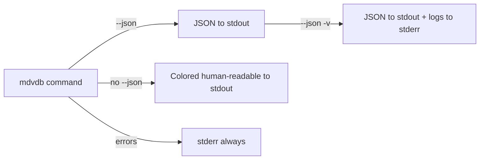

# JSON Output Reference

Every `mdvdb` command that produces output supports the `--json` global flag. When enabled, the command writes machine-readable JSON to stdout instead of the human-readable colored format.

## General Behavior

- **`--json` suppresses tracing logs** unless `-v` is also specified. This keeps stdout clean for JSON parsing.
- **Colored output is suppressed** in JSON mode (no ANSI escape codes in the output).
- **Errors still go to stderr** as plain text, even in JSON mode.
- **All JSON output is pretty-printed** (indented with 2 spaces) for readability.
- **`serde_json` serialization** is used throughout, so field names match the Rust struct fields exactly (snake_case).
- **Optional fields** with `None` values are omitted from the output (via `skip_serializing_if`).
- **Empty arrays** on certain fields (like `graph_context`) are omitted rather than included as `[]`.



## Wrapped Format Convention

Several commands use a **wrapped output format** that adds metadata around the core result. For example, `search` wraps results in an object containing `results`, `query`, `total_results`, and `mode`. This convention makes it easy to distinguish the result data from metadata about the request.

Commands that use wrapped output:
- [`search`](#searchoutput) - wraps in `{results, query, total_results, mode, ...}`
- [`ingest`](#ingestoutput) - wraps in `{files_indexed, files_skipped, ...}`
- [`links`](#linksoutput) - wraps in `{file, links}`
- [`backlinks`](#backlinksoutput) - wraps in `{file, backlinks, total_backlinks}`
- [`orphans`](#orphansoutput) - wraps in `{orphans, total_orphans}`
- [`edges`](#edgesoutput) - wraps in `{edges, total_edges, ...}`

Commands that output their library type directly:
- [`status`](#indexstatus) - `IndexStatus` directly
- [`schema`](#schema) - `Schema` directly (or `ScopedSchema` with `--path`)
- [`clusters`](#clustersummary) - `ClusterSummary[]` array directly
- [`tree`](#filetree) - `FileTree` directly
- [`get`](#documentinfo) - `DocumentInfo` directly
- [`graph`](#graphdata) - `GraphData` directly
- [`doctor`](#doctorresult) - `DoctorResult` directly
- [`config`](#config) - `Config` directly
- [`ingest --preview`](#ingestpreview) - `IngestPreview` directly

---

## SearchOutput

**Command:** [`mdvdb search`](./commands/search.md)

The search command wraps results in a `SearchOutput` envelope that includes the query string, result count, search mode, and optional timing/graph data.

```json
{
  "results": [
    {
      "score": 0.847,
      "chunk": {
        "chunk_id": "docs/api/auth.md#2",
        "heading_hierarchy": ["API Reference", "Authentication"],
        "content": "All API requests require a Bearer token...",
        "start_line": 15,
        "end_line": 32
      },
      "file": {
        "path": "docs/api/auth.md",
        "frontmatter": {
          "title": "Authentication",
          "tags": ["api", "security"]
        },
        "file_size": 2048,
        "path_components": ["docs", "api", "auth.md"],
        "modified_at": 1710000000
      }
    }
  ],
  "query": "authentication API tokens",
  "total_results": 1,
  "mode": "hybrid",
  "timings": {
    "embed_secs": 0.142,
    "vector_search_secs": 0.003,
    "lexical_search_secs": 0.001,
    "fusion_secs": 0.0001,
    "assemble_secs": 0.002,
    "total_secs": 0.148
  },
  "graph_context": [
    {
      "chunk": {
        "chunk_id": "docs/api/oauth.md#0",
        "heading_hierarchy": ["OAuth Integration"],
        "content": "For third-party integrations, use OAuth2...",
        "start_line": 1,
        "end_line": 20
      },
      "file": {
        "path": "docs/api/oauth.md",
        "frontmatter": null,
        "file_size": 1024,
        "path_components": ["docs", "api", "oauth.md"],
        "modified_at": 1709000000
      },
      "linked_from": "docs/api/auth.md",
      "hop_distance": 1,
      "edge_context": "See also the OAuth integration guide",
      "edge_relationship": "references"
    }
  ],
  "edge_results": []
}
```

### Field Reference

| Field | Type | Description |
|-------|------|-------------|
| `results` | `SearchResult[]` | Ranked search results, ordered by descending score |
| `query` | `string` | The original query string |
| `total_results` | `number` | Count of results returned |
| `mode` | `string` | Search mode used: `"hybrid"`, `"semantic"`, `"lexical"`, or `"edge"` |
| `timings` | `SearchTimings?` | Per-phase timing breakdown (only present when `-v` is used) |
| `graph_context` | `GraphContextItem[]` | Supplementary chunks from linked files (omitted if empty; requires `--expand`) |
| `edge_results` | `EdgeSearchResult[]` | Edge-based results (omitted if empty; populated when mode is `edge`) |

### SearchResult

| Field | Type | Description |
|-------|------|-------------|
| `score` | `number` | Relevance score (0.0-1.0). Semantic: cosine similarity. Lexical: BM25 normalized. Hybrid: RRF normalized |
| `chunk` | `SearchResultChunk` | The matched chunk data |
| `file` | `SearchResultFile` | File-level metadata for the chunk's source file |

### SearchResultChunk

| Field | Type | Description |
|-------|------|-------------|
| `chunk_id` | `string` | Chunk identifier, e.g., `"path.md#0"` |
| `heading_hierarchy` | `string[]` | Heading hierarchy leading to this chunk |
| `content` | `string` | The text content of the chunk |
| `start_line` | `number` | 1-based start line in the source file |
| `end_line` | `number` | 1-based end line (inclusive) in the source file |

### SearchResultFile

| Field | Type | Description |
|-------|------|-------------|
| `path` | `string` | Relative path to the source markdown file |
| `frontmatter` | `object?` | Parsed YAML frontmatter as JSON, or `null` if absent |
| `file_size` | `number` | File size in bytes |
| `path_components` | `string[]` | Path split into components, e.g., `["docs", "api", "auth.md"]` |
| `modified_at` | `number?` | Filesystem modification time as Unix timestamp (seconds), or `null` |

### SearchTimings

Only included when `-v` (verbose) flag is used alongside `--json`.

| Field | Type | Description |
|-------|------|-------------|
| `embed_secs` | `number` | Time spent embedding the query |
| `vector_search_secs` | `number` | Time in HNSW vector search (0 for lexical-only) |
| `lexical_search_secs` | `number` | Time in BM25 search (0 for semantic-only) |
| `fusion_secs` | `number` | Time in RRF fusion + normalization (0 if not hybrid) |
| `assemble_secs` | `number` | Time filtering, applying decay, and link boosting |
| `total_secs` | `number` | Total wall-clock search time |

### GraphContextItem

Present when `--expand <N>` is used (with N > 0).

| Field | Type | Description |
|-------|------|-------------|
| `chunk` | `SearchResultChunk` | Chunk from the linked file |
| `file` | `SearchResultFile` | File-level metadata for the linked file |
| `linked_from` | `string` | Path of the result file this item is linked from |
| `hop_distance` | `number` | Number of link hops from the result file (1 = direct link) |
| `edge_context` | `string?` | Contextual information about the connecting edge (omitted if absent) |
| `edge_relationship` | `string?` | Relationship type of the connecting edge (omitted if absent) |

### EdgeSearchResult

Populated when search mode is `edge` (`--edge-search` or `--mode=edge`).

| Field | Type | Description |
|-------|------|-------------|
| `score` | `number` | Relevance score for this edge match |
| `edge_id` | `string` | Unique edge identifier, e.g., `"edge:source.md->target.md@42"` |
| `source_path` | `string` | Source document path |
| `target_path` | `string` | Target document path |
| `link_text` | `string` | Link text connecting source to target |
| `context` | `string` | Contextual text surrounding the link |
| `relationship_type` | `string?` | Relationship type label (omitted if absent) |
| `cluster_id` | `number?` | Cluster ID this edge belongs to (omitted if absent) |
| `strength` | `number?` | Edge strength/weight (omitted if absent) |

---

## IngestOutput

**Command:** [`mdvdb ingest`](./commands/ingest.md)

The ingest command wraps results in an `IngestOutput` envelope with summary statistics.

```json
{
  "files_indexed": 12,
  "files_skipped": 88,
  "files_removed": 1,
  "chunks_created": 47,
  "api_calls": 3,
  "files_failed": 0,
  "errors": [],
  "duration_secs": 4.231,
  "timings": {
    "discover_secs": 0.012,
    "parse_secs": 0.345,
    "embed_secs": 3.567,
    "upsert_secs": 0.089,
    "save_secs": 0.218,
    "total_secs": 4.231
  },
  "cancelled": false
}
```

### Field Reference

| Field | Type | Description |
|-------|------|-------------|
| `files_indexed` | `number` | Number of files indexed (new or changed) |
| `files_skipped` | `number` | Number of files skipped (unchanged content hash) |
| `files_removed` | `number` | Number of files removed from index (deleted from disk) |
| `chunks_created` | `number` | Number of chunks created |
| `api_calls` | `number` | Number of API calls to the embedding provider |
| `files_failed` | `number` | Number of files that failed to ingest |
| `errors` | `IngestError[]` | Array of per-file error details |
| `duration_secs` | `number` | Wall-clock duration of the ingestion in seconds |
| `timings` | `IngestTimings?` | Per-phase timing breakdown (only present when `-v` is used) |
| `cancelled` | `boolean` | Whether the ingestion was cancelled via Ctrl+C |

### IngestError

| Field | Type | Description |
|-------|------|-------------|
| `path` | `string` | Path to the file that failed |
| `message` | `string` | Error message |

### IngestTimings

Only included when `-v` (verbose) flag is used alongside `--json`.

| Field | Type | Description |
|-------|------|-------------|
| `discover_secs` | `number` | Time spent discovering markdown files |
| `parse_secs` | `number` | Time spent parsing files, computing hashes, and chunking |
| `embed_secs` | `number` | Time spent calling the embedding provider API |
| `upsert_secs` | `number` | Time spent upserting chunks into the vector index and FTS |
| `save_secs` | `number` | Time spent saving the index to disk and committing FTS |
| `total_secs` | `number` | Total wall-clock time |

---

## IngestPreview

**Command:** [`mdvdb ingest --preview`](./commands/ingest.md)

When `--preview` is passed to `ingest`, the command outputs a dry-run preview directly (not wrapped).

```json
{
  "files": [
    {
      "path": "docs/getting-started.md",
      "status": "New",
      "chunks": 4,
      "estimated_tokens": 1820
    },
    {
      "path": "docs/api/auth.md",
      "status": "Changed",
      "chunks": 3,
      "estimated_tokens": 1250
    },
    {
      "path": "README.md",
      "status": "Unchanged",
      "chunks": 2,
      "estimated_tokens": 950
    }
  ],
  "total_files": 3,
  "files_to_process": 2,
  "files_unchanged": 1,
  "total_chunks": 7,
  "estimated_tokens": 3070,
  "estimated_api_calls": 1
}
```

### Field Reference

| Field | Type | Description |
|-------|------|-------------|
| `files` | `PreviewFileInfo[]` | Per-file details |
| `total_files` | `number` | Total number of files discovered |
| `files_to_process` | `number` | Number of files that need processing (new + changed) |
| `files_unchanged` | `number` | Number of unchanged files |
| `total_chunks` | `number` | Total chunks across files to process |
| `estimated_tokens` | `number` | Estimated total tokens for embedding |
| `estimated_api_calls` | `number` | Estimated number of API calls |

### PreviewFileInfo

| Field | Type | Description |
|-------|------|-------------|
| `path` | `string` | Relative path to the file |
| `status` | `string` | One of `"New"`, `"Changed"`, or `"Unchanged"` |
| `chunks` | `number` | Number of chunks this file would produce |
| `estimated_tokens` | `number` | Estimated token count for embedding |

---

## IndexStatus

**Command:** [`mdvdb status`](./commands/status.md)

The status command outputs `IndexStatus` directly.

```json
{
  "document_count": 100,
  "chunk_count": 523,
  "vector_count": 523,
  "last_updated": 1710000000,
  "file_size": 4194304,
  "embedding_config": {
    "provider": "OpenAI",
    "model": "text-embedding-3-small",
    "dimensions": 1536
  }
}
```

### Field Reference

| Field | Type | Description |
|-------|------|-------------|
| `document_count` | `number` | Number of unique files in the index |
| `chunk_count` | `number` | Total number of chunks across all files |
| `vector_count` | `number` | Total number of vectors in the HNSW index |
| `last_updated` | `number` | Unix timestamp of last save |
| `file_size` | `number` | Size of the index file on disk in bytes |
| `embedding_config` | `EmbeddingConfig` | Embedding configuration snapshot |

### EmbeddingConfig

| Field | Type | Description |
|-------|------|-------------|
| `provider` | `string` | Provider name: `"OpenAI"`, `"Ollama"`, `"Custom"`, or `"Mock"` |
| `model` | `string` | Model identifier, e.g., `"text-embedding-3-small"` |
| `dimensions` | `number` | Vector dimensionality, e.g., `1536` |

---

## Schema

**Command:** [`mdvdb schema`](./commands/schema.md)

The schema command outputs `Schema` directly. When `--path` is used, it outputs `ScopedSchema` instead.

### Schema (global)

```json
{
  "fields": [
    {
      "name": "tags",
      "field_type": "List",
      "description": null,
      "occurrence_count": 85,
      "sample_values": ["api", "tutorial", "reference", "guide"],
      "allowed_values": null,
      "required": false
    },
    {
      "name": "title",
      "field_type": "String",
      "description": null,
      "occurrence_count": 100,
      "sample_values": ["Getting Started", "API Reference"],
      "allowed_values": null,
      "required": false
    },
    {
      "name": "date",
      "field_type": "Date",
      "description": null,
      "occurrence_count": 42,
      "sample_values": ["2024-01-15", "2024-03-20"],
      "allowed_values": null,
      "required": false
    }
  ],
  "last_updated": 1710000000
}
```

### ScopedSchema (with `--path`)

```json
{
  "scope": "blog/",
  "schema": {
    "fields": [
      {
        "name": "author",
        "field_type": "String",
        "description": null,
        "occurrence_count": 12,
        "sample_values": ["Alice", "Bob"],
        "allowed_values": null,
        "required": false
      }
    ],
    "last_updated": 1710000000
  }
}
```

### SchemaField

| Field | Type | Description |
|-------|------|-------------|
| `name` | `string` | Frontmatter field name |
| `field_type` | `string` | Inferred type: `"String"`, `"Number"`, `"Boolean"`, `"List"`, `"Date"`, or `"Mixed"` |
| `description` | `string?` | Human-readable description from schema overlay, or `null` |
| `occurrence_count` | `number` | Number of files containing this field |
| `sample_values` | `string[]` | Up to 20 unique sample values |
| `allowed_values` | `string[]?` | Allowed values from overlay, or `null` |
| `required` | `boolean` | Whether this field is required (from overlay; defaults to `false`) |

---

## ClusterSummary

**Command:** [`mdvdb clusters`](./commands/clusters.md)

The clusters command outputs a `ClusterSummary[]` array directly.

```json
[
  {
    "id": 0,
    "document_count": 15,
    "label": "api, authentication, tokens",
    "keywords": ["api", "authentication", "tokens", "oauth", "bearer"]
  },
  {
    "id": 1,
    "document_count": 23,
    "label": "tutorial, getting-started, setup",
    "keywords": ["tutorial", "getting-started", "setup", "install", "quickstart"]
  }
]
```

### Field Reference

| Field | Type | Description |
|-------|------|-------------|
| `id` | `number` | Cluster identifier (0-based) |
| `document_count` | `number` | Number of documents in this cluster |
| `label` | `string?` | Representative label from top keywords, or `null` if unlabeled |
| `keywords` | `string[]` | Top TF-IDF keywords for this cluster |

---

## FileTree

**Command:** [`mdvdb tree`](./commands/tree.md)

The tree command outputs `FileTree` directly. The tree is a recursive structure of `FileTreeNode` objects.

```json
{
  "root": {
    "name": ".",
    "path": ".",
    "is_dir": true,
    "state": null,
    "children": [
      {
        "name": "docs",
        "path": "docs",
        "is_dir": true,
        "state": null,
        "children": [
          {
            "name": "api",
            "path": "docs/api",
            "is_dir": true,
            "state": null,
            "children": [
              {
                "name": "auth.md",
                "path": "docs/api/auth.md",
                "is_dir": false,
                "state": "indexed",
                "children": []
              }
            ]
          }
        ]
      },
      {
        "name": "README.md",
        "path": "README.md",
        "is_dir": false,
        "state": "new",
        "children": []
      }
    ]
  },
  "total_files": 50,
  "indexed_count": 48,
  "modified_count": 1,
  "new_count": 1,
  "deleted_count": 0
}
```

### Field Reference

| Field | Type | Description |
|-------|------|-------------|
| `root` | `FileTreeNode` | Root node of the file tree |
| `total_files` | `number` | Total number of files |
| `indexed_count` | `number` | Number of files that are indexed and unchanged |
| `modified_count` | `number` | Number of files modified since last index |
| `new_count` | `number` | Number of new files not yet indexed |
| `deleted_count` | `number` | Number of files in the index but deleted from disk |

### FileTreeNode

| Field | Type | Description |
|-------|------|-------------|
| `name` | `string` | File or directory name |
| `path` | `string` | Relative path from project root |
| `is_dir` | `boolean` | Whether this node is a directory |
| `state` | `string?` | Sync state: `"indexed"`, `"modified"`, `"new"`, `"deleted"`, or `null` (for directories) |
| `children` | `FileTreeNode[]` | Child nodes (empty for files) |

---

## DocumentInfo

**Command:** [`mdvdb get`](./commands/get.md)

The get command outputs `DocumentInfo` directly.

```json
{
  "path": "docs/api/auth.md",
  "content_hash": "a1b2c3d4e5f6...",
  "frontmatter": {
    "title": "Authentication",
    "tags": ["api", "security"],
    "date": "2024-01-15"
  },
  "chunk_count": 5,
  "file_size": 2048,
  "indexed_at": 1710000000,
  "modified_at": 1709500000
}
```

### Field Reference

| Field | Type | Description |
|-------|------|-------------|
| `path` | `string` | Relative path to the markdown file |
| `content_hash` | `string` | SHA-256 hex digest of the file content |
| `frontmatter` | `object?` | Parsed YAML frontmatter as JSON, or `null` |
| `chunk_count` | `number` | Number of chunks for this document |
| `file_size` | `number` | File size in bytes |
| `indexed_at` | `number` | Unix timestamp when the file was indexed |
| `modified_at` | `number?` | Filesystem modification time as Unix timestamp, or `null` |

---

## LinksOutput

**Command:** [`mdvdb links`](./commands/links.md) (depth = 1)

When the `links` command is run with the default depth of 1, it outputs a `LinksOutput` wrapper.

```json
{
  "file": "docs/api/auth.md",
  "links": {
    "file": "docs/api/auth.md",
    "outgoing": [
      {
        "entry": {
          "source": "docs/api/auth.md",
          "target": "docs/api/oauth.md",
          "text": "OAuth integration",
          "line_number": 25,
          "is_wikilink": false
        },
        "state": "Valid"
      },
      {
        "entry": {
          "source": "docs/api/auth.md",
          "target": "docs/api/deprecated.md",
          "text": "old auth docs",
          "line_number": 42,
          "is_wikilink": true
        },
        "state": "Broken"
      }
    ],
    "incoming": [
      {
        "source": "README.md",
        "target": "docs/api/auth.md",
        "text": "Authentication docs",
        "line_number": 10,
        "is_wikilink": false
      }
    ]
  }
}
```

### Field Reference

| Field | Type | Description |
|-------|------|-------------|
| `file` | `string` | The queried file path |
| `links` | `LinkQueryResult` | Link query result containing outgoing and incoming links |

### LinkQueryResult

| Field | Type | Description |
|-------|------|-------------|
| `file` | `string` | The queried file path |
| `outgoing` | `ResolvedLink[]` | Outgoing links from this file with validity status |
| `incoming` | `LinkEntry[]` | Incoming links (backlinks) to this file |

### ResolvedLink

| Field | Type | Description |
|-------|------|-------------|
| `entry` | `LinkEntry` | The link entry details |
| `state` | `string` | Link validity: `"Valid"` or `"Broken"` |

### LinkEntry

| Field | Type | Description |
|-------|------|-------------|
| `source` | `string` | Source file (relative path) |
| `target` | `string` | Target file (resolved relative path) |
| `text` | `string` | Display text of the link |
| `line_number` | `number` | Line number in source file (1-based) |
| `is_wikilink` | `boolean` | Whether this was a `[[wikilink]]` |

---

## NeighborhoodResult

**Command:** [`mdvdb links --depth <N>`](./commands/links.md) (depth > 1)

When the `links` command is run with `--depth 2` or `--depth 3`, it outputs a `NeighborhoodResult` instead of `LinksOutput`.

```json
{
  "file": "docs/api/auth.md",
  "outgoing": [
    {
      "path": "docs/api/oauth.md",
      "state": "Valid",
      "children": [
        {
          "path": "docs/api/tokens.md",
          "state": "Valid",
          "children": []
        }
      ]
    }
  ],
  "incoming": [
    {
      "path": "README.md",
      "state": "Valid",
      "children": [
        {
          "path": "CONTRIBUTING.md",
          "state": "Valid",
          "children": []
        }
      ]
    }
  ],
  "outgoing_count": 2,
  "incoming_count": 2,
  "outgoing_depth_count": 2,
  "incoming_depth_count": 2
}
```

### Field Reference

| Field | Type | Description |
|-------|------|-------------|
| `file` | `string` | The queried file path |
| `outgoing` | `NeighborhoodNode[]` | Tree of outgoing (forward) links |
| `incoming` | `NeighborhoodNode[]` | Tree of incoming (backlinks) |
| `outgoing_count` | `number` | Total unique outgoing links (all depths) |
| `incoming_count` | `number` | Total unique incoming links (all depths) |
| `outgoing_depth_count` | `number` | Number of depth levels explored for outgoing |
| `incoming_depth_count` | `number` | Number of depth levels explored for incoming |

### NeighborhoodNode

| Field | Type | Description |
|-------|------|-------------|
| `path` | `string` | Relative path to this file |
| `state` | `string` | Whether the file exists: `"Valid"` or `"Broken"` |
| `children` | `NeighborhoodNode[]` | Further links discovered from this file |

---

## BacklinksOutput

**Command:** [`mdvdb backlinks`](./commands/backlinks.md)

The backlinks command wraps results in a `BacklinksOutput` envelope.

```json
{
  "file": "docs/api/auth.md",
  "backlinks": [
    {
      "entry": {
        "source": "README.md",
        "target": "docs/api/auth.md",
        "text": "Authentication",
        "line_number": 15,
        "is_wikilink": false
      },
      "state": "Valid"
    },
    {
      "entry": {
        "source": "docs/overview.md",
        "target": "docs/api/auth.md",
        "text": "auth docs",
        "line_number": 42,
        "is_wikilink": true
      },
      "state": "Valid"
    }
  ],
  "total_backlinks": 2
}
```

### Field Reference

| Field | Type | Description |
|-------|------|-------------|
| `file` | `string` | The queried file path |
| `backlinks` | `ResolvedLink[]` | Array of resolved backlinks pointing to this file |
| `total_backlinks` | `number` | Total number of backlinks |

See [ResolvedLink](#resolvedlink) and [LinkEntry](#linkentry) above for nested types.

---

## OrphansOutput

**Command:** [`mdvdb orphans`](./commands/orphans.md)

The orphans command wraps results in an `OrphansOutput` envelope.

```json
{
  "orphans": [
    {
      "path": "drafts/unlinked-note.md"
    },
    {
      "path": "archive/old-doc.md"
    }
  ],
  "total_orphans": 2
}
```

### Field Reference

| Field | Type | Description |
|-------|------|-------------|
| `orphans` | `OrphanFile[]` | Array of files with no incoming or outgoing links |
| `total_orphans` | `number` | Total number of orphan files |

### OrphanFile

| Field | Type | Description |
|-------|------|-------------|
| `path` | `string` | Relative path to the orphan file |

---

## EdgesOutput

**Command:** [`mdvdb edges`](./commands/edges.md)

The edges command wraps results in an `EdgesOutput` envelope.

```json
{
  "edges": [
    {
      "edge_id": "edge:docs/api/auth.md->docs/api/oauth.md@25",
      "source": "docs/api/auth.md",
      "target": "docs/api/oauth.md",
      "context_text": "For third-party integrations, see the OAuth guide for detailed setup instructions.",
      "line_number": 25,
      "strength": 0.82,
      "relationship_type": "references",
      "cluster_id": 2
    }
  ],
  "total_edges": 1,
  "file": "docs/api/auth.md",
  "relationship_filter": null
}
```

### Field Reference

| Field | Type | Description |
|-------|------|-------------|
| `edges` | `SemanticEdge[]` | Array of semantic edges |
| `total_edges` | `number` | Total number of edges returned |
| `file` | `string?` | File filter applied, or `null` if showing all edges |
| `relationship_filter` | `string?` | Relationship type filter applied, or `null` |

### SemanticEdge

| Field | Type | Description |
|-------|------|-------------|
| `edge_id` | `string` | Unique identifier, format: `"edge:source->target@line"` |
| `source` | `string` | Source file (relative path) |
| `target` | `string` | Target file (resolved relative path) |
| `context_text` | `string` | Paragraph context surrounding the link |
| `line_number` | `number` | Line number in the source file (1-based) |
| `strength` | `number?` | Cosine similarity between edge and target embeddings |
| `relationship_type` | `string?` | Auto-discovered relationship label from edge clustering |
| `cluster_id` | `number?` | Cluster ID this edge belongs to |

---

## GraphData

**Command:** [`mdvdb graph`](./commands/graph.md)

The graph command outputs `GraphData` directly, containing nodes, edges, and clusters for visualization.

```json
{
  "nodes": [
    {
      "id": "docs/api/auth.md",
      "path": "docs/api/auth.md",
      "label": null,
      "chunk_index": null,
      "cluster_id": 0,
      "size": 2048.0
    }
  ],
  "edges": [
    {
      "source": "docs/api/auth.md",
      "target": "docs/api/oauth.md",
      "weight": 1.0,
      "relationship_type": "references",
      "strength": 0.82,
      "context_text": "See the OAuth integration guide"
    }
  ],
  "clusters": [
    {
      "id": 0,
      "label": "api, authentication",
      "keywords": ["api", "authentication", "tokens"],
      "member_count": 15
    }
  ],
  "level": "document",
  "edge_clusters": [
    {
      "id": 0,
      "label": "references, documentation",
      "keywords": ["references", "guide", "see"],
      "member_count": 8
    }
  ]
}
```

### Field Reference

| Field | Type | Description |
|-------|------|-------------|
| `nodes` | `GraphNode[]` | All indexed files (or chunks) as graph nodes |
| `edges` | `GraphEdge[]` | Markdown link connections between nodes |
| `clusters` | `GraphCluster[]` | Document cluster groupings with labels |
| `level` | `string` | Graph granularity: `"document"` or `"chunk"` |
| `edge_clusters` | `GraphCluster[]` | Semantic edge cluster groupings (omitted if empty) |

### GraphNode

| Field | Type | Description |
|-------|------|-------------|
| `id` | `string` | Unique identifier (file path or chunk id) |
| `path` | `string` | Relative file path |
| `label` | `string?` | Display label (e.g., heading text for chunks) |
| `chunk_index` | `number?` | Chunk index within the file (only for chunk-level graphs) |
| `cluster_id` | `number?` | Cluster assignment |
| `size` | `number?` | Size metric for visualization (omitted if absent) |

### GraphEdge

| Field | Type | Description |
|-------|------|-------------|
| `source` | `string` | Source node id |
| `target` | `string` | Target node id |
| `weight` | `number?` | Edge weight (e.g., cosine similarity) |
| `relationship_type` | `string?` | Semantic relationship type label (omitted if absent) |
| `strength` | `number?` | Semantic edge strength (omitted if absent) |
| `context_text` | `string?` | Paragraph context surrounding the link (omitted if absent) |

### GraphCluster

Used for both document clusters and edge clusters.

| Field | Type | Description |
|-------|------|-------------|
| `id` | `number` | Cluster identifier |
| `label` | `string` | Auto-generated label from top keywords |
| `keywords` | `string[]` | Cross-cluster TF-IDF keywords |
| `member_count` | `number` | Number of members in this cluster |

---

## DoctorResult

**Command:** [`mdvdb doctor`](./commands/doctor.md)

The doctor command outputs `DoctorResult` directly.

```json
{
  "checks": [
    {
      "name": "Config file exists",
      "status": "Pass",
      "detail": ".markdownvdb/.config found"
    },
    {
      "name": "Embedding provider reachable",
      "status": "Pass",
      "detail": "OpenAI API responded successfully"
    },
    {
      "name": "Index file exists",
      "status": "Fail",
      "detail": "No index file found. Run 'mdvdb ingest' first."
    },
    {
      "name": "Source directories exist",
      "status": "Warn",
      "detail": "Directory 'legacy/' does not exist"
    }
  ],
  "passed": 2,
  "total": 4
}
```

### Field Reference

| Field | Type | Description |
|-------|------|-------------|
| `checks` | `DoctorCheck[]` | Array of individual diagnostic checks |
| `passed` | `number` | Number of checks that passed |
| `total` | `number` | Total number of checks run |

### DoctorCheck

| Field | Type | Description |
|-------|------|-------------|
| `name` | `string` | Human-readable name of the check |
| `status` | `string` | Result: `"Pass"`, `"Fail"`, or `"Warn"` |
| `detail` | `string` | Detail message describing the result |

---

## Config

**Command:** [`mdvdb config`](./commands/config.md)

The config command outputs the resolved `Config` object directly, showing all configuration values after applying the full resolution chain (shell env > `.markdownvdb/.config` > legacy `.markdownvdb` > `.env` > `~/.mdvdb/config` > defaults).

```json
{
  "embedding_provider": "OpenAI",
  "embedding_model": "text-embedding-3-small",
  "embedding_dimensions": 1536,
  "embedding_batch_size": 100,
  "openai_api_key": "sk-...",
  "ollama_host": "http://localhost:11434",
  "embedding_endpoint": null,
  "source_dirs": ["."],
  "ignore_patterns": [],
  "watch_enabled": true,
  "watch_debounce_ms": 300,
  "chunk_max_tokens": 512,
  "chunk_overlap_tokens": 50,
  "clustering_enabled": true,
  "clustering_rebalance_threshold": 50,
  "search_default_limit": 10,
  "search_min_score": 0.0,
  "search_default_mode": "hybrid",
  "search_rrf_k": 60.0,
  "bm25_norm_k": 1.5,
  "search_decay_enabled": false,
  "search_decay_half_life": 90.0,
  "search_decay_exclude": [],
  "search_decay_include": [],
  "search_boost_links": false,
  "search_boost_hops": 1,
  "search_expand_graph": 0,
  "search_expand_limit": 3,
  "vector_quantization": "F16",
  "index_compression": true,
  "edge_embeddings": true,
  "edge_boost_weight": 0.15,
  "edge_cluster_rebalance": 50
}
```

### Field Reference

| Field | Type | Description |
|-------|------|-------------|
| `embedding_provider` | `string` | Provider type: `"OpenAI"`, `"Ollama"`, `"Custom"`, or `"Mock"` |
| `embedding_model` | `string` | Model name, e.g., `"text-embedding-3-small"` |
| `embedding_dimensions` | `number` | Vector dimensions |
| `embedding_batch_size` | `number` | Batch size for embedding API calls |
| `openai_api_key` | `string?` | OpenAI API key, or `null` |
| `ollama_host` | `string` | Ollama server URL |
| `embedding_endpoint` | `string?` | Custom embedding endpoint, or `null` |
| `source_dirs` | `string[]` | Source directories to scan |
| `ignore_patterns` | `string[]` | Additional ignore patterns |
| `watch_enabled` | `boolean` | Whether file watching is enabled |
| `watch_debounce_ms` | `number` | Debounce interval in milliseconds |
| `chunk_max_tokens` | `number` | Max tokens per chunk |
| `chunk_overlap_tokens` | `number` | Overlap between sub-split chunks |
| `clustering_enabled` | `boolean` | Whether clustering is enabled |
| `clustering_rebalance_threshold` | `number` | Rebalance trigger threshold |
| `search_default_limit` | `number` | Default result limit |
| `search_min_score` | `number` | Minimum score threshold |
| `search_default_mode` | `string` | Default search mode: `"hybrid"`, `"semantic"`, `"lexical"`, or `"edge"` |
| `search_rrf_k` | `number` | RRF fusion constant |
| `bm25_norm_k` | `number` | BM25 saturation normalization constant |
| `search_decay_enabled` | `boolean` | Whether time decay is enabled by default |
| `search_decay_half_life` | `number` | Decay half-life in days |
| `search_decay_exclude` | `string[]` | Path prefixes excluded from decay |
| `search_decay_include` | `string[]` | Path prefixes where decay applies |
| `search_boost_links` | `boolean` | Whether link boosting is enabled by default |
| `search_boost_hops` | `number` | Link boost hop depth (1-3) |
| `search_expand_graph` | `number` | Graph context expansion depth (0-3) |
| `search_expand_limit` | `number` | Max expanded results (1-10) |
| `vector_quantization` | `string` | Quantization type: `"F16"` or `"F32"` |
| `index_compression` | `boolean` | Whether zstd metadata compression is enabled |
| `edge_embeddings` | `boolean` | Whether edge embeddings are computed |
| `edge_boost_weight` | `number` | Edge boost weight (0.0-1.0) |
| `edge_cluster_rebalance` | `number` | Edge cluster rebalance threshold |

> **Note:** The `openai_api_key` field will show the actual key value. In shared environments, consider using `mdvdb config` without `--json` which masks sensitive values.

See the [Configuration Reference](./configuration.md) for details on all environment variables that control these settings.

---

## Watch Events

**Command:** [`mdvdb watch`](./commands/watch.md)

The watch command outputs **newline-delimited JSON** (one JSON object per line) rather than a single pretty-printed document. An initial status message is printed, followed by event reports as files change.

### Initial Message

```json
{"status":"watching","message":"File watching started"}
```

### Event Reports

```json
{"event_type":"Modified","path":"docs/api/auth.md","chunks_processed":5,"duration_ms":1234,"success":true,"error":null}
{"event_type":"Created","path":"docs/new-page.md","chunks_processed":3,"duration_ms":890,"success":true,"error":null}
{"event_type":"Deleted","path":"docs/removed.md","chunks_processed":0,"duration_ms":45,"success":true,"error":null}
```

### WatchEventReport

| Field | Type | Description |
|-------|------|-------------|
| `event_type` | `string` | Event type: `"Created"`, `"Modified"`, `"Deleted"`, or `"Renamed"` |
| `path` | `string` | Relative path of the affected file |
| `chunks_processed` | `number` | Number of chunks processed (0 for deletions) |
| `duration_ms` | `number` | Duration in milliseconds to process this event |
| `success` | `boolean` | Whether the event was processed successfully |
| `error` | `string?` | Error message if processing failed, or `null` |

---

## Commands Without JSON Support

The following commands do not produce `--json` output:

| Command | Reason |
|---------|--------|
| `init` | Prints a success message to stderr; no structured data to output |
| `watch` | Uses streaming NDJSON (see [Watch Events](#watch-events) above) |
| `completions` | Outputs shell completion scripts (hidden command) |
| `chunks` | Outputs raw chunk JSON directly (hidden benchmarking command) |

---

## Tips for Consuming JSON Output

### Piping to jq

```bash
# Get just the file paths from search results
mdvdb search "authentication" --json | jq '.results[].file.path'

# Count indexed files
mdvdb status --json | jq '.document_count'

# List all orphan paths
mdvdb orphans --json | jq '.orphans[].path'

# Get cluster labels
mdvdb clusters --json | jq '.[].label'

# Extract search timings
mdvdb search "query" --json -v | jq '.timings'
```

### Scripting with JSON

```bash
# Check if index needs updating
MODIFIED=$(mdvdb tree --json | jq '.modified_count + .new_count')
if [ "$MODIFIED" -gt 0 ]; then
  mdvdb ingest --json
fi

# Fail CI if doctor finds issues
PASSED=$(mdvdb doctor --json | jq '.passed')
TOTAL=$(mdvdb doctor --json | jq '.total')
if [ "$PASSED" -ne "$TOTAL" ]; then
  echo "Doctor found issues!"
  exit 1
fi
```

### Verbose Timings

Add `-v` alongside `--json` to include timing breakdowns in search and ingest output:

```bash
# Get search timings
mdvdb search "query" --json -v | jq '.timings'

# Get ingest phase timings
mdvdb ingest --json -v | jq '.timings'
```

Without `-v`, the `timings` field is omitted from the output entirely.

---

## See Also

- [Global Options](./commands/index.md) - `--json`, `--verbose`, `--root`, `--no-color`
- [Configuration Reference](./configuration.md) - Environment variables controlling defaults
- [Command Reference](./commands/index.md) - Individual command documentation
