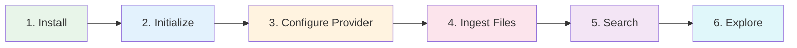

# Quick Start

This guide takes you from zero to your first semantic search in under 5 minutes. By the end, you'll have indexed a set of Markdown files and run your first query.

## Overview



## Prerequisites

- **mdvdb** installed and available in your `PATH` ([Installation](./installation.md))
- A directory containing `.md` files you want to search
- An embedding provider: **OpenAI API key** or a running **Ollama** instance

## Step 1: Initialize Your Project

Navigate to a directory containing Markdown files and create a configuration:

```bash
cd my-notes
mdvdb init
```

Expected output:

```
Created .markdownvdb config file
```

This creates a `.markdownvdb` directory with a default configuration. The directory is where mdvdb stores its index and settings.

## Step 2: Configure an Embedding Provider

mdvdb needs an embedding provider to convert your Markdown text into vectors for semantic search. Choose one of the following:

### Option A: OpenAI (Default)

Set your OpenAI API key as an environment variable:

```bash
export OPENAI_API_KEY="sk-..."
```

Or add it to your `.markdownvdb/.config` file:

```bash
echo 'OPENAI_API_KEY=sk-...' >> .markdownvdb/.config
```

This uses the `text-embedding-3-small` model by default (1536 dimensions). No other configuration is needed.

### Option B: Ollama (Local, Free)

If you prefer to run embeddings locally with [Ollama](https://ollama.ai/), first make sure Ollama is running, then configure mdvdb:

```bash
# Pull an embedding model
ollama pull nomic-embed-text

# Configure mdvdb to use Ollama
cat >> .markdownvdb/.config << 'EOF'
MDVDB_EMBEDDING_PROVIDER=ollama
MDVDB_EMBEDDING_MODEL=nomic-embed-text
MDVDB_EMBEDDING_DIMENSIONS=768
EOF
```

Ollama connects to `http://localhost:11434` by default. To use a different host, set `OLLAMA_HOST`:

```bash
echo 'OLLAMA_HOST=http://my-server:11434' >> .markdownvdb/.config
```

### Verify Your Configuration

Run the doctor command to check that everything is set up correctly:

```bash
mdvdb doctor
```

Expected output:

```
Doctor Results
  Config valid ........................... OK
  Provider reachable .................... OK
  Index present ......................... WARN  No index found (run mdvdb ingest)
```

If the provider check fails, verify your API key or Ollama connection.

## Step 3: Ingest Your Files

Index your Markdown files:

```bash
mdvdb ingest
```

You'll see a progress display as files are discovered, parsed, and embedded:

```
Ingesting...
  Discovering files ..................... 42 files
  Parsing & chunking ................... 128 chunks
  Embedding ............................ 128/128
  Saving index ......................... done
  Clustering ........................... 5 clusters

Ingestion complete
  Files indexed     42
  Chunks created    128
  Files skipped     0
  Duration          3.2s
```

mdvdb splits each file by headings into chunks, generates embeddings for each chunk, and stores everything in a local index under `.markdownvdb/`.

### Preview Mode

If you want to see what ingestion would do without actually indexing anything:

```bash
mdvdb ingest --preview
```

## Step 4: Search Your Files

Run your first semantic search:

```bash
mdvdb search "how to deploy"
```

Example output:

```
Search results for "how to deploy" (hybrid, 3 results)

  1. docs/deployment.md #2                          0.847  ████████░░
     Deployment Guide > Production Setup
     "To deploy the application, first build the Docker image..."

  2. docs/ci-cd.md #1                               0.723  ███████░░░
     CI/CD Pipeline > Deploy Stage
     "The deploy stage pushes the built container to..."

  3. docs/infrastructure.md #4                      0.691  ██████░░░░
     Infrastructure > Docker Compose
     "The production docker-compose.yml configures..."
```

Results show the file path, section heading, a snippet of the matching content, and a relevance score.

### JSON Output

For machine-readable output (useful in scripts or AI agent pipelines), add `--json`:

```bash
mdvdb search "how to deploy" --json
```

```json
{
  "results": [
    {
      "file_path": "docs/deployment.md",
      "chunk_index": 2,
      "heading": "Production Setup",
      "score": 0.847,
      "snippet": "To deploy the application, first build the Docker image..."
    }
  ],
  "query": "how to deploy",
  "total_results": 3,
  "mode": "hybrid"
}
```

### Search with Filters

If your Markdown files use YAML frontmatter, you can filter results by metadata:

```bash
# Only search files with type: guide
mdvdb search "deployment" --filter type=guide

# Limit results and set minimum score
mdvdb search "authentication" --limit 5 --min-score 0.5
```

### Search Modes

mdvdb supports multiple search modes:

```bash
# Hybrid (default) — combines semantic + lexical (BM25)
mdvdb search "deploy docker"

# Semantic only — pure vector similarity
mdvdb search "deploy docker" --semantic

# Lexical only — keyword matching (BM25)
mdvdb search "deploy docker" --lexical
```

See [Search Modes](./concepts/search-modes.md) for a detailed comparison.

## Step 5: Check Your Index

View the current state of your index:

```bash
mdvdb status
```

```
Index Status
  Documents         42
  Chunks            128
  Vectors           128
  Index size         2.4 MB
  Last ingested     2 minutes ago
  Schema fields     4 (type, tags, date, status)
```

## What's Next?

Now that you have a working setup, explore these features:

### Explore Your Data

```bash
# See the file tree with sync status
mdvdb tree

# View document clusters
mdvdb clusters

# Check metadata schema inferred from frontmatter
mdvdb schema

# Get details about a specific file
mdvdb get docs/deployment.md
```

### Navigate the Link Graph

If your Markdown files link to each other, mdvdb builds a link graph automatically:

```bash
# See outgoing links from a file
mdvdb links docs/deployment.md

# See which files link to a file
mdvdb backlinks docs/deployment.md

# Find orphan files (no incoming or outgoing links)
mdvdb orphans
```

### Watch for Changes

Keep your index up to date automatically:

```bash
mdvdb watch
```

This watches for file changes and re-indexes incrementally. Press `Ctrl+C` to stop.

### Advanced Search

```bash
# Boost results that are linked to/from top matches
mdvdb search "deploy" --boost-links

# Include graph context (linked file chunks) in results
mdvdb search "deploy" --expand 2

# Apply time decay (favor recently modified files)
mdvdb search "deploy" --decay

# Restrict search to a specific directory
mdvdb search "deploy" --path docs/
```

## Quick Reference

| Task | Command |
|------|---------|
| Initialize project | `mdvdb init` |
| Index all files | `mdvdb ingest` |
| Re-index everything | `mdvdb ingest --reindex` |
| Semantic search | `mdvdb search "query"` |
| Search with JSON output | `mdvdb search "query" --json` |
| Check index status | `mdvdb status` |
| Run diagnostics | `mdvdb doctor` |
| Watch for changes | `mdvdb watch` |
| View configuration | `mdvdb config` |

## Further Reading

- [Configuration](./configuration.md) -- All environment variables and config file options
- [Command Reference](./commands/index.md) -- Complete reference for every command
- [Embedding Providers](./concepts/embedding-providers.md) -- Detailed provider setup (OpenAI, Ollama, Custom)
- [Search Modes](./concepts/search-modes.md) -- Hybrid, semantic, lexical, and edge search
- [JSON Output Reference](./json-output.md) -- JSON schemas for scripting and automation
