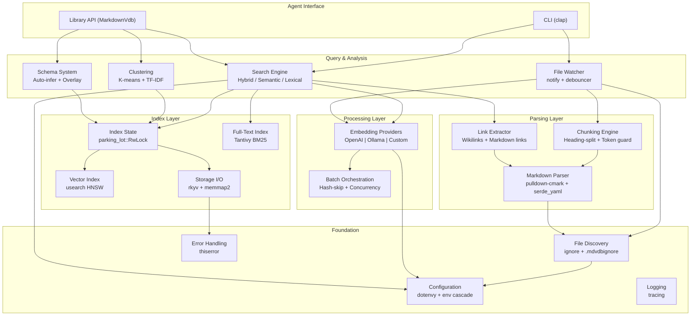
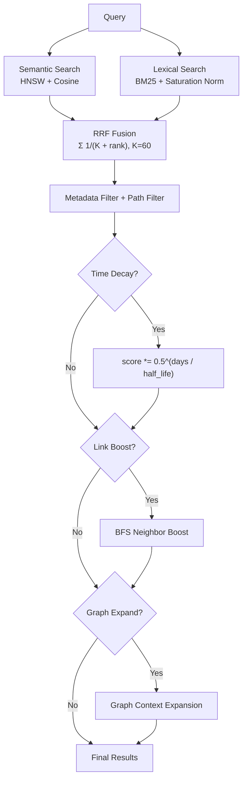
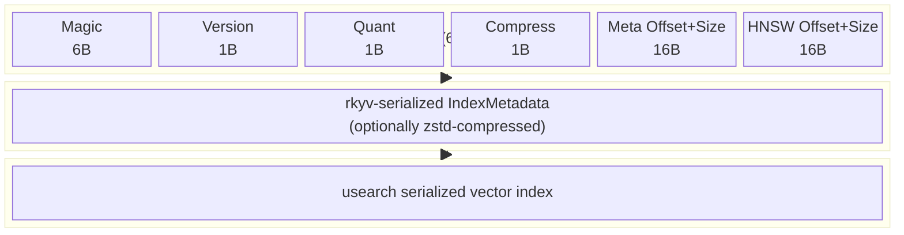
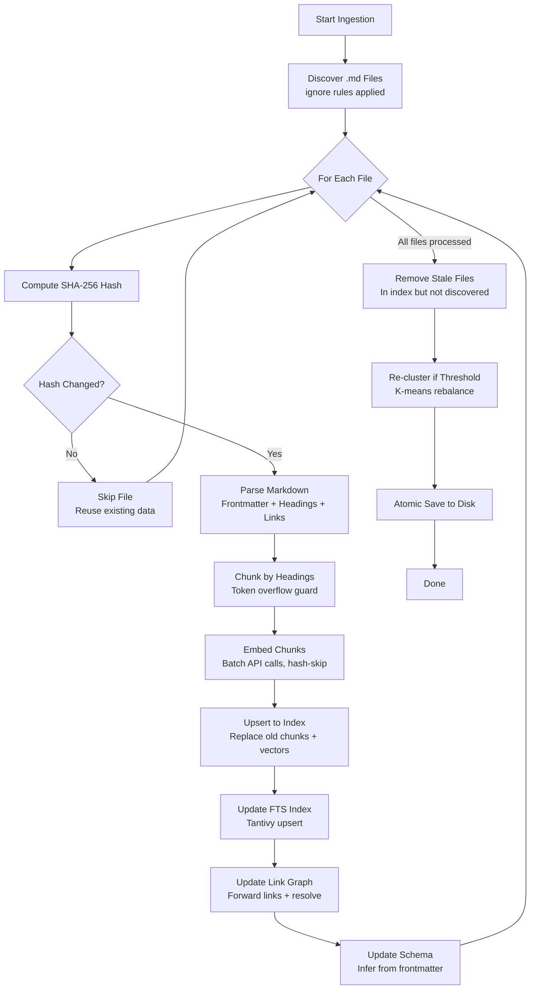
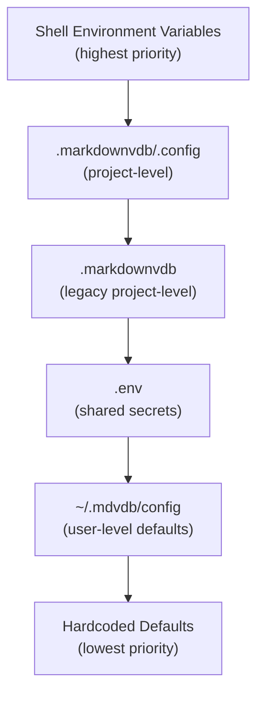

# Markdown VDB: A Filesystem-Native Vector Database for Structured Retrieval over Markdown Corpora

**Version 1.0** | March 2026

---

## Abstract

Markdown VDB is a single-binary, zero-infrastructure vector database designed for semantic and lexical retrieval over collections of Markdown files. The system combines hierarchical navigable small world (HNSW) approximate nearest neighbor search with BM25 lexical ranking, fused via Reciprocal Rank Fusion (RRF). Documents are chunked along heading boundaries with token-count overflow guards, embedded through pluggable providers (OpenAI, Ollama, or custom endpoints), and stored in a single memory-mapped binary index file using zero-copy deserialization. The system additionally maintains a link graph extracted from Markdown cross-references, supports multi-hop graph traversal for context expansion, performs K-means document clustering with TF-IDF keyword extraction, and infers metadata schemas from YAML frontmatter. All state is local to the filesystem. There is no server process, no external database, and no network dependency at query time. The implementation comprises approximately 12,000 lines of Rust across 18 completed subsystems, validated by 612 automated tests.

---

## Table of Contents

1. [Introduction and Motivation](#1-introduction-and-motivation)
2. [Design Goals and Non-Goals](#2-design-goals-and-non-goals)
3. [System Architecture](#3-system-architecture)
4. [Core Subsystems](#4-core-subsystems)
   - 4.1 [File Discovery](#41-file-discovery)
   - 4.2 [Markdown Parsing](#42-markdown-parsing)
   - 4.3 [Chunking Engine](#43-chunking-engine)
   - 4.4 [Embedding Providers](#44-embedding-providers)
   - 4.5 [Index Storage](#45-index-storage)
   - 4.6 [Full-Text Search](#46-full-text-search)
   - 4.7 [Link Graph](#47-link-graph)
   - 4.8 [Document Clustering](#48-document-clustering)
   - 4.9 [Metadata Schema System](#49-metadata-schema-system)
   - 4.10 [File Watching](#410-file-watching)
5. [Search Pipeline](#5-search-pipeline)
   - 5.1 [Query Processing](#51-query-processing)
   - 5.2 [Semantic Search](#52-semantic-search)
   - 5.3 [Lexical Search](#53-lexical-search)
   - 5.4 [Hybrid Fusion](#54-hybrid-fusion)
   - 5.5 [Post-Retrieval Processing](#55-post-retrieval-processing)
6. [Storage Format](#6-storage-format)
   - 6.1 [Binary Index Layout](#61-binary-index-layout)
   - 6.2 [Serialization Strategy](#62-serialization-strategy)
   - 6.3 [Atomic Write Protocol](#63-atomic-write-protocol)
7. [Ingestion Pipeline](#7-ingestion-pipeline)
8. [Configuration System](#8-configuration-system)
9. [Evaluation](#9-evaluation)
10. [Related Work](#10-related-work)
11. [Limitations and Future Work](#11-limitations-and-future-work)
12. [Conclusion](#12-conclusion)
13. [Technology Stack](#13-technology-stack)
14. [Appendix A: Library API Reference](#appendix-a-library-api-reference)
15. [Appendix B: Configuration Reference](#appendix-b-configuration-reference)
16. [Appendix C: CLI Command Reference](#appendix-c-cli-command-reference)

---

## 1. Introduction and Motivation

### 1.1 Problem Statement

Knowledge workers and AI agents increasingly operate over collections of Markdown files: personal wikis, documentation repositories, engineering notes, research journals, and Zettelkasten-style knowledge bases. These corpora range from tens to tens of thousands of files and exhibit several structural properties that generic vector databases do not exploit:

- **Heading hierarchy**: Markdown headings (`#` through `######`) impose a natural document structure that maps to semantic boundaries between topics.
- **YAML frontmatter**: Many Markdown workflows attach structured metadata (tags, dates, categories, authors) as YAML blocks at the top of each file.
- **Internal cross-references**: Wiki-style links (`[[target]]`) and standard Markdown links (`[text](path.md)`) encode a document graph that carries relational information.
- **Filesystem locality**: The files already reside on disk. A retrieval system that requires copying them into a separate database introduces synchronization overhead and duplicates storage.

Existing vector database solutions fall into two categories. Cloud-hosted services (Pinecone, Weaviate Cloud, Zilliz) require network connectivity, introduce latency, and impose per-query pricing. Local-first alternatives (Chroma, LanceDB, Qdrant in embedded mode) reduce infrastructure requirements but still operate as general-purpose vector stores that treat documents as opaque text blobs. None exploit Markdown-specific structure for chunking, do not extract or index the link graph, and do not provide incremental re-indexing triggered by filesystem events.

### 1.2 Target Users

Markdown VDB is designed for three primary user populations:

**AI coding agents** (e.g., Claude, Copilot, Cursor) that need to retrieve relevant context from a codebase's documentation, design documents, and notes. These agents benefit from JSON output, deterministic IDs, and a library API that can be called programmatically.

**Knowledge workers** who maintain personal or team Markdown-based knowledge bases (Zettelkasten, engineering journals, research notes) and want to find relevant content by describing what they're looking for in natural language, rather than remembering exact keywords or file locations.

**Developers** who maintain documentation repositories and want to ensure that their documentation is searchable, cross-referenced, and organized without adopting a heavyweight CMS or search infrastructure.

### 1.3 Contributions

Markdown VDB addresses the gaps identified in Section 1.1 with a retrieval system purpose-built for Markdown corpora. Its contributions are:

1. **Heading-aware chunking** that preserves document structure and produces chunks aligned to semantic boundaries.
2. **Hybrid search** combining dense (HNSW) and sparse (BM25) retrieval with Reciprocal Rank Fusion (RRF).
3. **Link graph extraction and multi-hop traversal** that leverages Markdown cross-references for context expansion and relevance boosting.
4. **A single-file, memory-mapped binary index** that requires no server process and enables sub-millisecond cold-start reads.
5. **Incremental ingestion** with content-hash deduplication that avoids redundant embedding API calls.
6. **A filesystem watcher** that keeps the index synchronized with file changes in real time.
7. **Automatic metadata schema inference** from YAML frontmatter, enabling structured filtering without manual schema definition.
8. **Document clustering** via K-means with TF-IDF keyword extraction, providing an organizational overview derived from content rather than filesystem structure.

The system is implemented as a Rust library with an accompanying CLI, suitable for direct invocation by AI coding agents and human users alike.

### 1.4 Paper Organization

The remainder of this paper is organized as follows. Section 2 defines explicit design goals and non-goals. Section 3 presents the system architecture as a layered diagram. Sections 4 through 6 describe the core subsystems, search pipeline, and storage format in technical detail. Section 7 covers the ingestion pipeline. Section 8 describes the configuration system. Section 9 evaluates test coverage and performance characteristics. Section 10 compares with related work. Section 11 discusses limitations and future directions. Section 12 concludes.

---

## 2. Design Goals and Non-Goals

### 2.1 Goals

| Goal | Rationale |
|------|-----------|
| Zero infrastructure | No database server, no Docker, no cloud account required for basic operation |
| Filesystem-native | The index lives alongside the Markdown files it indexes; moving the directory moves everything |
| Markdown-aware | Exploit heading structure, frontmatter metadata, and internal links rather than treating files as flat text |
| Incremental by default | Only re-embed files whose content has changed, minimizing embedding API cost |
| Agent-friendly | JSON output mode, deterministic IDs, and a library API enable programmatic integration |
| Sub-second queries | Search latency under 100ms for corpora of 10,000+ documents on commodity hardware |
| Read-heavy concurrency | Multiple concurrent readers with a single writer, matching the access pattern of search-dominated workloads |

### 2.2 Non-Goals

| Non-Goal | Explanation |
|----------|-------------|
| Distributed operation | The system targets single-machine, single-index deployments. Cross-machine replication is out of scope. |
| Arbitrary file formats | Only Markdown (`.md`) files are supported. PDF, HTML, and other formats require external conversion. |
| Built-in embedding models | The system delegates embedding computation to external providers (OpenAI API, Ollama, custom HTTP endpoints). It does not ship or run neural network inference locally. |
| Source file mutation | The system never writes to Markdown files. All computed state (embeddings, clusters, schema) resides in the index. |
| Real-time collaboration | There is no multi-user locking or conflict resolution. Concurrent writes from multiple processes are serialized by file-level locks. |

---

## 3. System Architecture

### 3.1 Layer Diagram

The system is organized into seven layers, each depending only on layers below it:



### 3.2 Module Inventory

| Module | Source | Responsibility |
|--------|--------|---------------|
| `config` | `src/config.rs` | Load and validate configuration from environment cascade |
| `error` | `src/error.rs` | Typed error enum via `thiserror` |
| `logging` | `src/logging.rs` | `tracing-subscriber` initialization |
| `discovery` | `src/discovery.rs` | Recursive `.md` file scanning with ignore rules |
| `parser` | `src/parser.rs` | Frontmatter extraction, heading parsing, link extraction, SHA-256 hashing |
| `chunker` | `src/chunker.rs` | Heading-based document splitting with token overflow guard |
| `embedding` | `src/embedding/` | Provider trait, OpenAI/Ollama implementations, batch orchestration |
| `index` | `src/index/` | Binary storage format, HNSW management, runtime state with RwLock |
| `search` | `src/search.rs` | Query pipeline: embed, retrieve, filter, fuse, boost, decay |
| `fts` | `src/fts.rs` | Tantivy BM25 wrapper for lexical search |
| `links` | `src/links.rs` | Link graph construction, backlink computation, BFS traversal |
| `clustering` | `src/clustering.rs` | K-means clustering, TF-IDF keyword extraction |
| `schema` | `src/schema.rs` | Automatic schema inference from frontmatter fields |
| `watcher` | `src/watcher.rs` | Filesystem event monitoring with debounced incremental re-indexing |
| `ingest` | `src/ingest.rs` | Orchestration of discovery, parsing, chunking, embedding, and index update |
| `tree` | `src/tree.rs` | File tree rendering with sync-status indicators |
| `format` | `src/format.rs` | Human-readable output formatting (colors, bars, timestamps) |

### 3.3 Error Handling Strategy

The system uses a two-layer error handling strategy:

- **Library layer** (`src/error.rs`): A typed error enum defined via `thiserror::Error` with variants for each failure mode (index not found, embedding provider error, parse failure, configuration invalid, etc.). All library functions return `Result<T, Error>`. The `unwrap()` method is never used in library code.
- **CLI layer** (`src/main.rs`): The `anyhow` crate provides ergonomic error chaining at the application boundary. Library errors are converted to `anyhow::Error` with context messages and printed to stderr. The process exits with code 1 on any error.

This separation ensures that library consumers receive structured, matchable errors (via the typed enum) while CLI users receive human-readable error messages with context chains.

### 3.4 Data Flow Invariants

Several invariants are maintained throughout the system:

1. **Relative paths only**: All file paths stored in the index are relative to the project root. Absolute paths are never stored, ensuring the index is portable.
2. **Read-only source files**: The system never writes to Markdown files. All computed state (embeddings, clusters, schema, link graph) resides in the index.
3. **Configuration isolation**: All environment variable reading occurs in `Config::load()`. Other modules receive a typed `Config` struct — there is no global mutable state, no `lazy_static`, and no module-level env var access.
4. **Atomic writes**: The index file is never written to directly. All saves go through the temp-file + fsync + rename protocol.
5. **Deterministic IDs**: Chunk IDs (`path#index`) and HNSW keys (sorted alphabetical assignment) are deterministic given the same input.

---

## 4. Core Subsystems

### 4.1 File Discovery

File discovery uses the `ignore` crate (the same library underlying `ripgrep`) to perform recursive directory traversal that respects `.gitignore` rules natively. The discovery module is the first stage of the ingestion pipeline and determines the set of Markdown files that the system will index.

**Source directories**: By default, the current working directory (`.`) is scanned recursively. Users can configure one or more source directories via `MDVDB_SOURCE_DIRS` (comma-separated). Each directory is walked independently, and results are merged.

**Ignore rule precedence** (highest to lowest):
1. Fifteen built-in directory exclusions (`.git/`, `node_modules/`, `target/`, `.obsidian/`, IDE directories, build output directories)
2. `.gitignore` rules (inherited from the repository)
3. `.mdvdbignore` files (same syntax as `.gitignore`, scoped to index exclusions)
4. `MDVDB_IGNORE_PATTERNS` environment variable (comma-separated glob patterns)

**Built-in ignore list** (always applied, not overridable):
```
.claude/  .cursor/  .vscode/  .idea/  .git/
node_modules/  .obsidian/  __pycache__/
.next/  .nuxt/  .svelte-kit/
target/  dist/  build/  out/
```

These directories are excluded because they either contain non-Markdown content (build artifacts, IDE settings) or represent version control internals that should never be indexed.

**`.mdvdbignore` file**: This file uses identical syntax to `.gitignore` (glob patterns, negation with `!`, comments with `#`, directory markers with trailing `/`). Unlike `.gitignore`, it only affects index exclusion — the files remain tracked by git. Nested `.mdvdbignore` files are supported and scope their rules to their containing subtree. The `ignore` crate's `add_custom_ignore_filename()` API integrates this directly into the traversal without additional parsing logic.

Only files with the `.md` extension pass the filter. Discovered paths are returned as relative paths from the project root, sorted and deduplicated. This invariant (relative paths only, never absolute) is maintained throughout the entire system to ensure index portability — moving the project directory preserves all path references.

### 4.2 Markdown Parsing

Each discovered file is parsed into a `MarkdownFile` structure containing:

| Field | Type | Source |
|-------|------|--------|
| `path` | Relative path | Discovery |
| `frontmatter` | `Option<serde_json::Value>` | YAML between `---` delimiters, converted to JSON |
| `headings` | `Vec<Heading>` | Extracted via `pulldown-cmark` event stream |
| `body` | `String` | Full file content after frontmatter removal |
| `content_hash` | `String` | SHA-256 hex digest of file content |
| `file_size` | `u64` | Byte size on disk |
| `links` | `Vec<RawLink>` | Internal Markdown and wiki-style links |
| `modified_at` | `u64` | File modification time as Unix timestamp |

**Heading extraction** uses `pulldown-cmark`'s streaming parser. Each `Start(Heading(level))` event opens a heading context; text events within that context are concatenated; the `End(Heading)` event closes it. Line numbers are derived from byte offsets by counting preceding newlines.

**Link extraction** identifies two syntactic forms:
- Standard Markdown links: `[text](target.md)` — captured from `pulldown-cmark` `Link` events
- Wikilinks: `[[target]]` or `[[target|display text]]` — captured via regex `\[\[([^\]]+)\]\]`

External URLs (`http://`, `https://`, `mailto:`) and anchor-only references (`#section`) are filtered out. Only internal file references are retained.

**Content hashing** computes a SHA-256 digest of the full file content. This hash serves as the primary mechanism for incremental ingestion: if a file's hash matches the stored hash in the index, the file is skipped during re-ingestion.

### 4.3 Chunking Engine

The chunking engine splits parsed Markdown files into semantically coherent units suitable for embedding. The strategy is hierarchical: headings define primary chunk boundaries, and a token-count guard prevents individual chunks from exceeding the embedding model's context window.

#### 4.3.1 Design Rationale

Chunking strategies for retrieval systems fall along a spectrum from purely structural (fixed character/token counts) to purely semantic (model-based boundary detection). Markdown VDB uses a middle ground: structural boundaries derived from the document's own heading hierarchy, with a token-count safety valve for oversized sections. This approach has several advantages:

- **Semantic coherence**: Text under a single heading typically addresses a single topic, producing chunks that embed to a coherent region of vector space.
- **Determinism**: Given the same file content, the same chunks are produced. There is no model-dependent boundary detection that could change across runs.
- **Hierarchy preservation**: Each chunk retains its heading breadcrumb trail (e.g., `["Architecture", "Storage Layer", "HNSW Configuration"]`), providing structural context in search results.
- **Efficiency**: The chunking algorithm is O(n) in file length and requires no external calls.

#### 4.3.2 Algorithm

```
Input: MarkdownFile with headings and body
Output: Vec<Chunk> with deterministic IDs

1. Build heading-delimited sections:
   For each heading h[i]:
     section[i].content = body[h[i].line .. h[i+1].line]
     section[i].hierarchy = stack of headings up to h[i]
   Preamble (text before first heading) becomes section[0]

2. For each section s:
   tokens = count_tokens(s.content, cl100k_base)
   if tokens <= max_tokens:
     emit Chunk(id="{path}#{index}", content=s.content, ...)
   else:
     sub_split(s, max_tokens, overlap_tokens)

3. Sub-split procedure:
   tokens = encode(s.content)  // cl100k_base token IDs
   stride = max_tokens - overlap_tokens  // minimum 1
   for offset in (0, stride, 2*stride, ...):
     window = tokens[offset .. offset+max_tokens]
     text = decode(window)
     emit Chunk(id="{path}#{index}", is_sub_split=true, ...)
```

**Heading hierarchy stack management**: When a heading of level L is encountered, all entries in the hierarchy stack at level L or deeper are popped before the new heading is pushed. This ensures correct nesting: an H3 following an H2 under the same H1 produces the hierarchy `[H1, H2, H3]`, but a subsequent H2 resets the stack to `[H1, H2_new]`.

#### 4.3.3 Parameters

| Parameter | Default | Config Key | Description |
|-----------|---------|------------|-------------|
| `max_tokens` | 512 | `MDVDB_CHUNK_MAX_TOKENS` | Maximum tokens per chunk |
| `overlap_tokens` | 50 | `MDVDB_CHUNK_OVERLAP_TOKENS` | Token overlap between sub-split windows |
| Tokenizer | `cl100k_base` | (fixed) | Matches OpenAI embedding model tokenization |

The default of 512 tokens was chosen to balance chunk granularity against embedding quality. Smaller chunks (128-256 tokens) produce more precise matches but may lack sufficient context for the embedding model to capture the topic. Larger chunks (1024+ tokens) retain more context but dilute the embedding signal when the chunk contains multiple sub-topics. The 512-token default represents a widely used middle ground in retrieval system literature.

The 50-token overlap ensures that content near sub-split boundaries appears in both adjacent chunks, preventing information loss at split points. The overlap is a fraction (approximately 10%) of the chunk size, following common practice.

#### 4.3.4 Chunk Data Structure

Each chunk carries the following metadata:

| Field | Type | Description |
|-------|------|-------------|
| `id` | `String` | Deterministic ID: `"{path}#{index}"` |
| `source_path` | `String` | Relative path of the source file |
| `heading_hierarchy` | `Vec<String>` | Breadcrumb trail of heading texts |
| `content` | `String` | Chunk text content |
| `start_line` | `usize` | First line number (1-based) in source file |
| `end_line` | `usize` | Last line number (1-based) in source file |
| `chunk_index` | `usize` | Zero-based index within the file |
| `is_sub_split` | `bool` | `true` if produced by token-based overflow splitting |

**Invariants**:
- A file with no headings produces at least one chunk containing the entire body.
- A file with an empty body produces exactly one chunk with empty content.
- Chunk IDs are unique within a single index.
- `chunk_index` values are contiguous starting from 0 for each file.

### 4.4 Embedding Providers

Embedding computation is delegated to external services via a trait-based provider interface:

```rust
#[async_trait]
pub trait EmbeddingProvider: Send + Sync {
    async fn embed_batch(&self, texts: &[String]) -> Result<Vec<Vec<f32>>>;
    fn dimensions(&self) -> usize;
}
```

Three production providers are implemented:

| Provider | Model Default | Dimensions | Endpoint |
|----------|---------------|------------|----------|
| OpenAI | `text-embedding-3-small` | 1536 | `https://api.openai.com/v1/embeddings` |
| Ollama | (user-specified) | (model-dependent) | `http://localhost:11434/api/embed` |
| Custom | (user-specified) | (user-specified) | User-provided URL |

A `Mock` provider (8 dimensions, deterministic output) is used in the test suite.

**Batch orchestration** (`src/embedding/batch.rs`) processes chunks in configurable batch sizes (default: 100 texts per API call). Up to 4 concurrent batches are dispatched using `futures::stream::buffer_unordered`. Each chunk's content hash is checked against a cache of previously embedded content; chunks with unchanged hashes are skipped, and their existing vectors are reused. This content-hash deduplication is the primary mechanism for controlling embedding API cost during incremental re-indexing.

**Error handling** follows a differentiated retry policy based on HTTP status codes:

| Status | Category | Action |
|--------|----------|--------|
| 401 | Authentication failure | Fail immediately with descriptive error |
| 429 | Rate limit | Exponential backoff, up to 3 retries |
| 5xx | Server error | Exponential backoff, up to 3 retries |
| Network error | Connection failure | Retry up to 3 times with backoff |
| 200 | Success | Process response |

The exponential backoff starts at 1 second and doubles with each retry (1s, 2s, 4s). This prevents thundering herd effects when the provider is under load while avoiding excessive delays for transient errors.

**Provider selection** is configured via `MDVDB_EMBEDDING_PROVIDER`. The factory function in `embedding/mod.rs` dispatches to the appropriate implementation. Adding a new provider requires implementing the `EmbeddingProvider` trait and adding a match arm to the factory — no changes to the rest of the system are needed.

### 4.5 Index Storage

The index is a single binary file stored at `.markdownvdb/index` (configurable via `MDVDB_INDEX_DIR`). Its format is described in detail in [Section 6](#6-storage-format). At runtime, the index is accessed through an `Index` struct that wraps a `parking_lot::RwLock<IndexState>`, providing concurrent read access for search queries and exclusive write access during ingestion.

#### 4.5.1 Concurrency Model

The system uses `parking_lot::RwLock` (not `std::sync::RwLock`) for its performance characteristics on read-heavy workloads. `parking_lot` avoids the poisoning mechanism of the standard library's RwLock and provides faster lock acquisition through adaptive spinning before falling back to OS-level blocking.

**Lock acquisition by operation**:

| Operation | Lock | Description |
|-----------|------|-------------|
| `search_vectors(query_vec, limit)` | Read | HNSW approximate nearest neighbor search |
| `get_chunk(id)` | Read | Retrieve stored chunk metadata by ID |
| `get_file_metadata(path)` | Read | Retrieve stored file metadata by path |
| `get_document_vectors()` | Read | Average chunk vectors per file (for clustering) |
| `get_link_graph()` | Read | Access link graph state |
| `upsert(file, chunks, vectors)` | Write | Remove old data for file, insert new chunks and vectors |
| `remove_file(path)` | Write | Delete all chunks and vectors for a file |
| `update_clusters(state)` | Write | Replace cluster state |
| `update_link_graph(graph)` | Write | Replace link graph |
| `save()` | Read | Serialize current state to disk (atomic write) |

Note that `save()` acquires a read lock, not a write lock. This is safe because `save()` only reads the current state to serialize it; the atomic file rename ensures consistency with concurrent readers of the on-disk file. This design allows search queries to proceed during index saves.

#### 4.5.2 HNSW Configuration

The HNSW index (`usearch` crate) is configured with fixed parameters:

| Parameter | Value | Effect |
|-----------|-------|--------|
| Connectivity (M) | 16 | Each node maintains 16 bidirectional links per layer. Higher values improve recall at the cost of memory and insertion time. |
| Expansion (add) | 128 | During insertion, 128 candidates are considered for neighbor selection. Higher values produce a better graph at the cost of slower insertion. |
| Expansion (search) | 64 | During search, 64 candidates are explored per layer. This is the primary knob for recall vs. latency. |
| Metric | Cosine | Cosine similarity, matching the embedding model's training objective. |
| Multi | false | Each key maps to exactly one vector (no multi-vector support). |
| Quantization | F16 (default) | Half-precision storage reduces memory by 50% with negligible impact on ranking quality. |

**HNSW key assignment** is deterministic: chunk IDs are sorted alphabetically and assigned sequential integer keys starting from 0. Edge vectors (from the link graph) are assigned keys starting after the last chunk key. This scheme ensures that key assignments are reproducible across index loads.

#### 4.5.3 Read-Only Mode

The index supports a read-only open mode (`MarkdownVdb::open_readonly()`) that skips acquiring the FTS writer lock. This enables concurrent read-only processes (e.g., search queries from an IDE plugin) to operate alongside a background write process (e.g., `mdvdb watch`). Read-only mode returns an error if a write operation (ingest, upsert) is attempted.

### 4.6 Full-Text Search

Lexical search is provided by Tantivy, a Rust-native full-text search engine implementing the BM25 ranking function. The FTS index is stored in a separate directory (`.markdownvdb/fts/`) as Tantivy segment files.

**Schema** (Tantivy fields):
- `chunk_id`: Stored string, used for joining results back to the vector index
- `source_path`: Stored string, used for per-file deletion during incremental updates
- `content`: Indexed with the `en_stem` tokenizer (English stemming), recording term frequencies and positions. **Not stored** — the full text is already available in the rkyv metadata region, avoiding redundant storage.
- `heading_hierarchy`: Indexed text with a 1.5x boost factor, reflecting the assumption that heading text carries higher topical signal than body text.

**Query parsing** uses Tantivy's lenient query parser, which degrades gracefully on malformed input (e.g., unbalanced quotes) rather than returning an error.

**Markdown stripping**: Before indexing, chunk content is passed through a `strip_markdown()` function that uses `pulldown-cmark` to extract only text and code tokens, discarding formatting syntax, link URLs, and image references. This prevents Markdown syntax from polluting term statistics. For example, the text `See [the API docs](api.md) for details` is stripped to `See the API docs for details` before indexing.

**FTS lifecycle**:
- **Creation**: The FTS index is created alongside the vector index during the first `mdvdb ingest`.
- **Updates**: During incremental ingestion, chunks for modified files are deleted (by `source_path` field) and re-inserted with current content.
- **Writer heap**: Tantivy's indexing writer uses a 50MB heap buffer. Commits to disk occur at the end of each ingestion batch.
- **Reader policy**: `OnCommitWithDelay` — readers see newly committed data after a short delay, avoiding the overhead of immediate reloading after every commit.

**Separation from vector index**: The FTS index is stored in a separate directory (`.markdownvdb/fts/`) rather than embedded in the binary index file. This is because Tantivy manages its own segment files, merge operations, and reader/writer locks. Embedding Tantivy's data into the single-file format would require reimplementing Tantivy's segment management, which would add complexity without benefit.

### 4.7 Link Graph

The link graph captures internal cross-references between Markdown files, providing a structural signal that complements the semantic and lexical retrieval pathways.

#### 4.7.1 Data Model

The link graph is represented as a `LinkGraph` structure stored within the index metadata:

```
LinkGraph {
    forward: HashMap<String, Vec<LinkEntry>>,       // source_path → outgoing links
    last_updated: u64,                               // Unix timestamp
    semantic_edges: HashMap<String, SemanticEdge>,   // edge_id → edge with context
    edge_cluster_state: Option<EdgeClusterState>,    // clustered edge types
}

LinkEntry {
    source: String,         // source file path
    target: String,         // resolved target file path
    text: String,           // link display text
    line_number: usize,     // 1-based line in source file
    is_wikilink: bool,      // true for [[target]] syntax
}

SemanticEdge {
    edge_id: String,
    source: String,
    target: String,
    context_text: String,   // surrounding paragraph text
    line_number: usize,
    strength: Option<f32>,  // cosine similarity to target
    relationship_type: Option<String>,
    cluster_id: Option<usize>,
}
```

#### 4.7.2 Link Resolution

Link targets are resolved through a normalization pipeline:

1. **Filter external links**: Targets starting with `http://`, `https://`, or `mailto:` are excluded.
2. **Filter anchor-only links**: Targets starting with `#` (in-page section links) are excluded.
3. **Resolve relative paths**: `..` and `.` components are resolved relative to the source file's directory.
4. **Normalize separators**: Backslashes are converted to forward slashes.
5. **Strip fragments**: URL fragments (`#section`) are removed from the target path.
6. **Ensure extension**: If the target lacks a `.md` extension, one is appended.
7. **Deduplicate**: Multiple links from the same source to the same target are collapsed into one entry.
8. **Exclude self-links**: Links from a file to itself are removed.

This pipeline handles the variety of link syntax found in practice: relative paths (`../sibling.md`), implicit extensions (`[[notes/idea]]`), and fragment-bearing references (`design.md#architecture`).

#### 4.7.3 Backlink Computation

Backlinks (incoming links) are computed by inverting the forward map at query time rather than stored redundantly. For a query file `F`, backlinks are the set `{S : F in forward[S]}`. This approach avoids maintaining two synchronized maps and keeps the stored graph representation compact.

#### 4.7.4 Multi-Hop BFS Traversal

The `bfs_neighbors` function performs a breadth-first search from a set of seed files, expanding through both forward links and backlinks:

```
BFS(seeds, max_depth):
    visited = {}
    queue = [(seed, 0) for seed in seeds]
    while queue not empty:
        (file, depth) = queue.pop_front()
        if file in visited or depth > max_depth:
            continue
        visited[file] = depth
        for neighbor in forward_links(file) + backlinks(file):
            queue.push((neighbor, depth + 1))
    return visited  // file → hop distance
```

The depth is clamped to the range [1, 3] to prevent excessive expansion in densely linked corpora. This traversal serves two purposes:

1. **Link boosting**: Neighbors of top search results receive a score boost proportional to their proximity (see [Section 5.5.2](#552-link-boosting)).
2. **Neighborhood API**: The `links_neighborhood` endpoint returns a recursive tree structure for interactive exploration of the document graph.

#### 4.7.5 Orphan Detection

Orphan detection identifies files that appear in neither the forward map (as sources with outgoing links) nor the inverted map (as targets of incoming links). These isolated files are surfaced via `mdvdb orphans` and may indicate documents that need better cross-referencing within the corpus.

#### 4.7.6 Broken Link Detection

During link resolution, targets that do not correspond to any indexed file are flagged as broken. The `mdvdb links <file>` command displays broken links alongside valid ones, enabling users to fix stale references.

### 4.8 Document Clustering

Document clustering groups files by semantic similarity using K-means over document-level embedding vectors, providing an organizational view of the corpus that is derived entirely from content rather than filesystem hierarchy.

#### 4.8.1 Document Vector Computation

For each file, the vectors of all its chunks are element-wise averaged to produce a single document-level vector:

```
doc_vector(file) = mean(chunk_vectors(file))
```

This average-of-chunks approach captures the overall semantic content of the file without privileging any particular section. Files with many chunks contribute vectors of the same dimensionality as files with one chunk, ensuring that document size does not bias clustering.

#### 4.8.2 K Selection Heuristic

The number of clusters K is determined by:

```
K = clamp(floor(sqrt(N * granularity / 2)), 2, 50)
```

where `N` is the number of documents and `granularity` is a configurable multiplier (default: 1.0, range: [0.25, 4.0]).

Example values for `granularity = 1.0`:

| Documents (N) | K |
|---------------|---|
| 8 | 2 |
| 50 | 5 |
| 200 | 10 |
| 800 | 20 |
| 5000 | 50 (capped) |

The lower bound of 2 ensures meaningful clustering even for small corpora. The upper bound of 50 prevents excessive fragmentation for large corpora, where too many clusters become difficult to label meaningfully.

#### 4.8.3 Algorithm Parameters

K-means is executed via the `linfa` crate with:

| Parameter | Value |
|-----------|-------|
| Maximum iterations | 100 |
| Convergence tolerance | 1e-4 |
| Centroid update metric | Euclidean (standard K-means) |
| Assignment metric | Cosine similarity (for nearest-centroid) |

The use of Euclidean distance for centroid updates follows standard K-means formulation, while cosine similarity for assignment better reflects the geometry of normalized embedding vectors. In practice, for L2-normalized vectors, Euclidean and cosine distances produce equivalent orderings.

#### 4.8.4 Keyword Extraction

Cluster labels are generated via cross-cluster TF-IDF, which identifies terms that are distinctive to a cluster relative to other clusters:

1. For each cluster, concatenate the text content of all member documents.
2. Tokenize on non-alphanumeric boundaries, lowercase, and filter tokens shorter than 3 characters.
3. Remove stop words from a list of 58 common English words (the, is, at, which, on, ...).
4. Compute TF within each cluster: `TF(term, cluster) = count(term in cluster) / total_tokens(cluster)`.
5. Compute IDF across clusters (not documents): `IDF(term) = log(total_clusters / clusters_containing_term)`.
6. Score: `TF-IDF(term, cluster) = TF * IDF`.
7. The top 3 terms by TF-IDF score become the cluster label, joined by " / ".

The use of cluster-level IDF (rather than document-level IDF) ensures that keywords discriminate between clusters rather than between individual documents. A term that appears in all clusters receives IDF = 0 and is suppressed, regardless of its document frequency.

#### 4.8.5 Incremental Assignment and Rebalancing

Between full re-clustering runs, new documents are assigned to the nearest existing centroid by cosine similarity. The centroid is updated incrementally using a running average.

A full re-clustering is triggered when the number of documents added since the last rebalance exceeds a configurable threshold (`MDVDB_CLUSTERING_REBALANCE_THRESHOLD`, default: 50). This amortizes the O(N*K*d) cost of K-means over many insertions while ensuring that cluster quality does not degrade as the corpus grows.

Clustering can be disabled entirely via `MDVDB_CLUSTERING_ENABLED=false` for corpora where the organizational overhead is unwanted.

### 4.9 Metadata Schema System

The schema system provides automatic type inference over YAML frontmatter fields across the corpus.

**Inference rules**:
- A field appearing in any file is included in the schema.
- Field types are inferred from observed values: `String`, `Number`, `Boolean`, `List`, `Date` (detected via `YYYY-MM-DD` or ISO 8601 patterns), or `Mixed` (when multiple types are observed for the same field).
- Sample values are collected for each field.

**Overlay schema**: An optional `.markdownvdb.schema.yml` file can annotate inferred fields with:
- Type overrides
- `allowed_values` constraints
- `required` flags
- Human-readable descriptions

The inferred schema and overlay are merged and persisted in the index metadata. The schema updates automatically during ingestion when new fields are encountered.

**Path-scoped schemas**: Top-level directories are auto-discovered as scopes. The overlay file supports a `scopes:` section where field annotations can be specialized per directory prefix. Schema resolution unions global fields with all matching scopes, with more specific scopes overriding less specific ones.

**Example**: Consider a corpus with `blog/` and `docs/` directories. Blog posts have `author`, `date`, and `tags` frontmatter; documentation files have `version` and `api_status`. The auto-inferred schema discovers all five fields globally. The overlay file can specify:

```yaml
scopes:
  blog:
    author:
      required: true
    date:
      type: Date
  docs:
    version:
      allowed_values: ["1.0", "2.0", "3.0"]
```

The `mdvdb schema --path blog/` command returns the blog-specific schema, while the unscoped `mdvdb schema` returns the global schema.

### 4.10 File Watching

The file watcher keeps the index synchronized with the filesystem in real time, enabling a "write and search" workflow where new or modified files become searchable within seconds.

#### 4.10.1 Architecture

The watcher uses the `notify` crate for cross-platform filesystem event notification (inotify on Linux, FSEvents on macOS, ReadDirectoryChangesW on Windows) with `notify-debouncer-full` for event coalescing. Raw filesystem events (which may fire multiple times for a single logical operation) are debounced into single events with a configurable window (default: 300ms, via `MDVDB_WATCH_DEBOUNCE_MS`).

Debounced events are dispatched to a tokio mpsc channel for async processing. Each event is classified and handled:

| Filesystem Event | Classification | Action |
|-----------------|---------------|--------|
| File created | `FileEvent::Created` | Parse, chunk, embed, upsert to index and FTS |
| File modified (data change) | `FileEvent::Modified` | Check content hash; if changed, re-process |
| File modified (metadata only) | `FileEvent::Modified` | Hash check → skip (no content change) |
| File deleted | `FileEvent::Deleted` | Remove from vector index, FTS index, and link graph |
| File renamed (within scope) | `FileEvent::Renamed` | Remove old path, process new path |
| File renamed (out of scope) | `FileEvent::Deleted` | Treat as deletion of the old path |

#### 4.10.2 Incremental Processing

Each file event triggers the same processing pipeline used by the ingestion module, applied to a single file:

1. Parse the modified/created file
2. Compute content hash and compare against stored hash
3. If unchanged, skip (no API calls)
4. If changed: chunk, embed, upsert to vector index, upsert to FTS index
5. Update the link graph for the affected file
6. Update the schema if the file has frontmatter
7. Save the index to disk (atomic write)

**Invariant**: The content-hash check ensures that file save events that do not change content (e.g., auto-save operations that write the same bytes, or metadata-only modifications like permission changes) do not trigger embedding API calls.

#### 4.10.3 Output Format

In watch mode, the CLI emits one NDJSON (newline-delimited JSON) record per event to stdout. Each record contains:
- Event type (created, modified, deleted, renamed)
- File path
- Number of chunks processed
- Duration in milliseconds
- Success/error status

This format enables line-by-line parsing by external tools and AI agents that monitor the watcher's output stream.

#### 4.10.4 Lifecycle

Graceful shutdown is supported via `tokio::sync::CancellationToken`. When a cancellation signal is received (Ctrl+C or programmatic cancellation), the watcher:
1. Stops accepting new filesystem events
2. Completes any in-flight file processing
3. Saves the index to disk
4. Exits with a success status code

The watcher can be disabled entirely via `MDVDB_WATCH=false`.

---

## 5. Search Pipeline

The search pipeline transforms a natural-language query into a ranked list of chunk-level results, optionally augmented with graph context from linked documents.

### 5.1 Query Processing

A search query is represented by the `SearchQuery` structure:

| Field | Type | Default | Description |
|-------|------|---------|-------------|
| `query` | `String` | (required) | Natural-language query text |
| `limit` | `usize` | 10 | Maximum results to return |
| `min_score` | `f32` | 0.0 | Minimum score threshold [0.0, 1.0] |
| `mode` | `SearchMode` | `Hybrid` | One of: `Hybrid`, `Semantic`, `Lexical` |
| `filters` | `Vec<MetadataFilter>` | `[]` | Frontmatter field predicates (AND logic) |
| `path_prefix` | `Option<String>` | `None` | Restrict results to a directory subtree |
| `boost_links` | `bool` | `false` | Enable link-aware score boosting |
| `boost_hops` | `usize` | 1 | BFS depth for link boosting [1, 3] |
| `decay` | `bool` | `false` | Enable time-based score decay |
| `decay_half_life` | `f64` | 90.0 | Half-life in days for exponential decay |
| `expand_graph` | `usize` | 0 | Depth of graph context expansion [0, 3] |

**Metadata filters** support four predicate types:
- `Equals(field, value)`: Exact match on a frontmatter field
- `In(field, values)`: Field value is in a set
- `Range(field, min, max)`: Numeric or date range
- `Exists(field)`: Field is present in frontmatter

All filters are combined with AND logic.

### 5.2 Semantic Search


1. The query text is embedded using the same provider and model that produced the index vectors.
2. The HNSW index is searched for the `limit * over_fetch_factor` nearest neighbors (over-fetch factor: 3 for non-hybrid modes, 5 for hybrid). Over-fetching compensates for results that will be removed by metadata filtering or minimum-score thresholds.
3. Results are returned as `(chunk_id, cosine_similarity)` pairs, where cosine similarity is in [0, 1] (the HNSW metric is pre-configured for cosine distance).

### 5.3 Lexical Search

```mermaid
flowchart LR
    Q[Query Text] --> PARSE[Tantivy Query Parser<br/>lenient mode]
    PARSE --> BM25[BM25 Search<br/>k = limit * over_fetch]
    BM25 --> RAW["(chunk_id, bm25_score)"]
    RAW --> NORM[Saturation Normalization<br/>score / (score + k)]
    NORM --> PAIRS["(chunk_id, normalized_score)"]
```

1. The query is parsed by Tantivy's lenient query parser, searching the `content` and `heading_hierarchy` fields (headings receive a 1.5x boost).
2. BM25 scores are unbounded positive reals. To make them commensurable with cosine similarities in [0, 1], a saturation normalization is applied: `normalized = score / (score + bm25_norm_k)` where `bm25_norm_k` defaults to 1.5. This maps BM25 scores to the (0, 1) range with diminishing returns for very high raw scores.

### 5.4 Hybrid Fusion

When `SearchMode::Hybrid` is selected (the default), semantic and lexical results are combined via Reciprocal Rank Fusion (RRF):

```
RRF_score(d) = Σ 1/(K + rank_i(d))  for each result list i
```

where K defaults to 60.0 (`MDVDB_SEARCH_RRF_K`). Each result list (semantic and lexical) contributes `1/(K + rank)` for every document it contains, where rank is 1-indexed. Documents appearing in both lists accumulate scores from each. Documents appearing in only one list receive a contribution from that list alone.

After fusion, RRF scores are normalized to [0, 1] by dividing by the theoretical maximum score. The maximum occurs when a document is ranked #1 in all lists: `max_score = num_lists / (K + 1)`. For the two-list case with K=60: `max_score = 2/61 ≈ 0.0328`. After normalization:

- A document ranked #1 in both lists receives a normalized score of 1.0
- A document ranked #1 in only one list receives approximately 0.5
- Ranking order is preserved since normalization is monotonic

RRF was chosen because it is rank-based rather than score-based, making it robust to differences in score distributions between dense (cosine similarity) and sparse (BM25) retrievers. It does not require calibration of relative weights between the two signals.

**Over-fetching**: To compensate for results that may be eliminated by metadata filters or minimum-score thresholds, the system retrieves more candidates than the requested limit:
- Hybrid mode: `limit * 5` candidates from each list
- Semantic/Lexical mode: `limit * 3` candidates
This ensures sufficient candidates remain after filtering to satisfy the requested limit in most cases.



### 5.5 Post-Retrieval Processing

After fusion and filtering, several optional post-processing stages are applied in sequence:

#### 5.5.1 Time Decay

When enabled, each result's score is multiplied by an exponential decay factor based on the file's modification time:

```
decay_multiplier = 0.5 ^ (elapsed_days / half_life_days)
```

- `half_life_days` defaults to 90 (configurable via `MDVDB_SEARCH_DECAY_HALF_LIFE`).
- The multiplier is always in (0, 1], so scores are penalized but never boosted.
- At 90-day half-life: a 30-day-old file retains 79.4% of its score; a 180-day-old file retains 25%.

**Decay curve examples** (half-life = 90 days):

| File Age | Decay Multiplier | Effective Score (if base = 0.80) |
|----------|-----------------|----------------------------------|
| 0 days | 1.000 | 0.800 |
| 7 days | 0.947 | 0.758 |
| 30 days | 0.794 | 0.635 |
| 90 days | 0.500 | 0.400 |
| 180 days | 0.250 | 0.200 |
| 365 days | 0.063 | 0.050 |

**Path-scoped decay control** addresses the reality that not all content in a corpus has the same temporal relevance. Reference documentation, API specifications, and evergreen guides should not be penalized for age, while journal entries, meeting notes, and status updates lose relevance over time.

- `MDVDB_SEARCH_DECAY_EXCLUDE`: Comma-separated path prefixes immune to decay (e.g., `docs/reference` for evergreen documentation).
- `MDVDB_SEARCH_DECAY_INCLUDE`: If set, only files matching these prefixes receive decay (e.g., `journal/` for time-sensitive entries).
- Exclude takes precedence over include.
- When both are unset, all files are subject to decay (if decay is enabled).

#### 5.5.2 Link Boosting

When enabled, the system performs a BFS traversal from the top-ranked result files through the link graph, up to a configurable depth (1-3 hops). Files discovered as neighbors receive a score boost:

```
boost = 1.0 + (edge_boost_weight / 2^(distance - 1))
```

where `edge_boost_weight` defaults to 0.15 and `distance` is the BFS hop count from the seed result. The exponential decay by hop distance ensures that directly linked files receive the strongest boost, with diminishing returns for more distant neighbors.

#### 5.5.3 Graph Context Expansion

When `expand_graph > 0`, the system performs an additional BFS from top results to discover linked files, then retrieves the best-matching chunk from each linked file via a targeted HNSW query. These chunks are returned as `GraphContextItem` entries alongside the primary results, providing supplementary context from the document neighborhood without displacing the original ranked results.

Each `GraphContextItem` includes:
- The linked file path and the best-matching chunk content
- The hop distance from the originating result
- The cosine similarity of the chunk to the query
- The heading hierarchy of the matched chunk

Graph context items are distinct from the primary results — they appear in a separate `graph_context` array in the JSON response, preserving the ranking of the primary results while providing supplementary material from the document neighborhood. The `expand_limit` parameter (default: 3, range: [1, 10]) caps the number of graph context items returned per hop level.

---

## 6. Storage Format

### 6.1 Binary Index Layout

The primary index is a single binary file with three contiguous regions:



**Header fields** (64 bytes total):

| Offset | Size | Field | Description |
|--------|------|-------|-------------|
| 0 | 6 | Magic | `MDVDB\x00` — file type identifier |
| 6 | 1 | Version | Format version (currently 1) |
| 7 | 1 | Quantization | `0x00` = F32, `0x01` = F16 |
| 8 | 1 | Compression | `0x00` = none, `0x01` = zstd |
| 9 | 8 | Meta offset | Byte offset of metadata region (u64 LE) |
| 17 | 8 | Meta size | Byte size of metadata region (u64 LE) |
| 25 | 8 | HNSW offset | Byte offset of HNSW region (u64 LE) |
| 33 | 8 | HNSW size | Byte size of HNSW region (u64 LE) |
| 41 | 8 | Uncompressed meta size | Original size before compression (u64 LE) |
| 49 | 15 | Reserved | Zero-padded for future use |

### 6.2 Serialization Strategy

**Metadata region**: The `IndexMetadata` structure is serialized using `rkyv` (zero-copy deserialization framework). `rkyv` differs from traditional serialization frameworks (serde, protobuf) in that it produces an archived representation that can be accessed directly from a byte buffer without a deserialization pass. Field access on an `ArchivedIndexMetadata` reads directly from the underlying memory-mapped bytes, eliminating the need to copy the entire metadata structure into heap-allocated Rust objects.

When compression is enabled (default), the serialized bytes are compressed with `zstd` at compression level 3 before writing. On load, the region is decompressed into a byte buffer and then accessed via `rkyv`'s archived type system. The trade-off: compression reduces index file size by approximately 55% but requires a decompression step on load (the zero-copy property is preserved within the decompressed buffer, but the buffer itself must be allocated).

**Storage size analysis** (for 1536-dimensional OpenAI embeddings):

| Component | Per-chunk cost (F32) | Per-chunk cost (F16) |
|-----------|---------------------|---------------------|
| Vector storage | 6,144 bytes | 3,072 bytes |
| Metadata (rkyv) | ~500 bytes (variable) | ~500 bytes (variable) |
| HNSW graph links | ~256 bytes (M=16) | ~256 bytes (M=16) |
| **Total per chunk** | **~6,900 bytes** | **~3,828 bytes** |

For a corpus of 10,000 chunks, the index file size is approximately 69 MB (F32) or 38 MB (F16), before metadata compression. With zstd compression on the metadata region, the metadata portion shrinks by ~55%, yielding final sizes of approximately 66 MB (F32) or 36 MB (F16).

The `IndexMetadata` contains:

```
IndexMetadata {
    chunks: HashMap<String, StoredChunk>,      // chunk_id → chunk data
    files: HashMap<String, StoredFile>,         // relative_path → file data
    embedding_config: EmbeddingConfig,          // provider, model, dimensions
    last_updated: u64,                          // Unix timestamp
    schema: Option<Schema>,                     // inferred + overlay schema
    cluster_state: Option<ClusterState>,        // K-means results
    link_graph: Option<LinkGraph>,              // forward links + semantic edges
    file_mtimes: HashMap<String, u64>,          // path → modification time
    scoped_schemas: Option<HashMap<String, Schema>>,  // path-scoped schema overlays
}
```

**HNSW region**: The usearch vector index is serialized using usearch's native binary format, which stores the graph structure and vectors in a format optimized for memory-mapped access.

**Vector quantization**: By default, vectors are stored in F16 (half-precision, 2 bytes per dimension) rather than F32 (4 bytes per dimension). For 1536-dimensional OpenAI embeddings, this reduces per-vector storage from 6,144 bytes to 3,072 bytes. The quantization is lossless for the precision requirements of cosine similarity ranking.

### 6.3 Atomic Write Protocol

Index writes follow a crash-safe atomic write protocol:

```
1. Serialize metadata + HNSW to byte buffers
2. Write to temporary file: "{index_path}.tmp"
3. Call fsync() on the temporary file
4. Atomic rename: "{index_path}.tmp" → "{index_path}"
```

If the process crashes during step 2 or 3, the temporary file is left behind but the original index is intact. The rename in step 4 is atomic on POSIX filesystems, ensuring that the index file always contains a complete, consistent state. The `.tmp` file is cleaned up on the next successful write.

---

## 7. Ingestion Pipeline

The ingestion pipeline orchestrates the transformation of Markdown files on disk into indexed, searchable data. It is the primary write path through the system, coordinating file discovery, parsing, chunking, embedding, index updates, and ancillary subsystem maintenance (link graph, schema, clusters).

### 7.1 Pipeline Stages



### 7.2 Ingestion Modes

**Incremental** (default): Only re-processes files whose content hash has changed since the last ingestion. For each discovered file, the SHA-256 hash of its current content is compared against the hash stored in the index. If the hashes match, the file is skipped entirely — no parsing, no chunking, no embedding API calls. Stale files (present in the index but no longer discovered on disk) are removed from both the vector and FTS indexes.

**Full reindex** (`--reindex` flag): Re-processes all discovered files regardless of hash, rebuilds the entire index from scratch. This mode is necessary when:
- The embedding model or dimensions have changed
- Chunk parameters (max_tokens, overlap_tokens) have been modified
- The index is suspected to be corrupted

**Single-file** (`--file` flag): Ingests a single specified file, useful for targeted updates during development or debugging.

### 7.3 Cost Control Mechanisms

Embedding API calls are the primary cost driver in the ingestion pipeline. The system employs two levels of deduplication to minimize unnecessary calls:

1. **File-level hash check**: Files with unchanged SHA-256 hashes are skipped entirely (zero API calls).
2. **Chunk-level hash cache**: Within a single ingestion run, chunks with content hashes matching previously embedded content reuse the cached vector rather than making a redundant API call. This handles the case where identical content appears in multiple files (e.g., shared templates or duplicated sections).

### 7.4 Preview Mode

Preview mode (`--preview` flag) performs discovery, parsing, and chunking without making any embedding API calls. It reports:

| Metric | Description |
|--------|-------------|
| Files discovered | Total `.md` files found |
| Files to embed | Files with changed or new content |
| Files unchanged | Files that would be skipped |
| Total chunks | Chunks that would be produced |
| Estimated tokens | Token count across all chunks |
| Per-file breakdown | File path, chunk count, token count |

This enables cost estimation before committing to API usage. For OpenAI's `text-embedding-3-small` model (priced per token), the estimated token count directly translates to a dollar cost.

### 7.5 Progress Reporting

The ingestion pipeline emits structured progress events (`IngestProgress` enum) at each phase:

| Phase | Event | Information |
|-------|-------|-------------|
| Discovery | `Discovering` | Source directories being scanned |
| Parsing | `Parsing` | Current file, files parsed / total |
| Embedding | `Embedding` | Current file, chunks embedded / total, API calls made |
| Saving | `Saving` | Index file path |
| Clustering | `Clustering` | Cluster count, rebalance triggered |
| Cleanup | `Cleaning` | Stale files removed |
| Complete | `Done` | Summary: files, chunks, skipped, API calls, elapsed time |

The CLI renders these as multi-line progress bars (`indicatif` crate) with file names, percentages, and elapsed time. The library API exposes them as callback events for programmatic consumers.

### 7.6 Cancellation

Ingestion supports graceful cancellation via `tokio::sync::CancellationToken`. When a cancellation signal is received (e.g., Ctrl+C in the CLI), the pipeline:

1. Completes the currently in-flight embedding batch (to avoid wasting an API call mid-flight)
2. Upserts any fully embedded files to the index
3. Saves the index to disk (atomic write)
4. Reports the partial result

This ensures that work completed before cancellation is preserved, enabling subsequent incremental runs to pick up where the cancelled run left off.

---

## 8. Configuration System

### 8.1 Cascading Resolution

Configuration follows a cascading resolution strategy where more specific sources override less specific ones:



At each level, keys present in the source override the same key from lower-priority sources. Keys not present are passed through unchanged. This means a user can set `OPENAI_API_KEY` in `~/.mdvdb/config` (applied to all projects) and override `MDVDB_CHUNK_MAX_TOKENS` in a project's `.markdownvdb/.config` (applied to one project).

### 8.2 Format

All configuration files use dotenv syntax (`KEY=value`). Lines starting with `#` are comments. Empty lines are ignored. Values may optionally be quoted. All Markdown VDB keys use the `MDVDB_` prefix; the `OPENAI_API_KEY` is an exception (it follows the convention established by OpenAI's own tools).

This design deliberately avoids introducing a TOML or YAML configuration format. The rationale: dotenv files are already familiar to most developers, are easily parsed, and compose naturally with shell environments and CI/CD systems. They also avoid the bikeshedding of nested configuration hierarchies — every setting is a flat key-value pair.

### 8.3 Validation

Validation is performed at load time. The `Config::load()` function returns a `Result<Config, Error>` with descriptive messages for invalid configurations. Validated constraints include:

| Constraint | Error |
|-----------|-------|
| `embedding_dimensions > 0` | "Embedding dimensions must be positive" |
| `chunk_overlap_tokens < chunk_max_tokens` | "Overlap must be less than max tokens" |
| `search_min_score` in [0.0, 1.0] | "Min score must be between 0 and 1" |
| `search_boost_hops` in [1, 3] | "Boost hops must be 1-3" |
| `search_expand_graph` in [0, 3] | "Expand graph must be 0-3" |
| `clustering_granularity` in [0.25, 4.0] | "Granularity must be 0.25-4.0" |
| `edge_boost_weight` in [0.0, 1.0] | "Edge boost weight must be 0-1" |
| `search_decay_half_life > 0` | "Half-life must be positive" |

### 8.4 Diagnostics

The `mdvdb doctor` subcommand performs a comprehensive diagnostic check:

1. **Configuration**: Loads and validates all configuration sources, reports the effective value and source of each key.
2. **API key**: Checks whether the configured embedding provider's API key is set.
3. **Provider connectivity**: Makes a test embedding call to verify the provider is reachable and the model exists.
4. **Index integrity**: Verifies the index file can be loaded, the HNSW region is valid, and metadata deserializes correctly.
5. **Source directories**: Checks that configured source directories exist and are readable.
6. **FTS index**: Verifies the Tantivy index can be opened and searched.

Each check reports pass/fail with a descriptive message, enabling rapid diagnosis of configuration and connectivity issues.

See [Appendix A](#appendix-a-configuration-reference) for the complete configuration reference.

---

## 9. Evaluation

### 9.1 Testing Philosophy

The project enforces a strict testing requirement: every feature, bug fix, or behavioral change must include automated tests. Untested code is considered unfinished. This policy is codified in the project's contribution guidelines and enforced through CI.

Tests are structured in two tiers:
- **Unit tests**: Inline `#[cfg(test)] mod tests` blocks within source files, testing individual functions and data structures in isolation.
- **Integration tests**: Files in the `tests/` directory, one per subsystem, testing end-to-end behavior through the public API.

All integration tests use `tempfile::TempDir` for filesystem isolation (each test gets a fresh temporary directory that is cleaned up on completion) and the `Mock` embedding provider (8 dimensions, deterministic output, no network calls). This ensures the full test suite runs without API keys, network access, or persistent state between tests.

### 9.2 Test Coverage by Subsystem

The system is validated by 612 automated tests spanning both tiers. Coverage is organized by subsystem:

| Test File | Subsystem | Focus |
|-----------|-----------|-------|
| `tests/config_test.rs` | Configuration | Loading priority, validation, env var parsing |
| `tests/discovery_test.rs` | File Discovery | Ignore rules, gitignore integration, path filtering |
| `tests/parser_test.rs` | Markdown Parsing | Frontmatter extraction, heading parsing, link extraction, hash computation |
| `tests/chunker_test.rs` | Chunking | Heading splits, token overflow, sub-splitting, edge cases (empty files, no headings) |
| `tests/embedding_test.rs` | Embedding | Provider dispatch, batch sizing, mock provider behavior |
| `tests/index_test.rs` | Index Storage | Serialization round-trip, mtime tracking, upsert/remove |
| `tests/search_test.rs` | Search | Hybrid/semantic/lexical modes, metadata filters, time decay, score ranges |
| `tests/fts_test.rs` | Full-Text Search | BM25 ranking, heading boost, markdown stripping, upsert/delete |
| `tests/links_test.rs` | Link Graph | Link resolution, backlinks, broken link detection, path normalization |
| `tests/graph_test.rs` | Graph Traversal | Multi-hop BFS, graph context expansion, neighborhood trees |
| `tests/clustering_test.rs` | Clustering | K selection, keyword extraction, incremental assignment, rebalancing |
| `tests/schema_test.rs` | Schema | Type inference, date detection, overlay merging |
| `tests/ingest_test.rs` | Ingestion | Incremental vs. full, hash-skip behavior, stale removal |
| `tests/watcher_test.rs` | File Watching | Event classification, debouncing, incremental re-index |
| `tests/tree_test.rs` | File Tree | Tree rendering, state computation |
| `tests/api_test.rs` | Library API | End-to-end workflows through `MarkdownVdb` |
| `tests/cli_test.rs` | CLI | Subcommand execution, JSON output validation, exit codes |

### 9.3 Test Characteristics

- **No network dependency**: All tests use the Mock embedding provider and run entirely locally.
- **No shared state**: Each test creates a fresh `TempDir` and `Index`, preventing inter-test interference.
- **Deterministic**: Mock embeddings produce deterministic vectors from content hashes, ensuring reproducible search results.
- **Fast**: The full test suite completes in under 60 seconds on a modern machine (the Mock provider eliminates API latency).
- **CI-compatible**: Tests require only `cargo test` with no external services or setup steps.

### 9.4 Quality Assurance

In addition to functional tests:

- **Static analysis**: `cargo clippy --all-targets` is required to pass with zero warnings. Clippy enforces idiomatic Rust patterns, catches common bugs, and prevents performance anti-patterns.
- **Memory safety**: The system is written in safe Rust with the exception of the `usearch` FFI bindings (which are provided by the upstream crate). No `unsafe` blocks exist in the project's own code.
- **Atomic writes**: The index write protocol (write to temp, fsync, rename) is verified to prevent corruption on crash.
- **Concurrency**: The `parking_lot::RwLock` concurrency model is tested with multiple concurrent readers and a single writer to verify that no data races or deadlocks occur.

### 9.5 Performance Characteristics

The following performance targets are documented in the PRD specifications and validated through integration testing:

| Operation | Target | Conditions |
|-----------|--------|------------|
| Cold index load | < 500ms | 10,000 documents, mmap-backed |
| Search query | < 100ms | 10,000 documents, including embedding API round-trip excluded |
| BM25 lexical search | < 1ms | Local, no network |
| Incremental ingest (unchanged) | < 1s | Hash check only, no API calls |
| File watcher debounce | 300ms | Configurable |

These figures represent design targets from the specification phase. Actual performance depends on hardware, corpus size, and embedding provider latency.

---

## 10. Related Work

### 10.1 General-Purpose Vector Databases

| System | Deployment | Markdown Awareness | Incremental Updates | Link Graph |
|--------|-----------|-------------------|--------------------|-----------|
| **Pinecone** | Cloud-hosted | None | Manual upsert | None |
| **Weaviate** | Self-hosted / Cloud | None | Manual upsert | Cross-references (manual) |
| **Qdrant** | Self-hosted / Embedded | None | Manual upsert | Payload filtering only |
| **Chroma** | Embedded (Python) | None | Manual add/update | None |
| **LanceDB** | Embedded | None | Append-based | None |
| **Markdown VDB** | Embedded (single file) | Heading-aware chunking, frontmatter schema, link graph | Automatic (hash-based) | Extracted from Markdown links |

General-purpose vector databases treat documents as opaque text or provide generic chunking strategies (fixed-size, sentence-level). None extract structural information from Markdown headings, frontmatter, or internal links. All require the user to manage document lifecycle (adding, updating, deleting) explicitly, whereas Markdown VDB derives this from the filesystem.

**Pinecone** is a fully managed cloud service that provides low-latency vector search at scale. It requires network connectivity for all operations and charges per query and per stored vector. It provides no document awareness — users must handle chunking, embedding, and lifecycle management externally.

**Weaviate** offers both self-hosted and cloud deployment with a GraphQL query interface. It supports cross-references between objects but requires them to be explicitly created by the user. It does not extract relationships from document content.

**Qdrant** provides an embedded mode (in-process) that eliminates the server requirement, making it the closest analog to Markdown VDB's deployment model. However, it lacks format-aware parsing, automatic chunking, and filesystem synchronization. Users must implement their own ingestion pipeline.

**Chroma** is a Python-native embedded database focused on simplicity. It stores documents and embeddings in a local SQLite database. Its chunking strategies are generic (character count, recursive text splitting) and do not account for Markdown structure.

**LanceDB** uses the Lance columnar format for efficient vector storage and supports zero-copy access via memory mapping. Like Qdrant's embedded mode, it provides storage and retrieval without a server, but does not include document parsing, format-aware chunking, or filesystem watching.

### 10.2 Markdown-Adjacent Tools

**Obsidian** is a Markdown-based knowledge management application that renders a graph view of wiki-style links. It provides full-text search via its local Lucene-based index but does not perform semantic (embedding-based) search. Its graph visualization is interactive but not used for retrieval augmentation.

**Logseq** is an outliner-based knowledge management tool that stores data as Markdown files. It maintains a block-level graph (linking individual paragraphs rather than files) and provides exact-match and regex search. It does not support vector similarity search.

**Docusaurus**, **MkDocs**, and other static site generators index Markdown content for client-side search (typically using lunr.js or Algolia). These provide keyword search over rendered documentation but lack embedding-based retrieval, metadata filtering, and graph traversal capabilities.

### 10.3 Retrieval-Augmented Generation (RAG) Frameworks

**LangChain** and **LlamaIndex** are Python-based frameworks that provide abstractions for document loading, chunking, embedding, and retrieval as components in RAG pipelines. They support multiple vector store backends and offer a variety of chunking strategies (recursive character splitting, sentence-based, semantic splitting).

Key differences from Markdown VDB:

| Aspect | RAG Frameworks | Markdown VDB |
|--------|---------------|-------------|
| Language | Python | Rust (compiled binary) |
| Persistence | Backend-dependent (varies by vector store) | Single binary file, always persistent |
| Format awareness | Generic text splitters | Markdown heading-aware chunking |
| Link graph | Not supported | Extracted from Markdown cross-references |
| Filesystem sync | Not supported | Built-in watcher with incremental re-indexing |
| Deployment | Library within a Python application | Standalone CLI or library |

RAG frameworks are designed as middleware within larger LLM applications. Markdown VDB can serve as the retrieval backend for such applications (via its library API or CLI JSON output) while also functioning as a standalone tool for direct human use.

### 10.4 Information Retrieval Techniques

The hybrid search approach in Markdown VDB draws on established techniques from the information retrieval literature:

- **HNSW** (Malkov & Yashunin, 2018) provides approximate nearest neighbor search with logarithmic query time and high recall. The choice of M=16 and ef_search=64 follows recommendations for balancing recall and latency in medium-scale deployments.
- **BM25** (Robertson & Zaragoza, 2009) remains a strong baseline for lexical retrieval. The saturation normalization applied to BM25 scores (`score / (score + k)`) is a standard technique for bounding unbounded scoring functions.
- **Linear score fusion** of semantic and lexical signals follows work on hybrid retrieval (e.g., Karpukhin et al., 2020 on DPR; Ma et al., 2021 on hybrid dense-sparse retrieval). The semantic weight of 0.7 reflects the finding that dense retrieval typically outperforms sparse retrieval for semantic queries but benefits from lexical reinforcement for exact-match terminology.
- **Time decay** via exponential half-life is a standard technique in recommender systems and news retrieval for expressing recency preference (e.g., Ding & Li, 2005 on temporal interest modeling).

---

## 11. Limitations and Future Work

### 11.1 Current Limitations

| Limitation | Impact | Severity |
|-----------|--------|----------|
| **Single-file index format** | The entire index resides in one file. Write operations serialize all metadata and the full HNSW graph. For corpora exceeding 100,000 chunks, save times may exceed 10 seconds. | Moderate for large corpora |
| **External embedding dependency** | The system requires an external embedding provider (OpenAI API key or running Ollama instance). Without one, ingestion cannot proceed, though search over an existing index works without network. | High for offline-only use cases |
| **Markdown only** | Non-Markdown files (PDF, HTML, plain text, Jupyter notebooks) are not supported. Users must convert to Markdown externally before indexing. | Moderate |
| **Single-machine operation** | There is no replication, sharding, or distributed query capability. The system is designed for single-user, single-machine deployment. | Low (matches target use case) |
| **Approximate nearest neighbor** | HNSW is a probabilistic data structure. With M=16 and ef_search=64, recall is typically above 95% but not guaranteed to be 100%. Exact nearest neighbor search is not supported. | Low |
| **English-centric FTS** | The Tantivy BM25 index uses the `en_stem` tokenizer. Non-English content is indexed but does not benefit from language-specific stemming, stop word removal, or CJK tokenization. | High for non-English corpora |
| **No query expansion** | The search pipeline does not perform query expansion, synonym injection, or query rewriting. Short or ambiguous queries may miss relevant documents that use different terminology. | Moderate |
| **No cross-index search** | Each index is independent. Users with multiple Markdown repositories must search each one separately. | Low |
| **Memory proportional to index** | The full metadata region is loaded into memory (decompressed from zstd). For very large corpora, this may consume significant RAM. The HNSW region is memory-mapped and paged on demand by the OS. | Moderate for large corpora |

### 11.2 Future Directions

**Local embedding models**: Integrating a local embedding model (e.g., via ONNX Runtime, Candle, or llama.cpp's embedding mode) would eliminate the external API dependency and enable fully offline operation. The trait-based provider interface is designed to accommodate this without changes to the rest of the system.

**Multi-format ingestion**: Supporting additional input formats (reStructuredText, AsciiDoc, HTML, Jupyter notebooks, plain text) through format-specific parsers would broaden the system's applicability. Each format would require a parser that produces the same `MarkdownFile`-equivalent structure (headings, content, metadata).

**Segmented index**: Splitting the index into multiple segments (similar to Tantivy's segment-based architecture) would improve write performance for large corpora. New documents could be written to a small segment that is later merged into the main index, amortizing the cost of full serialization.

**Cross-corpus federated search**: Federated search across multiple index files would support use cases where knowledge is spread across separate repositories (e.g., personal notes + team documentation + reference materials). This would require a query dispatcher that merges and re-ranks results from multiple indexes.

**Query expansion**: Techniques such as pseudo-relevance feedback (expanding the query with terms from top results), synonym dictionaries, or LLM-based query rewriting could improve recall for short or ambiguous queries.

**Multilingual FTS**: Adding language detection and per-language tokenizers (particularly for CJK languages that require word segmentation) to the Tantivy index would improve lexical search quality for non-English corpora.

**Incremental HNSW updates**: The current implementation rebuilds HNSW key assignments on each save. A persistent HNSW with stable key assignment would enable faster saves by appending new vectors without rewriting existing ones.

**Embedding caching across runs**: While the current system caches embeddings within a single ingestion run via content hashes, a persistent embedding cache (keyed by content hash and model identifier) would allow embeddings to survive index rebuilds and model re-configurations where the same model is reselected.

---

## 12. Conclusion

Markdown VDB demonstrates that a retrieval system purpose-built for a specific document format can exploit structural information that generic vector databases discard. The key insight is that Markdown files are not opaque text blobs — they carry structure (headings), metadata (frontmatter), and relationships (links) that can be leveraged at every stage of the retrieval pipeline.

**Heading-aware chunking** produces semantically coherent units aligned to the author's own topical boundaries, avoiding the information fragmentation that plagues fixed-size chunking strategies. Each chunk retains its heading hierarchy as structural context.

**Frontmatter schema inference** enables structured filtering without requiring users to define a schema upfront. The system discovers field names, types, and value distributions from the corpus itself, with optional overlay annotations for richer constraints.

**Link graph extraction** creates a document graph from Markdown cross-references, enabling multi-hop traversal for relevance boosting and context expansion. This graph is a byproduct of Markdown syntax — no additional annotation effort is required from users.

**Hybrid search** with weighted linear fusion of dense (HNSW) and sparse (BM25) signals provides multiple complementary retrieval pathways. Semantic similarity captures topical relevance; lexical matching handles exact terminology, proper nouns, and code identifiers. The configurable fusion weight (default: 0.7 semantic, 0.3 lexical) allows tuning to corpus characteristics.

**The single-file, filesystem-native architecture** eliminates infrastructure overhead. The index file lives alongside the Markdown files it indexes. There is no server to start, no database to provision, no Docker container to orchestrate, and no network dependency at query time. Moving the directory moves everything.

**Incremental ingestion** with content-hash deduplication minimizes embedding API costs for corpora that change gradually. In a typical workflow where a user modifies a few files per day in a corpus of thousands, the vast majority of files are skipped on each re-indexing run. The filesystem watcher extends this to real-time synchronization.

The implementation in Rust provides memory safety without garbage collection pauses, predictable performance, and a single compiled binary that is straightforward to distribute and invoke. The 612 automated tests, clippy-clean static analysis, and the absence of `unsafe` code in the project's own codebase provide confidence in correctness.

Markdown VDB occupies a specific niche: local, single-user, Markdown-native retrieval. It does not attempt to be a general-purpose vector database, a distributed search engine, or a full RAG framework. Within its niche, it provides a cohesive, well-tested, and practical tool for developers, knowledge workers, and AI agents that operate over Markdown corpora.

---

## 13. Technology Stack

The following table enumerates the third-party crates used and their roles in the system:

| Layer | Crate | Version Constraint | Role |
|-------|-------|--------------------|------|
| Runtime | `tokio` | 1.x | Async I/O for embedding API calls, file watching, and CLI |
| CLI | `clap` | 4.x | Derive-based subcommand parsing and shell completion generation |
| CLI Output | `colored` | 2.x | ANSI terminal color output |
| CLI Output | `indicatif` | 0.17.x | Progress bars and spinners for ingestion |
| Markdown | `pulldown-cmark` | 0.x | Streaming CommonMark parser for heading and link extraction |
| Frontmatter | `serde_yaml` | 0.9.x | YAML frontmatter parsing to dynamic JSON values |
| Tokenizer | `tiktoken-rs` | 0.x | `cl100k_base` token counting for chunk size guards |
| HTTP | `reqwest` | 0.12.x | Async HTTP client for embedding provider APIs |
| Vectors | `usearch` | 2.x | HNSW approximate nearest neighbor index |
| Full-Text | `tantivy` | 0.22.x | BM25 lexical search with English stemming |
| Serialization | `rkyv` | 0.7.x | Zero-copy archived serialization for index metadata |
| Memory Map | `memmap2` | 0.x | Memory-mapped file I/O for index loading |
| Compression | `zstd` | (via rkyv/custom) | Metadata region compression at level 3 |
| File Watch | `notify` | 6.x | Cross-platform filesystem event notifications |
| File Watch | `notify-debouncer-full` | 0.x | Event debouncing to coalesce rapid changes |
| Concurrency | `parking_lot` | 0.12.x | Fast RwLock for read-heavy index access |
| Clustering | `linfa` | 0.7.x | K-means implementation |
| Clustering | `linfa-clustering` | 0.7.x | Clustering algorithms for linfa |
| Async | `futures` | 0.3.x | `buffer_unordered` for concurrent batch embedding |
| File Scan | `ignore` | 0.4.x | Gitignore-aware directory traversal |
| Hashing | `sha2` | 0.10.x | SHA-256 content hashing for change detection |
| Config | `dotenvy` | 0.15.x | Dotenv-style configuration file parsing |
| Errors | `thiserror` | 1.x | Derive macro for typed error enums |
| Errors | `anyhow` | 1.x | Ergonomic error handling at CLI boundary |
| JSON | `serde` + `serde_json` | 1.x | Serialization/deserialization for API types and CLI output |
| Logging | `tracing` | 0.1.x | Structured, span-aware logging |
| Logging | `tracing-subscriber` | 0.3.x | Log output formatting and filtering |

The system has no C/C++ dependencies beyond the `usearch` FFI bindings (which are vendored by the crate). All other crates are pure Rust, enabling straightforward cross-compilation.

---

## Appendix A: Library API Reference

The `MarkdownVdb` struct is the primary entry point for programmatic access:

```rust
// Lifecycle
MarkdownVdb::open(root: &Path) -> Result<Self>           // Open with auto-loaded config
MarkdownVdb::open_with_config(root: &Path, cfg: Config)  // Open with explicit config
MarkdownVdb::open_readonly(root: &Path) -> Result<Self>   // Read-only mode
MarkdownVdb::init(path: &Path) -> Result<()>              // Create .markdownvdb config

// Ingestion
vdb.ingest(options: IngestOptions) -> Result<IngestResult>
vdb.preview(reindex: bool, file: Option<&Path>) -> Result<IngestPreview>

// Search
vdb.search(query: SearchQuery) -> Result<SearchResponse>

// Introspection
vdb.status() -> Result<IndexStatus>
vdb.schema() -> Result<Schema>
vdb.schema_scoped(path: &str) -> Result<Schema>
vdb.clusters() -> Result<ClusterState>
vdb.file_tree() -> Result<FileTree>
vdb.get_document(path: &str) -> Result<DocumentInfo>

// Link Graph
vdb.links(path: &str) -> Result<LinkQueryResult>
vdb.links_neighborhood(path: &str, depth: usize) -> Result<NeighborhoodResult>
vdb.orphans() -> Result<Vec<OrphanFile>>

// Maintenance
vdb.doctor() -> Result<DiagnosticReport>
vdb.watch(cancel: CancellationToken) -> Result<()>
vdb.config() -> &Config
```

All methods that perform I/O are `async` and return `Result<T, Error>` with typed error variants. The `SearchQuery` struct uses a builder pattern for ergonomic construction:

```rust
let query = SearchQuery::new("how does authentication work")
    .with_limit(5)
    .with_mode(SearchMode::Hybrid)
    .with_filter(MetadataFilter::Equals("category".into(), "api".into()))
    .with_path_prefix("docs/")
    .with_decay(true)
    .with_boost_links(true);
```

---

## Appendix B: Configuration Reference

All configuration keys use dotenv syntax and the `MDVDB_` prefix. Values shown are defaults.

### Embedding

| Key | Default | Description |
|-----|---------|-------------|
| `MDVDB_EMBEDDING_PROVIDER` | `openai` | Provider: `openai`, `ollama`, `custom`, `mock` |
| `MDVDB_EMBEDDING_MODEL` | `text-embedding-3-small` | Model identifier |
| `MDVDB_EMBEDDING_DIMENSIONS` | `1536` | Vector dimensionality |
| `MDVDB_EMBEDDING_BATCH_SIZE` | `100` | Texts per API call |
| `OPENAI_API_KEY` | (none) | API key for OpenAI provider |
| `MDVDB_EMBEDDING_ENDPOINT` | (provider default) | Custom endpoint URL |

### Chunking

| Key | Default | Description |
|-----|---------|-------------|
| `MDVDB_CHUNK_MAX_TOKENS` | `512` | Maximum tokens per chunk |
| `MDVDB_CHUNK_OVERLAP_TOKENS` | `50` | Token overlap for sub-splits |

### Search

| Key | Default | Description |
|-----|---------|-------------|
| `MDVDB_SEARCH_DEFAULT_LIMIT` | `10` | Default result count |
| `MDVDB_SEARCH_MIN_SCORE` | `0.0` | Minimum score threshold [0.0, 1.0] |
| `MDVDB_SEARCH_MODE` | `hybrid` | Default mode: `hybrid`, `semantic`, `lexical` |
| `MDVDB_SEARCH_RRF_K` | `60.0` | RRF constant K for hybrid rank fusion |
| `MDVDB_BM25_NORM_K` | `1.5` | BM25 saturation normalization constant |

### Time Decay

| Key | Default | Description |
|-----|---------|-------------|
| `MDVDB_SEARCH_DECAY` | `false` | Enable time-based decay |
| `MDVDB_SEARCH_DECAY_HALF_LIFE` | `90` | Half-life in days |
| `MDVDB_SEARCH_DECAY_EXCLUDE` | (none) | Path prefixes immune to decay |
| `MDVDB_SEARCH_DECAY_INCLUDE` | (none) | Path prefixes subject to decay (if set) |

### Link Boosting and Graph Expansion

| Key | Default | Description |
|-----|---------|-------------|
| `MDVDB_SEARCH_BOOST_LINKS` | `false` | Enable link-aware score boosting |
| `MDVDB_SEARCH_BOOST_HOPS` | `1` | BFS depth for link boosting [1, 3] |
| `MDVDB_SEARCH_EXPAND_GRAPH` | `0` | Graph context expansion depth [0, 3] |
| `MDVDB_SEARCH_EXPAND_LIMIT` | `3` | Max graph context items per hop [1, 10] |
| `MDVDB_EDGE_BOOST_WEIGHT` | `0.15` | Edge similarity boost weight [0.0, 1.0] |

### Clustering

| Key | Default | Description |
|-----|---------|-------------|
| `MDVDB_CLUSTERING_ENABLED` | `true` | Enable document clustering |
| `MDVDB_CLUSTERING_REBALANCE_THRESHOLD` | `50` | Documents before re-clustering |
| `MDVDB_CLUSTER_GRANULARITY` | `1.0` | K multiplier [0.25, 4.0] |

### Vector Storage

| Key | Default | Description |
|-----|---------|-------------|
| `MDVDB_VECTOR_QUANTIZATION` | `f16` | Vector precision: `f16` or `f32` |
| `MDVDB_INDEX_COMPRESSION` | `true` | Enable zstd compression for metadata |

### File Watching

| Key | Default | Description |
|-----|---------|-------------|
| `MDVDB_WATCH` | `true` | Enable filesystem watcher |
| `MDVDB_WATCH_DEBOUNCE_MS` | `300` | Debounce interval in milliseconds |

### Paths and Discovery

| Key | Default | Description |
|-----|---------|-------------|
| `MDVDB_SOURCE_DIRS` | `.` | Comma-separated directories to scan |
| `MDVDB_INDEX_DIR` | `.markdownvdb` | Index storage directory |
| `MDVDB_IGNORE_PATTERNS` | (none) | Additional glob patterns to ignore |

---

## Appendix C: CLI Command Reference

```
mdvdb <COMMAND>

Commands:
  init        Initialize a new .markdownvdb configuration
  ingest      Index markdown files (incremental by default)
    --reindex   Full re-index of all files
    --preview   Dry-run: show what would be indexed
    --file      Ingest a single file
  search      Search the index
    <query>     Natural-language query text
    --limit     Maximum results (default: 10)
    --mode      Search mode: hybrid|semantic|lexical
    --filter    Metadata filter (field=value)
    --path      Restrict to directory subtree
    --boost-links  Enable link-aware boosting
    --hops      BFS depth for link boosting (1-3)
    --decay     Enable time-based score decay
    --expand    Graph context expansion depth (0-3)
    --json      Output as JSON
  status      Show index statistics
  schema      Show inferred metadata schema
    --path      Show schema for a specific directory scope
  clusters    Show document clusters with keywords
  tree        Show file tree with sync status
  links       Show links for a file
    <file>      File path
    --depth     Neighborhood depth (1-3)
  backlinks   Show incoming links for a file
  orphans     Show files with no internal links
  get         Show document details
    <file>      File path
  watch       Watch for file changes and auto-index
  doctor      Run diagnostic checks
  config      Show resolved configuration
  completions Generate shell completions
    <shell>     bash|zsh|fish|powershell
```

All commands support `--json` for machine-readable output and respect the `NO_COLOR` environment variable and `--no-color` flag for terminal formatting control.
