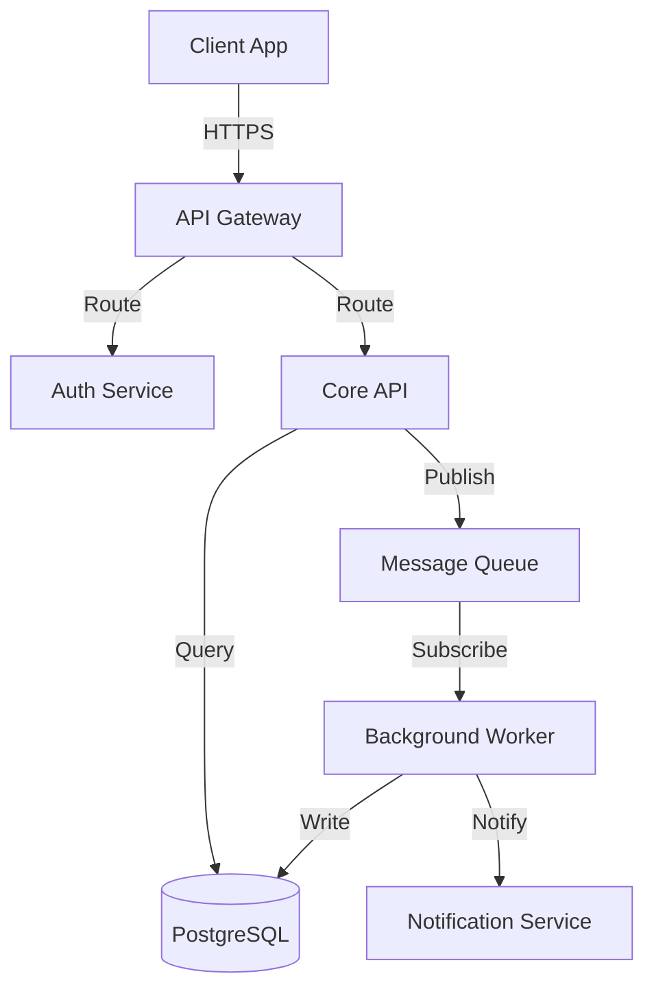
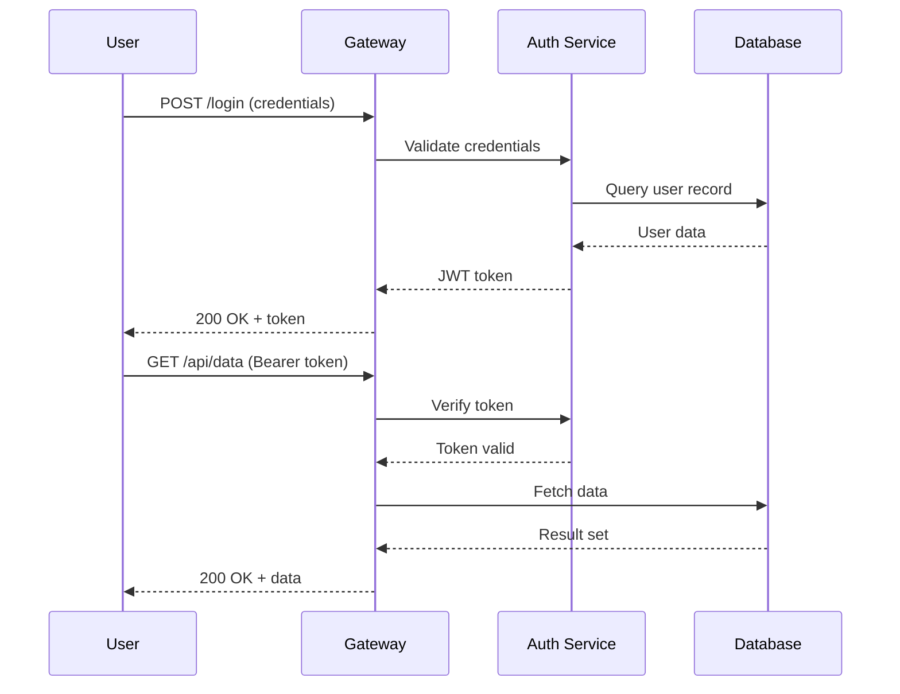
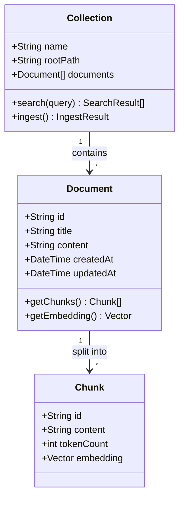
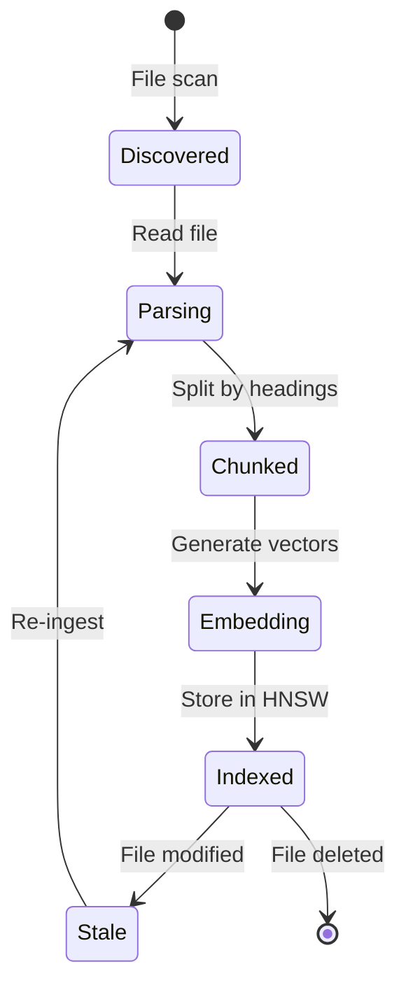
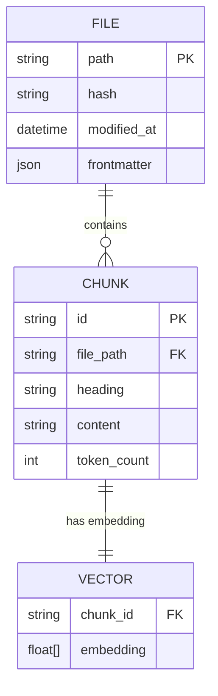
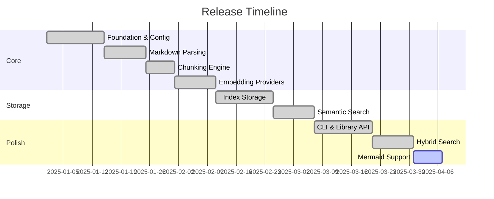
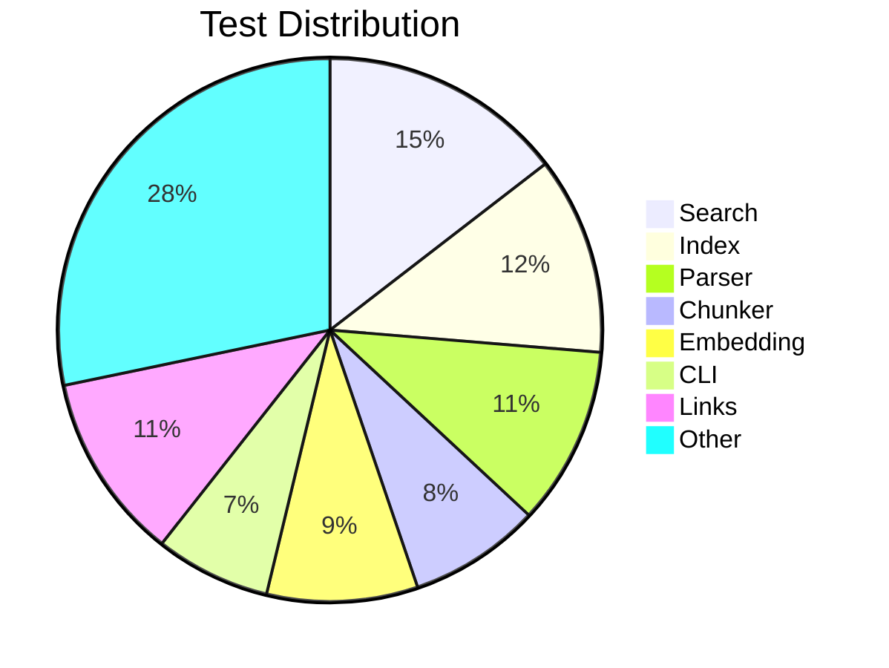
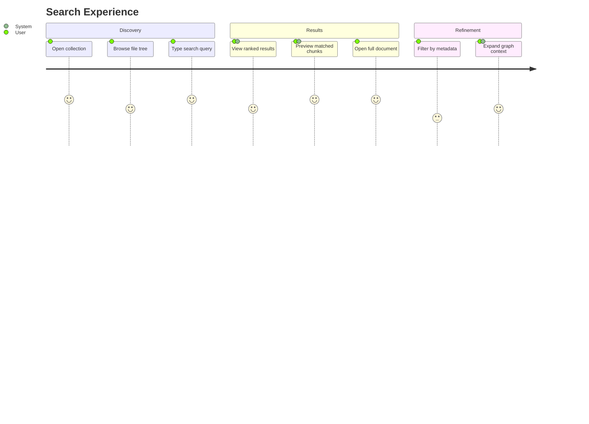
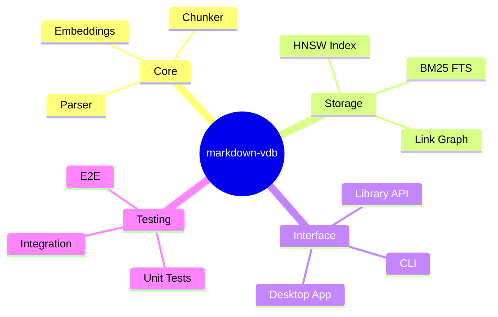

# Mermaid Diagram Examples

A collection of mermaid diagrams used across the project for visual documentation.

## System Architecture Flowchart

High-level request flow through the platform:



## Sequence Diagram

Authentication flow between services:



## Class Diagram

Core domain model:



## State Diagram

Document lifecycle in the index:



## Entity Relationship Diagram

Index storage model:



## Gantt Chart

Release timeline:



## Pie Chart

Test distribution by module:



## Journey Map

User experience for search:



## Mindmap

Project structure overview:



## Invalid Diagram (for error testing)

This block has intentionally broken syntax to verify error handling:

```mermaid
graph TD
    A --> B
    B --> C
    this is not valid mermaid --->>><<<
```
